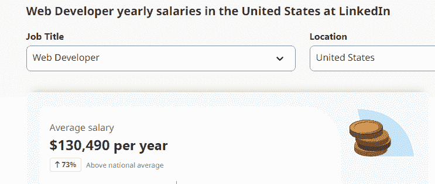
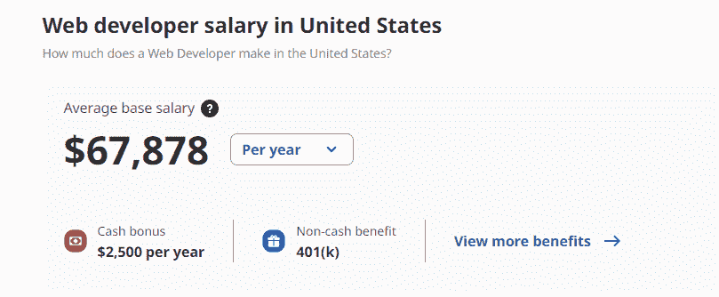
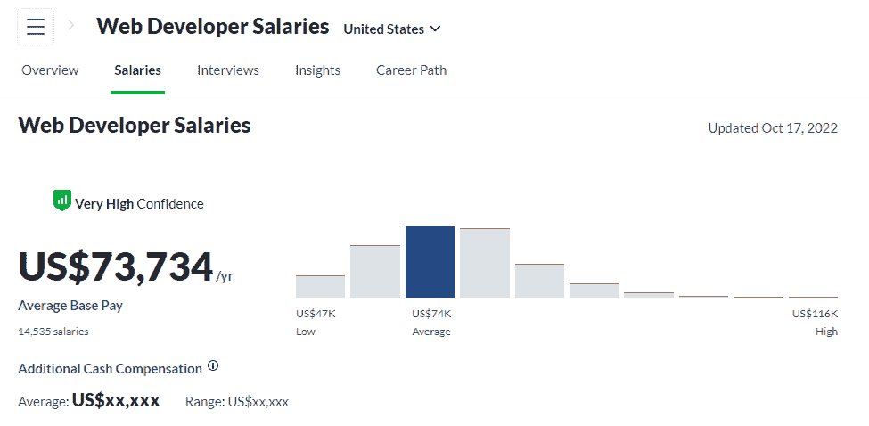

# 学习 Web 开发并赚取 65，000 美元—100，000 美元以上的年薪—完整指南

> 原文：<https://medium.com/codex/learn-web-development-and-earn-65k-100k-year-complete-guide-88879943a898?source=collection_archive---------16----------------------->

# 议程:

1.  什么是 Web 开发？
2.  从零开始学习需要多少时间？
3.  好处。
4.  学什么？
5.  2022–2023 年薪资预期。

## 1)什么是 Web 开发？

Web 开发与设计网站和应用程序的特性和功能的工作(通常称为“web 设计”)密切相关，但“web 开发”一词通常是为网站和应用程序的实际构建和编程而保留的。

想想这些年来你使用过的所有网页，这些网页都是由 web 开发人员建立的，确保它们正常运行，并以一种能提供良好用户体验的方式运行。因此，优秀的 web 开发人员通过使用各种编程语言编写代码来实现这一点，这些编程语言根据他们执行的任务和他们工作的平台而有所不同。

## 2)从零开始学习需要多少时间？

*   自学。
*   购买自学课程。
*   私人导师(推荐)。

作为一名开发人员，尤其是当你刚开始学习时，你可能会不时地陷入困境，自学通常至少需要 12 到 18 个月。如果你真的在自学，你知道这需要一些时间，尽管你能做到。但是这可能需要将近 12 到 14 个月的时间。然而，如果你潜心研究，找一个私人教练，进行这些私人培训，引导新兵训练营等，然后进行自学，加上引导课程，并在任何时候遇到困难时增加一个导师，那么这可能需要不到三四个月的时间来让你达到编码并开始新的职业生涯。

## 3)网络开发工作的好处:

*   发展最快的行业之一。
*   在家工作。
*   高薪。
*   做自由职业者。

## 4)学什么？

后端

*   。净核心(推荐)。
*   JAVA。
*   PHP。
*   PYTHON。

前端

*   有角度—(推荐)。
*   做出反应。
*   VUE JS。

## 5)2022-2023 年的薪资预期

● LinkedIn。

●确实。

●玻璃门。

# StartupHakk:

无论是做一些专门的业务流程。我们专门让这些专家进入他们的领域，教他们如何开发，教他们成为全栈开发人员。你将会得到的是，你将会得到一个既能成为全栈开发者，又能成为其领域专家的人，我们认为这最终将会是， 这是最好的混合体之一，也是企业界的最大受益者，他们可以让这些专业人士成为开发人员，这最终将帮助他们在他们的领域变得非常优秀，我认为这是我们将真正努力的专业之一，所以请确保您了解 startuphakk.com。

这是一个很好的机会，我们刚刚开始启动我们的编码训练营，这样你就可以找到你所在领域的专家，教他们成为一名开发人员，然后开始构建和学习你所获得的所有这些最重要的技能。所以一定要去看看 startuphakk.com 的。