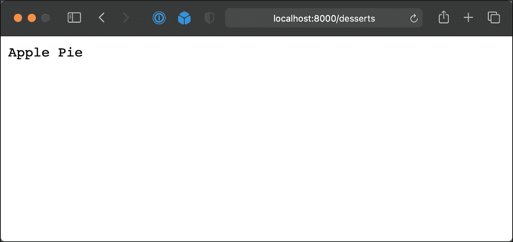

# 学习 Go Lang 第 6 和第 7 天—创建甜点 API #100DaysOfCode

> 原文：<https://medium.com/codex/learning-go-lang-day-6-creating-a-desserts-api-100daysofcode-9220f0e2509b?source=collection_archive---------9----------------------->

## [法典](https://medium.com/codex)

这篇文章中构建的 API 的截图

当我在新年那天开始学习 Go Lang 时，我的最终目标是精通这门语言，能够用 Go 编写 web 应用程序。在我的前 5 天，我选择专注于一些基础知识，但是今天我决定给自己定一个小项目。