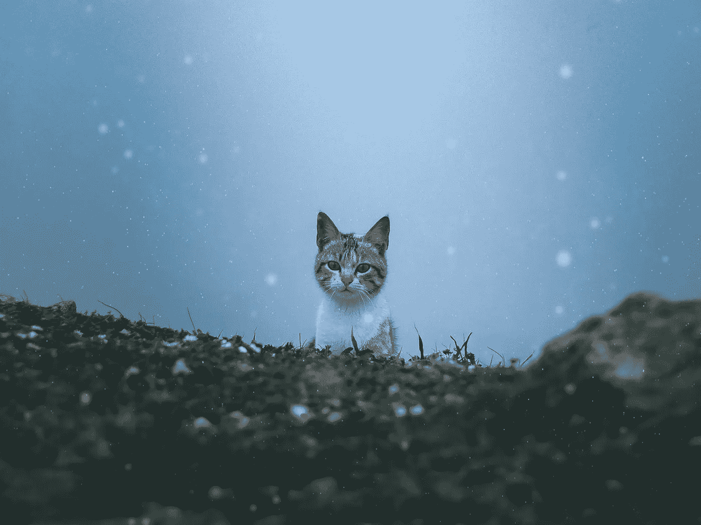

# 学习围棋第 8 到 12 天——构建一个返回随机猫事实的应用程序😸#100DaysOfCode

> 原文：<https://medium.com/codex/learning-go-lang-days-8-to-12-building-an-app-that-returns-random-cat-facts-100daysofcode-719c5265f3f9?source=collection_archive---------8----------------------->

## [法典](https://medium.com/codex)

由 [Malek Dridi](https://unsplash.com/@malek_dridi?utm_source=unsplash&utm_medium=referral&utm_content=creditCopyText) 在 [Unsplash](https://unsplash.com/s/photos/cat?utm_source=unsplash&utm_medium=referral&utm_content=creditCopyText) 上拍摄的照片

你可能已经注意到我在过去的几天里没有发帖，这是因为我一直专注于学习一些 Go Lang 的新部分，我想在一个小型的 Go Lang 项目中使用它们。