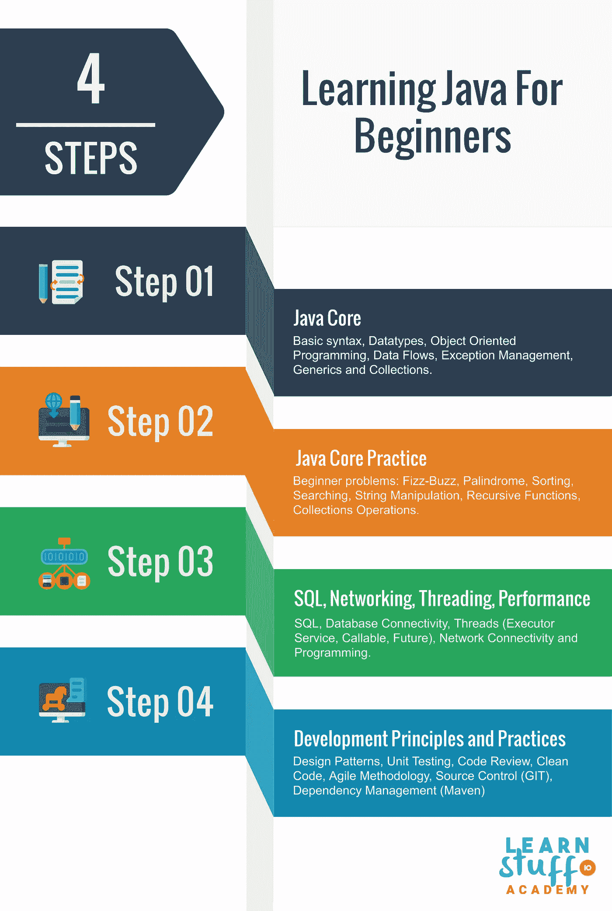
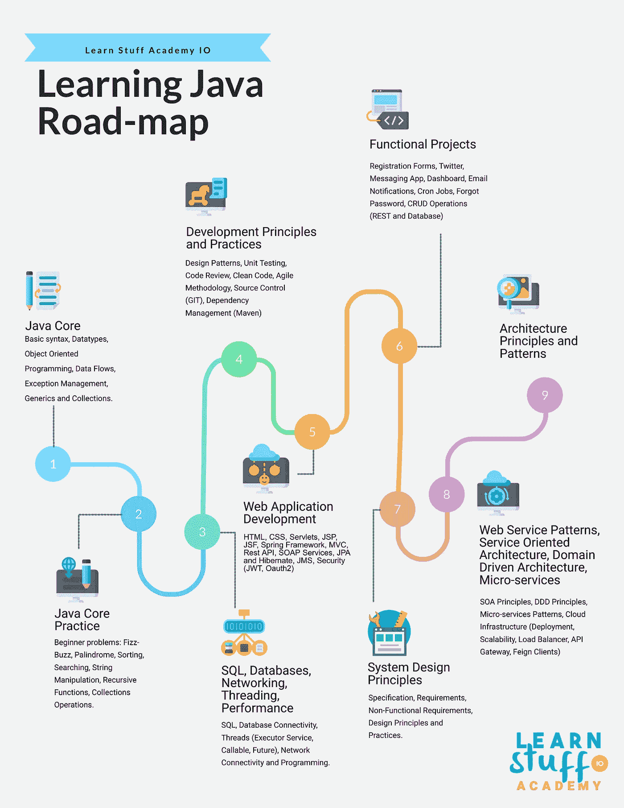

# 学习 Java 的路线图

> 原文：<https://medium.com/codex/learning-java-road-map-bea37c5e766d?source=collection_archive---------0----------------------->

# Java 初学者路线图

## 先决条件

在开始学习 Java 之前，有几个先决条件需要满足。首先，你需要基本了解如何使用电脑，如何在电脑上安装应用程序，如何在操作系统中进行基本配置，例如设置环境变量。第二，你需要熟悉在谷歌上搜索东西和跟随在线教程，因为你一开始需要的很多东西都可以很容易地在网上找到。最后，懂英语是一个很大的优势，因为大量的教程、课程和其他有用的信息都可以很容易地用英语找到。

Learn Stuff Academy —初学者学习 Java 路线图

## 步骤 1 — Java 核心

我们从学习基本的 Java 结构和语言语法开始。在这一点上，你需要学习 Java 使用的基本元素，比如用 main 方法创建一个类，声明变量和方法，以及使用控制结构。我们继续学习数据类型和数组，它们是任何编程语言的基础部分。

基础完成后，你需要关注面向对象编程(封装、继承、抽象类、接口和多态)，这是 Java 编程语言的定义元素之一。请确保您在这方面花费了足够的时间，因为 Java 的所有其他方面在某种程度上都与面向对象编程相关。

我们继续讨论数据流和异常管理。这将允许我们从文件中读取和写入数据，并在我们的代码中正确管理意外情况或行为。

泛型代表了 Java 中的类型安全特性，虽然我们不太可能定期实现泛型类型，但 Java 中的大多数库都是基于泛型的。因此，很好地理解这个特性是如何工作的非常重要。

最后，Java Core 的最后一部分提到了使用集合。集合提供了存储对象、遍历对象、排序和检索对象的功能，所有这些在任何 Java 应用程序中都大量使用。

这一步通常需要 2 到 6 周。

## 第二步——练习

为了更好地理解 Java 的核心元素，建议您做一系列实践练习，以便使用您所学的所有功能。我们的建议是搜索 Java 面试问题和练习，尽可能多地做。如果你很难找到合适的练习，你可以从下面开始:Fizz-Buzz，回文，实现快速排序和计算一个数的阶乘值。

这一步通常需要 1 到 3 周。

## 步骤 3 —核心库

完成练习后，我们可以继续学习 Java 提供的高级核心库。首先，我们需要专门花至少几天时间来学习 SQL(结构化查询语言)和在一个数据库管理系统上练习(我们推荐 PostgreSQL 或 MySQL)。在这之后，我们需要学习 JDBC (Java 数据库连接),以使我们的 Java 应用程序与数据库交互来存储和检索数据。Java 提供的其他实用库包括使用线程(用于并行执行)和网络编程(用于开发客户机-服务器应用程序和处理 URL)。

在某些情况下，根据您正在做或计划做的工作的性质，以及您在学习 Java 上投入的时间，使用 UI 库(如 Swing 或 JavaFX)也可能是有用的。

这个步骤需要 2 到 4 周。

## 步骤 4 —开发原则和实践

在这一步，我们应该重点学习与软件开发相关的原则和实践。这将有助于我们正确高效地使用 Java 编程语言。我们从学习软件开发的固体、干燥、YAGNI 和接吻原则开始。在此之后，我们关注单元测试和干净代码实践。最后，在理解并彻底实践了所有这些之后，我们可以专注于软件开发人员日常使用的代码审查、敏捷方法、源代码控制(我们推荐 GIT)和依赖性管理(我们推荐 Maven)的概念。

这个步骤需要 2 到 4 周。

# 从初学者到专家

学习材料学院——学习 Java 路线图

## 步骤 5 — Web 应用程序

这可能是学习过程中最复杂的一步，因为它包含了最多的学习主题。我们从熟悉 web 应用程序的本质开始，特别是侧重于客户机-服务器模式，并学习允许我们创建静态网页的 HTML 和 CSS。此时，虽然没有明确要求，但大多数 Java 开发人员也学习了 JavaScript 的基础知识。

我们继续学习 Java Enterprise 的概念知识，它是面向开发 web 应用程序的 Java 开发工具包——JDK 的一部分。在这个阶段，我们需要涵盖以下主题:Servlets、Java 服务器页面(JSP)、Java 服务器界面(JSF)、过滤器和 web 服务器。此外，如果我们练习使用应用服务器(如 Tomcat 和 Glassfish ),我们还可以处理 SOAP web 服务和企业 Java Beans(但更多是在概念层面，因为这些库在现代软件开发中不太常用)。

在我们掌握了 Java Web 开发的所有主要概念之后，我们可以开始学习 Spring，重点是 Spring Boot、控制反转、Spring MVC、使用 Spring 构建 REST APIs、Java 持久性 API (JPA)和 Java 消息传递(JMS)。所有这些都是 Spring 框架的组成部分，并允许快速和极度简化(与标准 Java 企业库和框架相比)的 web 开发。最后，我们将学习如何使用 Spring Security 保护我们的 web 应用程序，重点是使用 Java Web Token (JWT)和 OAuth2 实现安全性。

这一步通常需要 2 到 8 个月。

## 第 6 步—功能项目

到这个阶段，您应该已经掌握了使用 Java 构建端到端应用程序的足够知识。您应该尝试实现小规模但相对复杂的项目，确保您经历了从用户界面到实际数据库的应用程序的所有层。尝试从零开始实现一个项目，可以让您理解规范是如何工作的，项目应该如何计划和开发，以及提供 Spring 框架的每个元素如何适合构建一个完整的 web 应用程序的概述。我们建议您尽最大努力开发每个项目，包括干净的代码、单元测试和开发原则，以便更好地理解这些概念在 web 开发环境中的适用性。

这一步通常需要 2 到 4 个月。

## 第 7 步—系统设计

此时，我们将关注软件开发的需求和规范部分。我们将学习如何收集规范和需求(功能性和非功能性的)，然后学习设计满足这些需求的系统的原则。我们将了解哪些技术、框架和库更适合性能、并行处理、大量数据(大量插入操作或大量读取操作)、数据仓库和商业智能、安全性等等。在这一步中，我们还将重点学习和理解我们在此过程中学到的大多数框架和技术的最佳实践。

系统设计的一个重要方面是识别系统各部分的输入和输出，并设计从给定输入到期望输出的逻辑流(及其组成元素)。这个过程以及非功能性需求极大地影响了设计的软件系统。

虽然有许多方面需要考虑，但此时你很可能已经在一家公司工作了几年，并且你更有可能专注于更适合你所工作的公司的技术和项目，从而进入系统设计的专业化形式(如果你愿意的话)。

> **后期编辑**
> 
> 根据您的工作性质、项目需求和您所在的团队，在这一步您可能还需要了解以下概念:NoSQL(我们推荐 MongoDB、Cassandra 和 Elastic Search)、缓存(我们推荐 EhCache 和 Redis)和事件流(我们推荐 Kafka)。

这一步通常需要 2 到 4 个月。

## 步骤 8 — Web 服务模式、面向服务的架构、领域驱动的设计和微服务

一旦我们涵盖了系统设计，我们通过学习面向服务架构、领域驱动架构和微服务所使用的原则和标准，进一步增加了我们对 web 应用程序的知识和理解。这些在业界或 Java 世界中并不被认为是标准，但是这些概念在过去的十年中变得越来越流行，并且更有可能在您工作的公司和项目中使用。

接触 SOA、DDD 和微服务通常还会导致至少在概念层面上需要学习云基础设施、容器和容器管理(我们推荐 Docker、Docker Compose 和 Kubernetes)、负载平衡器和 API 网关(我们推荐 Amazon API Gateway、Mashery 和 Nginx)。在代码层面，你需要有一些使用 Feign Clients 的实践经验(我们推荐使用 Spring Cloud 的 Ribbon 的 Eureka)。

这一步通常需要 3 到 6 个月。

## 步骤 9 —软件架构

Java 路线图的最后一步是系统架构，并学习如何创建复杂系统的架构，这可能包含多个项目，每个项目都有自己的需求和规范。软件架构包括但不限于软件开发的以下方面:使用的硬件、部署、基础设施、可伸缩性、技术、安全性、组件、服务、软件系统组成部分的层和交互。

在这一点上，就我们可以学习的概念和实践而言，我们有各种各样的选择，但是与系统设计一样，我们更有可能专注于那些更适合我们工作的公司或我们负责的项目的实践和标准。

这一步通常需要 3 到 9 个月。

# 想开始你的 Java 开发者生涯吗？

> ***查看我们的免费 Java 课程:***
> 
> 【http://learnstuff.io/courses/java】T5[T6](http://learnstuff.io/courses/java)
> 
> ***和我们的综合代码示例:***
> 
> [*https://github.com/UngureanuVlad/learn-stuff-java*](https://github.com/UngureanuVlad/learn-stuff-java)

# 或者，您是否希望提高您的 Java 技能？

> ***查看我们免费的 Spring 框架课程:***
> 
> [http://learnstuff.io/courses/spring](http://learnstuff.io/courses/spring)
> 
> ***和我们的综合代码示例:***
> 
> [https://github.com/UngureanuVlad/learn-stuff-spring](https://github.com/UngureanuVlad/learn-stuff-spring)

# 对网上研讨会系列感兴趣(免费和付费)？

> **看看我们的平台:**
> 
> [https://learnstuffacademy.io/](https://learnstuffacademy.io/)