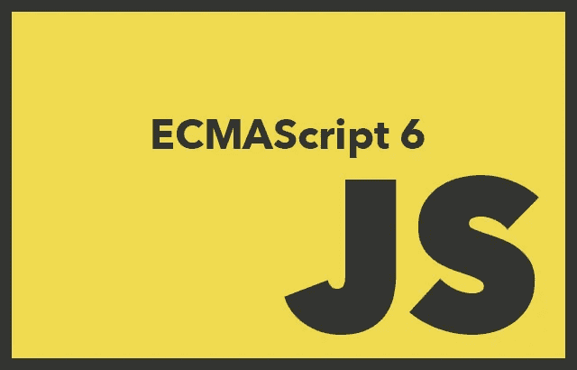

# 学习 JavaScript 类、模块和其他现代化

> 原文：<https://medium.com/codex/learning-javascript-classes-modules-and-other-modernizations-369c4ecaec04?source=collection_archive---------3----------------------->

## **的第一部分？**

似乎每年我们都有新的 JavaScript，像我这样的老人很难跟上。多亏了 ECMAScript 6(T2)，尤其是仅在 2021 年浏览器支持就成熟了(T3)，这意味着这不是你祖父的 JavaScript。