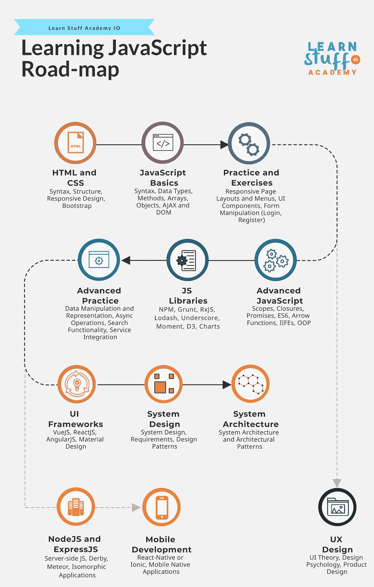

# 学习 JavaScript 路线图

> 原文：<https://medium.com/codex/learning-javascript-road-map-1d97d20aef5d?source=collection_archive---------0----------------------->

# 先决条件

在你开始学习用户界面设计之前，有几个先决条件需要满足。首先，你需要基本了解如何使用计算机，如何在计算机上安装应用程序，如何在操作系统中进行基本配置，如何使用互联网浏览器访问在线内容(如网站),并基本了解“客户机——服务器”模式的工作原理。第二，你需要习惯于在谷歌上搜索和跟随在线教程，因为你学习用户界面设计所需要的大部分东西只能在网上找到。最后，懂英语是一个很大的优势，因为大量的教程、课程和其他有用的信息都可以很容易地用英语找到。

学习材料学院——学习 JavaScript 路线图

# 步骤 1 — HTML 和 CSS

学习用户界面设计的第一步是学习如何实际设计网站的用户界面，通过使用超文本标记语言(HTML)来构造和组织网页内容以及级联样式表(CSS)来改变 HTML 元素的视觉属性。在学习 HTML 和 CSS 的同时，我们还需要学习响应式 Web 应用程序。在现代，也可以使用智能手机或平板电脑访问网站或网络应用程序，这些设备的显示面积较小。为了让我们的网站在移动设备上可用，他们需要有响应能力，也就是说，他们可能需要调整他们的内容，以确保在较小的显示器上实现最佳的可视性和可用性，在较小的显示器上，交互是通过触摸和滑动动作来完成的，而不是鼠标点击、悬停和拖动。

为了让应用程序能够及时、经济地响应，大多数人还学习了 Bootstrap，这是一个便于响应设计的 CSS 库。近年来，由于智能手机的使用越来越多，大多数公司都采用了一种称为“移动优先”的做法，根据这种做法，他们首先为移动设备设计用户界面，完成后，他们为桌面访问进行调整。

这个步骤需要 1 到 2 周的时间。

# 步骤 2 — JavaScript 基础知识

在学习了如何设计和构建我们的网页之后，下一步是允许用户与网页元素进行交互。与网页交互的主要用例是:能够点击按钮以获得特定的结果(如导航、隐藏或显示页面元素、关闭通知和弹出窗口等等)，或者能够与表单交互以向服务器发送数据。JavaScript 是一种脚本语言(顾名思义),它使您能够与表单交互、创建动态更新的内容、控制多媒体、动画图像以及几乎所有您可以在网页上做的事情(至少根据 Mozilla Developer Network 是这样的)。

与任何脚本或编程语言一样，你需要了解变量、数据类型(包括对象、日期和 JSON 表示)、数组、方法、控制结构、AJAX (http 请求、API 调用和 DOM 操作)和基本的 JS 承诺。最后，为了在 HTML 和 CSS 中使用 JS，你需要学习处理事件(鼠标和键盘)以及与网页的文档对象模型(DOM)元素交互。

虽然不是强制性的，但在这一点上，花一些时间学习和使用 jQuery 可能是有用的，jQuery 是一个轻量级 JS 库，它简化了 HTML/DOM 操作、CSS 操作、HTML 事件方法、效果和动画以及 AJAX。虽然这个库不是特别需要的，但是在为一家公司工作时，您很可能会发现许多项目(尤其是遗留项目)大量使用这个库。

这个步骤需要 1 到 3 周的时间。

# 第三步——练习

有了足够的关于 HTML、CSS 和 JavaScript 的知识，我们应该实践我们所学的。在这一点上，我们应该专注于为网站构建响应式模板，确保我们能够构建:不同类型的响应式页面布局(侧菜单、顶部菜单、扩展侧菜单、带有子菜单的悬停菜单、响应式菜单)、使用 Bootstrap 的内容结构(行、列、断点)、通用 UI 元素(自定义复选框、样式列表、弹出窗口、通知、工具提示)和通用可重用组件(日期/时间选择器、日历、滑块、自定义滚动、文件上传)。

从功能的角度来看，我们应该练习构建不同类型的表单(登录、注册、忘记密码、更改密码、客户资料)和相关的 JavaScript 功能(验证、约束、自定义选择、值范围)。

这个步骤需要 2 到 4 周。

## 第 3.1 步— UX 设计

用户体验设计(UX 设计)是通过将用户界面理论、设计心理学和产品设计原则应用于用户界面、用户界面元素的创建以及用户界面中导航和数据流的管理，来设计更好的客户体验的过程。大多数人很早就开始学习 UX，通常是在他们学习 JavaScript 基础知识之后。一旦人们理解了如何与 UI 元素交互(尤其是使用 AJAX)，他们就开始学习如何利用他们的知识为他们设计的用户创造更好的体验。

总的来说，UX 指的是提高设计的可用性、可访问性和一致性，以改善整体用户体验，方便用户实际使用设计的用户界面。为了提高可用性和可访问性，UI 开发人员应该考虑以下原则:立即访问有价值的信息、执行关键操作的最少步骤、促进可用性的视觉提示(高亮、工具提示、边框、通知、微调器、加载器)以及设计和内容结构的简单性(避免信息或动作过载)。

学习 UX 通常不是一帆风顺的(尽管如果你参加了 UX 设计的课程，就有可能)。人们似乎更喜欢以较短的增量学习，只学习与他们当前或正在进行的项目相关的信息。然而，资历较高的人通常对 UX 的设计原则和实践有更深的理解。

这个过程可能需要 2 到 8 周，但通常是一个持续多年的过程。

# 步骤 4 —高级 JavaScript

下一步是处理高级 JavaScript 主题，如作用域、闭包、“this”(全局和所有者上下文、绑定)、“let”、“const”、箭头函数、IIFEs(立即调用的函数表达式)和其他特定于 ES6 的 JavaScript 新增内容。就高级主题而言，我们还需要解决对象、原型和面向对象的编程原则和实践，这些现在正开始被软件开发公司广泛用于用户界面开发。在这一步中，还建议您熟悉 TypeScript，这是一种构建在 JavaScript 之上的编程语言(更像是 JS 的严格语法超集)，提供 OOP 特性(接口、类、构造函数、模块等等)、静态类型检查和 lambda 函数。

请注意，与 HTML、CSS 和 JS 基础知识相比，您需要学习的信息量相当少。然而，这些概念的复杂性和难度非常高。大多数人在轻松阅读后会离开这些主题，但是这些概念可以成就或破坏一个 JS 应用程序，应该引起您的充分注意。为了更好地理解这些概念是如何工作的，以及它们应该如何使用，如果您开发一些小型的概念验证应用程序，为您掌握这些概念提供足够的复杂性和上下文，将会很有帮助。

这个步骤需要 4 到 6 周。

# 步骤 5 — JavaScript 库

虽然不是核心 JavaScript 特性的一部分，但 JavaScript 的反应式扩展(RxJS)库在过去几年变得越来越流行。它不仅有助于异步和基于事件的脚本编写，还被 AngularJS 等趋势 JS 框架广泛使用。

在这一点上，你很可能已经被雇佣或者正在参加一个实习项目。因此，您可能需要学习特定于您公司开发的应用程序和项目的其他 JS 库。一些最常用的 JS 库有:Boostrap JS(用于使用 Boostrap 特定的 UI 元素及其相关功能)、Lodash(用于简化字符串、对象和数组的工作)、下划线(为对象、集合、数组和其他实用程序方法提供多种功能)、D3(便于数据驱动文档和创造性数据可视化)、ChartsJS(便于图表和数据可视化的创建和交互)、AnimeJS(用于快速简单的动画)、JsPDF(用于生成 PDF 文件)和 MomentJS(用于简化日期和时间的工作)。

这个列表包含了您在软件开发公司工作时可能遇到的最少的库，因为还有数百个库您可能需要学习和使用。虽然很明显有很多 JavaScript 的实用程序库(尤其是与其他脚本或编程语言相比)是直接的，但是不需要亲身体验其中的大部分，因为它们中的大部分可以解决非常具体的问题，并且可以在几天内学会。

使用库的另一个重要方面是管理依赖关系。大多数 JavaScript 开发人员学习使用 NPM，这是一个随任何 NodeJS 发行版一起安装的依赖管理工具。除了管理依赖关系，大多数 UI 开发人员还学习如何自动化 web 应用程序所需的大部分重复性任务，如缩小、编译或单元测试。任务自动化的首选工具通常是 Grunt 或 Gulp。

这一步需要 2 到 8 周的时间，取决于你想探索和学习的图书馆。

# 步骤 6 —高级实践

现在，我们已经通过高级主题和一些最常用的库增强了我们的 JS 知识，这表明我们需要一些时间来进行更多的练习。至此，您应该能够熟练地构建 web 页面布局、用户界面元素和表单，并操作数据和 DOM。

在这一点上，实践应该更加面向商业应用程序所需的高级功能，如:高级数据表示(产品列表、项目卡、购物篮、结账页面)、报告、搜索和过滤、定时事件、异步操作、可重用组件、组件交互、状态管理、服务集成(谷歌、脸书、LinkedIn 等)、身份验证、支付集成、安全性和性能。

请注意，安全性和性能需要大量的阅读、实验和练习才能掌握。你也不太可能仅仅通过练习就能完全学会这两个主题，因为它们需要真实的生活用例来学习什么是真正相关的，什么是不相关的。

这个步骤需要 2 到 8 周。

# 步骤 7 — UI 框架 VueJS、ReactJS 和 AngularJS

JavaScript 最重要的优势之一是有大量的 JavaScript 框架可用于开发大规模、高性能的应用程序，而且更容易，代码行也少得多(不言而喻，工作量更少)。虽然有许多 JS 框架，但我们选择了三个被广泛使用并且更可能是 UI 开发人员职位所需要的:VueJS、ReactJS 和 AngularJS。

VueJS 是一个轻量级的视图层(来自 MVC 的视图)框架，能够提供双向数据绑定、条件化或基于循环的 DOM 渲染以及基于组件的用户界面组合。就复杂性而言，它非常容易学习和使用，但就实际功能而言，它也是有限的，需要使用其他 JS 框架(或只是纯 JS)来为 UI 应用程序提供其他强制功能。

ReactJS 是一个声明性的状态管理框架，能够为大量数据提供高效的 UI 更新。虽然它也提供了 JSX(JavaScript 的语法扩展)、对基于组件的合成和条件呈现的支持，但它为表单管理提供了一个效率较低的解决方案。框架本身非常容易学习和使用。因为 ReactJS 专注于状态管理，所以 ReactJS 应用程序也经常使用 React-Redux，这是一个 JavaScript 的状态管理库。

AngularJS 是一个大规模(被一些开发人员称为 monolithic)JS 框架，能够在结构化 MVC 架构中提供双向数据绑定、基于组件的组合、过滤、服务、路由、广泛的 DOM 和 CSS 操作，包括条件和基于循环的呈现、依赖倒置、模块和延迟加载。与 VueJS 和 ReactJS 相比，AngularJs 提供的大量特征应该清楚地表明其更难学习。

请注意，还有许多库可以进一步促进所有三个框架的应用程序开发，尤其是在 UI 组件方面。最值得注意的是，这三个框架都有一个特定于材料设计的实现，它带有易于使用且非常有用的 UI 组件(通知、面板、选项卡、对话框、数据选择器、滑块、增强的表单输入等等)。

这个步骤需要 1 到 4 个月。

## 步骤 7.1 —节点 JS

虽然不是 UI 开发特别需要的，但大多数 UI 开发人员也学习 NodeJS，这是一个服务器端的跨平台 JS 执行环境。这意味着 NodeJS 可以用于开发后端(REST API 服务、封装业务逻辑、与数据库、缓存和消息队列等连接和交互)和前端(基于模板语言生成用户界面)功能。NodeJS 能够通过集成大量的库和框架来提供所有这些功能，如:ExpressJS(用于 API 开发)、MeteorJS(用于开发同构应用程序)和 DerbyJS(服务器端呈现和视图与模型之间的动态绑定)。

学习 NodeJs 和 ExpressJS 的基础需要 2 到 8 周的时间。

## 步骤 7.2 —移动应用程序开发

学习 JS 框架还可以通过使用 React-Native(广泛采用的、非常流行的基于 ReactJS 构建跨平台原生应用的框架)或 Ionic(一种不太流行但非常容易学习的灵活框架，用于通过使用 AngularJS、ReactJS、VueJS 或纯 JavaScript 构建跨平台原生应用)开始学习和处理特定于移动设备的应用。

注意，行业趋势是对一些移动应用采用 React-Native，但仍有许多公司选择由专门的 Android 和 iOS 原生移动团队开发移动应用。在这种情况下，如果你选择学习使用 JavaScript 框架进行移动开发，确保这些职位对你来说是容易获得的。

学习自然反应或离子反应需要 1 到 3 个月的时间。

# 步骤 8 —系统设计

至此，我们几乎涵盖了与构建用户界面和使用 JavaScript 相关的所有技术主题。我们也有大量构建商业应用中常用的复杂功能的实践。为了进一步提高我们的技能和知识(并可能为技术领导角色做准备)，我们需要投入时间学习与系统设计相关的概念和原则，以及如何根据给定的需求设计系统。

与任何其他编程或脚本语言一样，我们应该从关注开发原则(固、干、吻、YAGNI、德米特定律)和开发实践(干净代码、单元测试和代码审查)开始。第二步是投资学习适用于 JavaScript 的设计模式，如原型、模块设计、显示模块、外观、观察者、惰性初始化和其他一些不太可能使用的模式。

与其他与用户界面开发相关的主题一样，掌握设计模式和系统设计需要一段时间来开发概念验证应用程序，以便理解每个模式的用例。

这个步骤需要 1 到 3 个月。

# 步骤 9 —系统架构

鉴于 JavaScript 非凡的灵活性，许多公司在开发大规模应用程序时面临的一个问题是如何以易于理解、易于更改和易于维护的方式对应用程序代码进行实际的结构化和组织。

我们需要考虑到，应用程序代码的结构和使用会根据我们正在开发的 UI 应用程序的类型而有所不同，这些类型可以是:单页应用程序、多页应用程序或同构应用程序。

基于我们希望我们的代码被使用或重用的方式，我们将与 UI 元素交互的方式，以及我们的代码需要支持灵活性的程度(同时仍然坚持单一责任原则)，我们可能需要应用以下架构模式之一:模型视图控制器(MVC)、模型视图呈现器(MVP)、模型-视图-模型(MVVM)或基于组件。选择构建、组织和使用代码的方式将对我们编写的代码的质量、更改或维护代码的时间和成本、代码的可重用性、可测试性和灵活性产生重大影响。

与用户界面开发相关的其他主题一样，掌握架构模式需要一段时间来开发概念验证应用程序，以便理解每个模式的用例。

这一步需要 3 到 6 个月。

欲了解更多信息和 100 多门免费课程，请访问:

[http://learnstuff.io](http://learnstuff.io/?source=post_page---------------------------)

有关在线课程和网络研讨会，请访问:

https://learnstuffacademy.io/