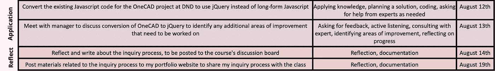

# 学习 jQuery:应用与反思

> 原文：<https://medium.com/codex/learning-jquery-application-and-reflection-e84277318788?source=collection_archive---------28----------------------->

“应用和反思”阶段的原始监控流程

我们已经完成了这个调查过程！完成这个项目并以这种方式学习 jQuery，感觉是一个非常值得的成就。自我调节学习的过程已经改变了我对未来目标设定的看法，包括编程语言和其他方面。

这个过程结束时，我实现的最终目标是:

> 在本课程结束时(8 月 20 日)，我将能够在我为国防创建的 web 应用程序中使用 Javascript 编程语言的 jQuery 库，以取代我目前使用的 jQuery 的 DOM 方法。

由于其他优先承诺的出现，申请和思考的最后阶段做了一些修改，但尽管发生了变化，该流程仍然卓有成效。这篇文章的前两个目标是将我到目前为止学到的一切应用到我正在工作的一个实际项目中。后半篇更侧重于我反思的过程。

**修改目标 10:将 DND 的需求提交表单项目的现有 Javascript 代码转换为使用 jQuery，而不是长格式 Javascript**

*最初的目标 10:将 DND 的 OneCAD 项目的现有 Javascript 代码转换为使用 jQuery，而不是长格式 Javascript*

*预计完工日期:8 月 12 日*

*实际完工日期:8 月 12 日*

这个特殊的目标教会了我很多，提前完美的计划是很难的，事情随时都可能改变。我最初计划转换一个更大的项目，但是工作中出现了额外的责任，减少了我为这个目标工作的时间。我不想删除这个目标，特别是因为这个目标代表了我的累积努力，并且将作为一个巨大的指标，表明我是否会实现我的远端目标。随着我工作重点的改变，我选择转换一个小得多的项目的代码。我验证了这个项目仍然允许我在进行转换之前测试各种 jQuery 方法。

完成这个目标并使用到目前为止我所学的一切感觉很好…不仅仅是实际的 jQuery 库，还有与自我调节的查询和学习相关的技术！我能够用我的时间管理技巧和检查我自己的能力来决定一个合适的项目来代替最初的 Javascript 项目。我与我的经理和同事进行了清晰的沟通，以了解我的任务大概需要多长时间。最重要的是，我通过使用过去行之有效的方法来控制自己完成这个目标的动机:来自同事的积极鼓励、奖励(完成后休息一下喝杯冰咖啡)，以及检查我的待办事项清单。

**修改后的目标 11:与经理会面，讨论将需求提交表单项目转换为 jQuery，以确定该项目和未来项目需要改进的任何其他领域**

*最初的目标 11:与经理会面，讨论 OneCAD 到 jQuery 的转换，以确定需要改进的其他领域*

*预计完工日期:8 月 12 日*

*实际完工日期:8 月 12 日*

我非常自豪地向我的经理展示了我更新的需求提交表，并展示了我在这个调查过程中取得的进展。我们坐下来一起审查代码，在那里我们对代码做了一些小的调整，以提高效率，但总的来说，这个项目没有大的改进。我们花了大部分时间讨论如何将我的知识应用到未来的项目中，以及改进我的编码和实际开发过程的建议。例如，他解释了我如何使用更具描述性的变量名来使我的代码更清晰。他还谈到了我在团队中的角色将如何在我们正在进行的下一个项目中发展，这样我就可以使用我对 jQuery 的新知识。这是完成项目的一个很好的方式，也是一次真正富有成效的交流。

为了使调查过程富有成效，获得所需的资源是非常重要的。对我来说，这看起来像是获得了编码教科书和课程，正确的计算机设置，我可以向专家提问并获得反馈，以及分配时间来实现我的目标。这显然取决于你的目标是什么，但我可以保证，当你有适当的工具和资源时，你的查询过程会容易得多。

**目标 12:思考并写下调查过程，张贴到课程的讨论板上**

*预计完工日期:8 月 14 日*

*实际完工日期:8 月 16 日*

我从一开始就没有提到的一点是，在整个调查过程中，我对每个接近的目标都做了笔记，以记住实现该目标所发生的重要细节以及我对该过程的反思。在完成大部分目标后，我通过我一直在分享的这些中型博客帖子，将这些粗略的笔记正式化为正式的反思。我很感激这样做，因为这让我可以对每个目标进行两次适当的反思:一次是在完成目标后，另一次是在结束时写下我的反思。我赶时间，在目标 12 和 13 之间有一些缓冲期，所以我选择分散写博客，这样我每天写 1 篇(总共 4 篇)。这样，当我写每篇博文时，我都保持着清新的思维，并且在结束时不会感到厌倦。每天对探究项目的一个部分进行反思确实增强了我的反思过程。

克里斯蒂娜@ wocintechchat.com 在 [Unsplash](https://unsplash.com?utm_source=medium&utm_medium=referral) 上的照片

我关注“像女孩一样编码”已经有一段时间了，我发现这篇名为[“编码、思考、反思&转移”](https://code.likeagirl.io/coding-thinking-reflection-transfer-5faf63dc63f4)的文章非常适合我的调查项目。它讲述了如何通过编码项目的反思，将学习转移到未来的项目中。编程语言之间的编码核心非常相似。在我的例子中，学习 jQuery 更侧重于语法和语义，因为我已经有了可以转移到这个查询过程的编码知识。在反思我的项目时，我发现 jQuery 在操作上与 DOM 非常相似，只是编写风格不同。特别是在 goal 10 中，当我将 DOM 代码逐行更改为 jQuery 时，我能够直观地进行比较。这篇文章提到了自我调节的探究和学习，通过挑战学生提出反思性的问题，并在博客帖子中捕捉反思性的想法(我们到了！！).作者吉姆·卡什也建议“为你的项目从头到尾建立一个时间表、描述、过程步骤”

至于我为什么选择 Medium 作为分享我的调查过程的方法，我有一段时间的目标是按照一位导师的建议进入博客写作。她提到，这将是一个很好的地方，让我分享我从自己独特的视角学到的东西，并展示我的一系列技能。尤其是在有太多东西需要学习的技术领域，博客是公开分享新信息的好地方。在我开始攻读硕士学位时，我认为开始我的媒体博客并写一篇关于我参加的每门课程的反思将是分享我作为一名教育学位软件开发人员的独特观点的一个很好的方式。由于 PME 800(自我调节的探究和学习)是我的第一门课程，这个项目看起来是我开博客的绝佳机会。我把我的反思分成 4 篇文章，以保持信息的可理解性。

**目标 13:将与调查过程相关的材料发布到我的作品集网站上，与全班分享我的调查过程**

*预计完工日期:8 月 19 日*

*实际完工日期:8 月 17 日*

我们终于到达了最终目标！这是一个很好的快速方法，我在写这篇博文的时候还没有完成，但是很快就会完成。我将在课程讨论板上分享我的博客帖子，这样我的同学就可以阅读和学习我的提问过程，并分享反馈。我还将通过我的调查过程，通过获得同伴反馈，以及通过向他人提供反馈，来补充我对自我调节学习的简短反思。

这个调查过程是非常有价值的，我很高兴将我在这里学到的关于自我调节学习的知识用于未来的目标。我能够根据我在编码目标之间从其他人那里收到的反馈，以及我对编码 jQuery 和使用相关资源感觉如何来衡量我的成功。我承认我会从正式的调查过程中休息一会儿，因为它已经消耗了我过去几周的工作时间，但我毫不怀疑，一旦我有了新的工作(或其他地方)需要学习的东西，我会回来的！