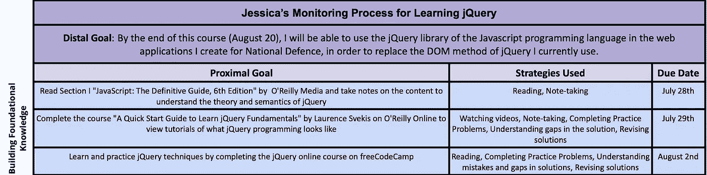
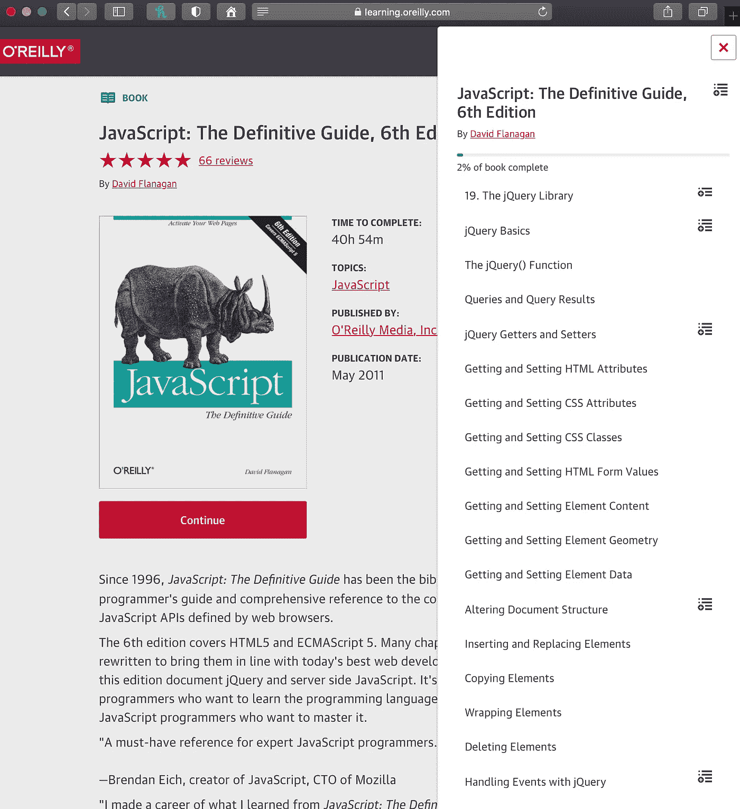
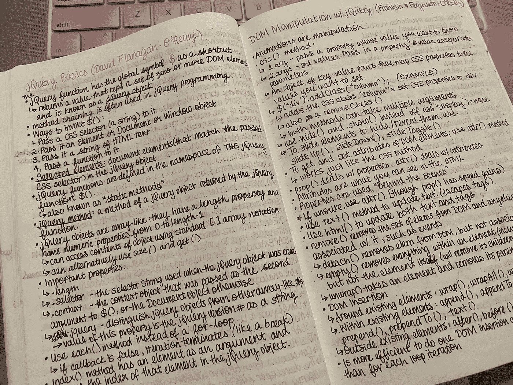
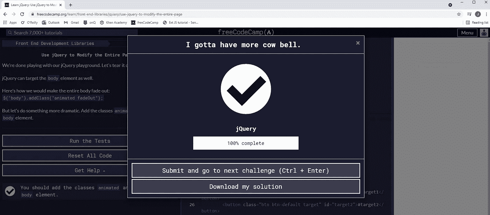

# 学习 jQuery:构建基础知识

> 原文：<https://medium.com/codex/learning-jquery-building-foundational-knowledge-8c477af67162?source=collection_archive---------16----------------------->

我已经正式开始了我的以学习 jQuery 为重点的探究过程！如果你没有看过我解释我如何开始这段旅程的第一篇文章，请点击这里 查看 [**:**](/@jessicadassanayake/initial-monitoring-process-for-jquery-inquiry-project-f90c712a1a12)

为了再次搭建舞台，这是我努力实现的首要目标:

> **在本课程结束时(8 月 20 日)，我将能够在我为国防创建的 web 应用程序中使用 Javascript 编程语言的 jQuery 库，以取代我目前使用的 jQuery 的 DOM 方法。**

“构建基础知识”阶段的原始监控流程

对于这个学习过程的第一部分，我创建了三个接近的目标，集中于构建我的基础知识。你可以在上面的图片中看到它们，尽管它们有轻微的变化。

## 目标 1:阅读 O'Reilly Media 的第一部分“Javascript:权威指南，第 6 版”,并对内容做笔记，以理解 jQuery 的理论和语义

预计完工日期:7 月 28 日

*实际完工日期:7 月 26 日*

我先说阅读不是我的强项。我发现很难坐下来连续阅读几十页，尤其是像编程理论这样的数字和枯燥内容。起初，我认为我通过 O'Reilly Media 只设定了包括这本在线书籍的一个部分的目标是现实的，但我很快发现很难盯着屏幕阅读信息墙。

我很快改变了这个目标，决定去读几本不同的书的一两章，直到我觉得我有足够的基本知识。这真的很有效，因为一些作者很好地阐释了一些概念，而另一些则不那么好。我能够消化所有我需要的信息，同时在不同的书籍之间切换，让自己休息一下。

我用手写笔记让自己保持忙碌。我在大学学到，当我花时间手写笔记时，我学得最好。虽然输入笔记更快，但信息并不总是固定的。我在阅读的不同章节上做了很多笔记，这对我处理信息很有帮助。后来，我了解到当我开始用 jQuery 编码时，记下 jQuery 语法的笔记作为快速参考是很有用的。

## 目标 2:完成 Laurence Svekis 在 O'Reilly Online 上的课程“jQuery 基础知识快速入门指南”,查看 jQuery 编程教程

*预计完工日期:7 月 29 日*

*实际完工日期:7 月 27 日*

我最初计划只是观看课程并做笔记。然而，我发现很难简单地观察而不尝试自己编码。当课程讲师讨论实践问题时，我决定暂停视频，尝试自己编写一个解决方案，然后恢复视频以查看讲师的解决方案。我经常有部分解决方案，所以我通过视频了解我哪里错了或者卡住了。我发现完成实际工作比简单地看视频更有效。

正如课程名称所示，本课程只是入门指南，并不全面。我发现这是我在上一个目标中读到的理论和我如何在未来的编码目标中将知识付诸实践之间的一个很好的过渡。

**目标 3:通过完成 freeCodeCamp 上的 jQuery 在线课程来学习和练习 jQuery 技术**

*预计完工日期:8 月 2 日*

*实际完工日期:7 月 29 日*

我以前从未使用过 freeCodeCamp，但是哇，它太棒了！当创建这个目标时，我想要一个没有压力的编码环境。freeCodeCamp 是完美的，因为它有一个编码环境和内置在 web 浏览器中的控制台，所以我不需要安装任何东西来完成课程。它在每个练习开始时提供一个快速阅读，解释与练习相关的概念。在此之后，我能够为所提供的问题创建一个解决方案。

我也喜欢它在我需要的时候提供提示；这防止了我在遇到困难时感到沮丧。如果我需要使用提示，我会记下问题编号，并在最后重试一次。freeCodeCamp 还非常擅长在你得到错误的解决方案时提供反馈，帮助你在重试时找到解决方案。对于一门新的语言来说，这真的很有帮助，我发现反思反馈帮助我从错误中吸取教训，不再重复错误。

我发现完成这个目标的动力来源是看到我已经完成了多少课程的进度条。在上图中，你可以看到当我完成课程时的弹出窗口，它显示“100%完成”。我是一个喜欢核对清单的人，当我完成一件事的时候，我会核对清单来跟踪我的进度，看看离结束还有多远。

我的查询项目的下一个阶段是练习 jQuery，获得反馈，并进行修改，我将很快发布！