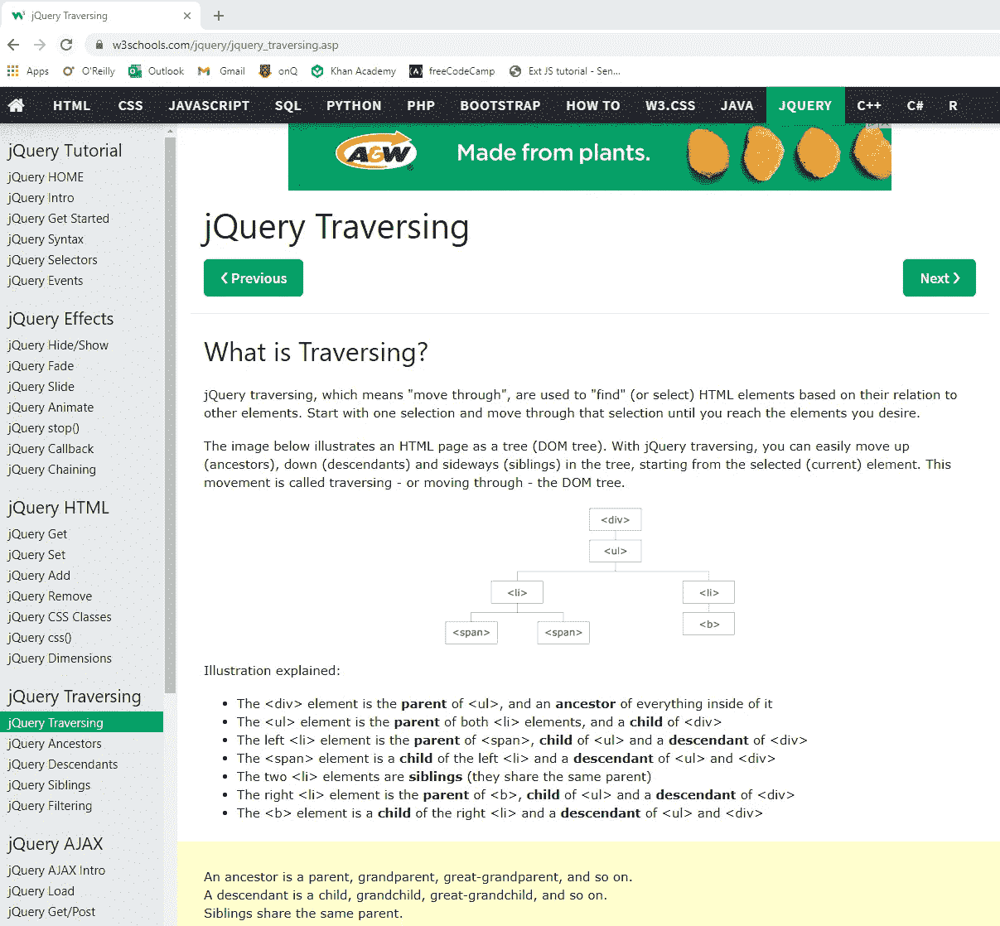

# 学习 jQuery:练习、获得反馈、修改

> 原文：<https://medium.com/codex/learning-jquery-practice-get-feedback-revise-205df92ee781?source=collection_archive---------22----------------------->

最初的监控过程为“实践、获得反馈、修改”阶段

我正在进行学习 jQuery 的调查过程，并想分享我对“练习、获得反馈、修改”阶段的看法。

提醒一下，我想达到的最终目标是:

> 到本课程结束时(8 月 20 日)，我将能够在我为国防创建的 web 应用程序中使用 Javascript 编程语言的 jQuery 库，以取代我目前使用的 jQuery 的 DOM 方法。

我的调查过程的这一阶段由 6 个较小的目标组成，这些目标将有助于我实现学习 jQuery 的总体目标。我的两个目标集中在创建一个实践项目上；两个设置为接收专家(我的经理或同事)对我的代码的反馈；两个阶段用于基于反馈的修改。

**目标 4:创建一个操作 DOM 元素的实践项目(一个 web 页面)。这个项目应该使用 jQuery 来添加、删除和移动 DOM 中的元素**

*预计完工日期:8 月 4 日*

*实际完工日期:8 月 2 日*

正如我在上一篇博文中所讨论的，我已经通过阅读、视频和练习题建立了关于如何使用 jQuery 的坚实知识基础。有了这些丰富的信息，我决定用一周前学到的概念创建一个自己的实践项目。起初，我花了一点时间来适应在没有简报的情况下规划自己的项目。我最终和我的同事聊了一会儿，得到了一些想法。我们决定最好先创建一个带有各种标签(包括标题、文本和图像)的 HTML 网页，以便使用 jQuery 进行操作。因为我有相当多的 HTML 知识，所以做起来真的很快。然后，我创建了一个 Javascript 文件，使用 jQuery 操纵 HTML 页面的不同元素。

反思之后，我觉得我没有创建一个太有挑战性的项目。在这一点上，我失去了一点动力，正在努力从头开始做每一件事，所以我保持我的练习项目相当简单。我意识到了这种中期发展，我很高兴我很快意识到了这一点，这样我就可以采取行动了。

**目标 5:请求经理或同事的反馈，以查看实践项目是否合理、完整，以及是否正确实现了 jQuery**

预计完工日期:8 月 4 日

*实际完工日期:8 月 3 日*

[https://www.w3schools.com/jquery/jquery_traversing.asp](https://www.w3schools.com/jquery/jquery_traversing.asp)

为了克服缺乏动力的问题，当我的项目正在进行的时候，我停止了最后一个目标(考虑到它的简单性，这并不太难)，并决定向我的经理寻求建议。我的经理给了我一些很棒的建议，解释说软件开发人员不应该觉得有必要从头开始记忆一种编码语言，因为互联网总是在我们的指尖。他建议我在编写代码时在一个单独的标签页上打开[w3schools.com](http://w3schools.com),因为它有很棒的所有 web 开发(包括 jQuery)的快速参考教程。他还建议了一些我可以尝试实现的 jQuery 命令，以使我最初的实践项目更加复杂，比如使用父方法来遍历 DOM 树。

我决定提前考虑一下，也问问他我想对目标 7 的练习项目做些什么更新。他告诉我，因为这是一个有趣的个人学习项目，所以我不应该害怕实现大量的动画(比如鼠标点击时改变颜色，让图像在页面上跳动等等。)来查看有哪些功能可用。从那里，我可以实现更真实的动作，比如在页面上打印文本作为对鼠标点击或按键的反应。

**目标 6:根据反馈修改实践项目，以确保 jQuery 被正确实现**

*预计完工日期:8 月 5 日*

*实际完工日期:8 月 4 日*

在和我的经理谈过之后，我觉得回到编码工作上舒服多了。修改很容易，因为我听从了他的建议，在必要时使用互联网。我还在我们的会议上做了笔记，以确保我没有错过任何东西。当我的经理经过我的办公桌时，我很快给他看了我的更新，他确认这个项目看起来好多了。获得积极的反馈并从以前的错误/经历中吸取教训是我继续前进的动力。知道下一个目标将允许更多的创造力让我兴奋不已。

**激励和奖励:自发的突破**

在目标 6 和 7 之间，我决定休息一天，度过一个漫长的周末。自从 6 月份开始这份工作以来，我从未休过一天假。事实上，我几乎没有休学(从本科毕业到硕士开始，我只有 2 个月的假期)。我为自己完成的所有工作感到自豪，并选择休假一天以示认可。当我们在大学时，我遇到了一个在疫情之前就没见过的朋友，我们去了一个当地的葡萄园，喝了酒，吃了披萨！美食和好朋友总能提振我的情绪，所以周一回到工作岗位时，我感觉神清气爽。我也提前完成了我的调查项目，所以我不觉得有必要修改我对每个近期目标的预期完成日期。

**目标 7:更新实践项目以包括 jQuery 事件和动画的使用，以便网页对鼠标点击或击键做出反应**

*预计完工日期:8 月 9 日*

*实际完工日期:8 月 9 日*

我经常在工作时做的便利贴待办事项清单(有很多朋友贴纸)

短暂休息后回到工作岗位，我想感觉自己能更好地控制自己的时间表。工作之外，我非常有条理地安排自己的时间，总是把事情写下来，更新我的日历。然而，随着新工作的开始，我不得不不断学习新的东西，这通常意味着我一天要承担多个新的职责。我的工作时间表相当灵活；我参加的会议不多，我负责自我调节如何支配时间。我决定借鉴那些对我个人和学术都有用的想法，所以我开始做一个每日必做清单。我总是发现核对清单上的事情，并在一天结束时反思它，看看我的一天有多有成效，这是一种激励。除了必须完成的实际任务，我还增加了一些事情，比如简单地参加一个会议。我还估算了每项任务所需的时间，这样我就能合理地安排当天的时间。如果我没有完成整个清单，我不会在一天结束时责备自己，但我喜欢便利贴给我的责任感和组织时间的能力。

至于这个实际的目标，这是一个很大的乐趣！起初，我疯狂地玩着每一个可能的动画，以至于元素在网页上褪色、跳动、闪烁和脱落。然后，我尝试了一种更严肃的方法，实现了当鼠标点击或击键发生时操纵元素的事件。我没有删除“好玩”的代码；我将其注释掉，使其处于非活动状态，但仍存在于我的代码中以供查看。

**目标 8:请求经理或同事的反馈，看看实践项目是否合理、完整，以及是否正确实现了 jQuery**

*预计完工日期:8 月 10 日*

*实际完工日期:8 月 10 日*

我本打算在完成项目后只从与我一起工作的专家那里获得反馈，尽管我承认在我附近工作的同事看到了我屏幕上的疯狂动画，并过来调查我在做什么！对于我的正式反馈，我在一次团队会议上进行了讨论，会上我展示了我的代码和我的最终项目。我的同事对我学习 jQuery 的速度给予了很多赞扬和积极的反馈，这真的激励了我。后来，我和我的经理开了一个简短的一对一的会议，深入审查我的代码。他找不到任何需要改进的地方，说我的项目照现在这样很好。

我们确实谈到了我在调查过程中的一些未来目标，但我会把它留到下一篇博文中。

**目标 9:根据反馈修改实践项目，以确保 jQuery 被正确实现。**

*预计完工日期:8 月 10 日*

*实际完工日期:8 月 10 日*

如上所述，根据我的经理的意见，我的代码没有任何地方需要修改，所以这个目标很快就达到了。我确实花了 30 分钟给我的代码添加注释，以防我将来引用它，并需要复习某些代码部分做了什么。

回想起来，这一阶段的调查过程有高潮也有低谷，大多与动机有关。我想这是因为它处于中间阶段，还看不到结尾，内容对我来说还很新。在我的学习过程中，我非常感谢我的经理和同事的支持。作为一个职业生涯早期还有很多东西要学的人，这让我很欣赏我工作的环境和团队。我也很高兴我找到了时间管理挑战的解决方案。在上一篇博文中，我提到完成 jQuery 课程的进度条是我动力的来源，我相信便笺待办事项列表也是如此。最后，我仍然从休假中感到精力充沛，并且更好地理解了如何利用休息和奖励来保持我的士气和动力。

我在最后冲刺阶段，期待看到这个进球结束！