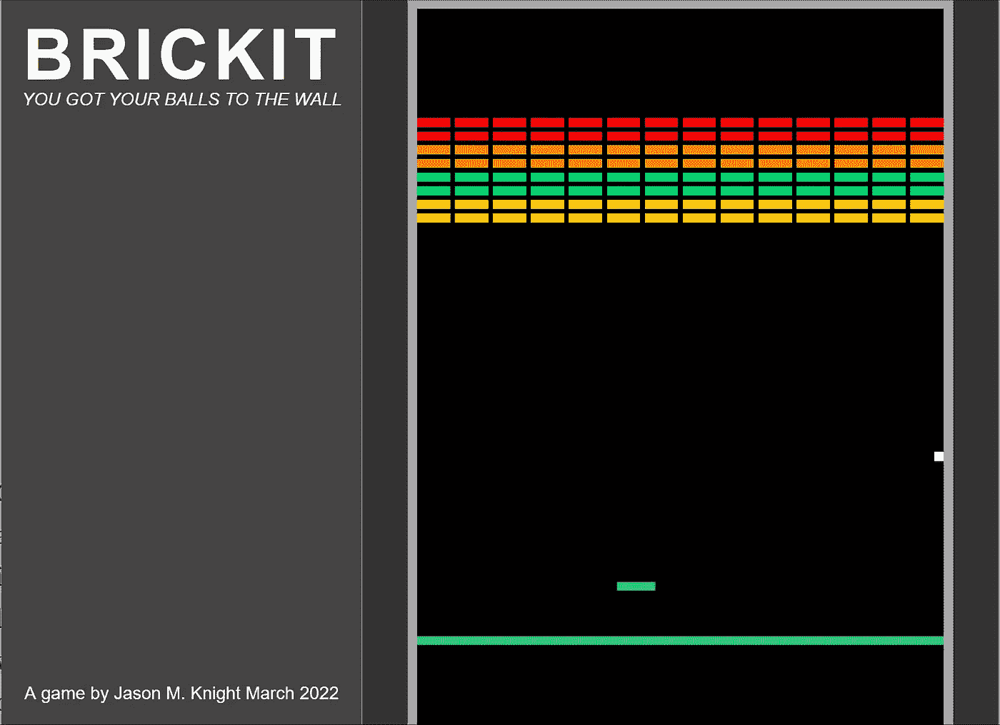

# 学习 JS 模块和类第 4 部分:重构，清理，弹力球，时间缩放。

> 原文：<https://medium.com/codex/learning-js-modules-classes-part-4-refactoring-cleanup-bouncy-balls-time-scaling-466945ad8784?source=collection_archive---------1----------------------->

[上一次](/p/a1c29b9b8046)我们启动并运行了画布，并在适当的位置设置了游戏场代码。在我进入有实际逻辑的东西之前，我喜欢仔细检查并重构代码，以便最好地“解决”任何相关的问题。

因此，这篇文章的前半部分感觉像是第 2 部分和第 3 部分的重复，但是…