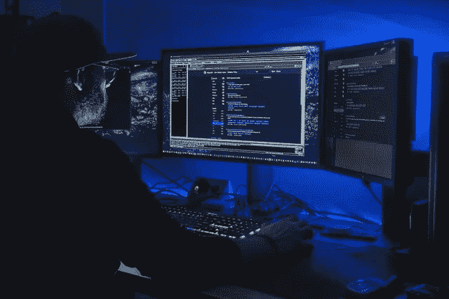

# 了解有关 DLL 劫持的更多信息

> 原文：<https://medium.com/codex/learning-more-about-dll-hijacking-f4022102ca1d?source=collection_archive---------6----------------------->

照片由 [Unsplash](https://unsplash.com/@stillnes_in_motion?utm_source=unsplash&utm_medium=referral&utm_content=creditCopyText) 上的[静止不动](https://unsplash.com/@stillnes_in_motion?utm_source=unsplash&utm_medium=referral&utm_content=creditCopyText)

**简介**

想象一下这样一个场景，您的组织成为大数据泄露的受害者，需要您关闭网络几个小时。如果您认为攻击者已经从您的网络中脱离出来，您可以更改防火墙规则并配置入侵检测和防御系统，以防止攻击者再次进入您的网络。然而，这是真的吗？是真的吗…