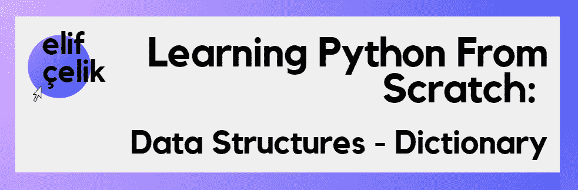

# 从头开始学习 Python:数据结构—字典

> 原文：<https://medium.com/codex/learning-python-from-scratch-data-structures-dictionary-bd5d0c72725c?source=collection_archive---------2----------------------->

大家好！我是 Sisterslab 的女性科技学院项目参与者之一，得到了[Toplum GNU llu leri vakf](https://www.tog.org.tr/en/)的支持。该项目旨在通过为期 3 个月的软件培训增强 25 名年龄在 20-28 岁之间的妇女的能力，并寻求她们加入该部门的劳动力队伍。你可以通过这个链接找到更多关于这个项目的信息:【https://sisterslab.co/women-in-tech-academy/ 

在这个中型文章系列中，我将尝试从头开始介绍 python。在今天的文章中，我将解释 Python 中的一种数据结构，字典。可以从我的中号账号查看其他数据结构或者 python 文章！

照片由[罗曼·辛克维奇·🇺🇦](https://unsplash.com/@synkevych?utm_source=medium&utm_medium=referral)在 [Unsplash](https://unsplash.com?utm_source=medium&utm_medium=referral) 拍摄

> **字典**

我们已经在我的 medium 系列之前的数据结构章节中讨论过[列表](https://elifcelik.medium.com/learning-python-from-scratch-data-structures-lists-ec20c3f83876)、[元组](https://elifcelik.medium.com/learning-python-from-scratch-data-structures-tuples-66079c95687c)和[集合](https://elifcelik.medium.com/learning-python-from-scratch-data-structures-set-947c0b98f82)。现在是时候学习字典了，这是 python 中的另一种数据结构。与 python 中的其他数据结构相比，字典具有更复杂的结构。但是我们可以把这种数据结构看作某种字典，正如它的名字所表示的那样。由于所有字典都包含单词及其相应的解释，python 中的字典由键及其相应的值组成。因此，在这种数据结构中，信息存储为键值对。所以让我们来看看字典的其他属性。

*   字典是无序的，所以我们无法访问条目的索引。
*   我们只能通过它们的唯一键来访问值。
*   字典是可以改变的，所以它们是可变的。它允许插入和减去操作。同样，我们可以改变键值。
*   我们可以用花括号{}来定义。键值对由逗号分隔。
*   可能包含不同的数据类型。
*   键值可以是唯一的，但值可以是重复的。

## **创建词典**

创建字典有两种方法，它们是:

*   **{} - >** 在键值对之间使用冒号(:)，在每对之间使用逗号(，)
*   **dict()**

在创建字典时，我们不必编写所有的键值对或相同类型的所有键值。也就是说，字典可以同时包含字符串和整数值，如下面的代码示例所示。

或者我们可以在值部分保留一个列表。

> **Dict()**

另一个定义是使用 dict()方法创建字典。您可以轻松地将想要定义的字典添加到方法中，如下例所示。

## 空字典

而如果要定义一个空字典，用花括号定义就行了！

## 访问字典中的值

有两种方法可以访问字典中的值，它们是:

*   **【钥匙】**
*   **获取(键)**

> **【钥匙】**

如果您想访问这些值，只需键入字典的名称，并将键值写在方括号中。

> **获取(键)**

您也可以通过使用 get 方法来访问这些值，就在字典后面加上一个点，并在 get 方法中写入您想要知道其值的唯一键！

## 访问字典中的所有键或值

我们学习了如何通过使用上面的键来访问某些值，但是如果你想同时访问一个字典中的所有键值，你需要像下面的例子一样使用它们的方法。

> **访问键**

要访问字典中的所有键，您需要做的就是使用**keys()**方法。

> **访问数值**

而对于字典中的值，可以使用 **values()** 方法。

> **词典中的条目**

或者您可以使用 **items()** 方法显示所有项目。

## 使用循环访问字典中的项目

您可能还想在操作的循环中访问键、项或值。这样做其实真的很简单。我们在 for 循环中使用 key、values 或 items 方法来遍历它们，如下所示。

## 字典的长度

要求一个字典的长度，在 **len()** 函数内部写字典名就足够了。

## 将项目添加到词典

要向字典添加条目，应该在代码中将新条目定义为**dictionary _ name[key]= value**。

## 改变价值观

如果你想改变一个键的值，只需像定义一个新项一样定义新值，如下例所示。

## 更新项目

要更新字典，您需要在 **update()** 方法中定义想要添加的值作为子字典。

## 删除操作

我们可以在字典上使用许多删除操作:

*   **删除键**
*   **清除()**
*   **del dict_name**
*   **流行(键)**
*   **popitem()**

> D **el 键**

该方法获取字典中的一个键值，并从字典中删除该项。

> **清除()**

clear 方法删除整个字典中的所有元素。但不删除字典。因此，当您稍后尝试访问字典时，它不会给出错误。

> **Del dict_name**

这个方法会立即删除整个字典。与 clear 方法不同，当您以后想要使用字典名时，它会给出一个错误。

> **pop(键)**

而 **pop(key)** 方法获取一个键值，并从字典中删除对应于该键值的条目。

> **popitem()**

从字典中删除最后一项。当你用一个空列表尝试时，它会出错。

## 合并两本词典

有两种方法可以合并字典:

*   **更新()**
*   **使用****

> U **pdate()**

您可以通过在 update 方法中添加另一个字典名称来合并这两个字典。因此，您在方法中编写的字典被添加到第一个字典之后。

> **使用****

您也可以合并两个或多个字典，如下例所示。

## 复制字典

我们可以用各种方式复制字典:

*   **=操作员**
*   **复制()**
*   **dict()**

> **=操作员**

如果我们使用等号(=)运算符，新字典将显示旧字典的确切内存位置。因此，我们所做的每一个改变都会影响另一个字典。

> **复制()**

如果我们想创建一个新的字典，它的位置与内存中的旧字典不同，我们需要使用 copy 方法。

> **字典()**

我们还可以使用 **dict()** 方法创建一个字典副本。

## 整理

**sorted()** 方法用于对字典进行排序。但是为了能够排序，整个字典必须由相同类型的键值对组成。

例如，下面的代码给出了一个错误，因为它需要是相同的类型才能排序。

我们已经到了另一篇媒体文章的结尾！我希望你喜欢它。你也可以从[这里](/@elifcelik)查看我的其他关于 Python 的文章。

[**还有，别忘了关注我和我的其他社交媒体账号。**](https://linktr.ee/Elifcelik)

你可以在这里找到我在文章中用到的所有资源！

**来源:**

[极客对极客 Python 数据结构](https://www.geeksforgeeks.org/python-data-structures/)

[教育巨蟒从零开始](https://www.educative.io/courses/learn-python-3-from-scratch)

[Python 中的字典](https://www.programiz.com/python-programming/dictionary)