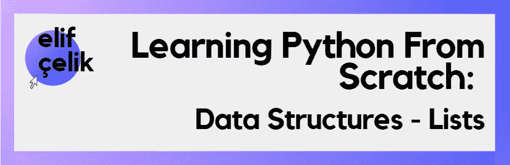

# 从头开始学习 Python:数据结构—列表

> 原文：<https://medium.com/codex/learning-python-from-scratch-data-structures-lists-ec20c3f83876?source=collection_archive---------26----------------------->

大家好，我是 Elif！我是 Sisterslab 的女性科技学院项目参与者之一，得到了 Toplum GNU llüleri vakf 的支持。该项目旨在通过为期 3 个月的软件培训增强 25 名年龄在 20-28 岁之间的妇女的能力，并寻求她们加入该部门的劳动力队伍。你可以通过这个链接找到更多关于这个项目的信息:【https://sisterslab.co/women-in-tech-academy/ 

在这个中型文章系列中，我将尝试从头开始介绍 python。是时候学习编程语言最重要的部分之一了:数据结构。在这一部分，我将解释列表。你可以从我的媒体账户查看其他文章！

由[在](https://unsplash.com/@clemhlrdt?utm_source=medium&utm_medium=referral) [Unsplash](https://unsplash.com?utm_source=medium&utm_medium=referral) 上拍摄的克莱门特·赫拉尔多

> 列表

列表可能是 Python 中最常用的数据结构。因此，知道如何以及在哪里使用它是很重要的。让我们从学习列表的结构和属性开始。

*   您可以通过索引来访问列表中的元素。这使得列表成为有序的数据结构。
*   列表是可变的，所以你可以改变它们的元素。
*   列表在方括号中定义。和列表元素用逗号分隔。
*   列表可以存储不同类型的数据。(字符串、整数、浮点、列表等。)
*   它们可以有两个值相同的项目，因此可能有重复的数据。

## **如何创建列表**

实际上，创建列表相当容易。您需要做的是给出一个列表名称，并用方括号定义该列表。像下面所有的例子一样，

正如我之前指定的列表属性，列表的元素可以通过索引来访问。但是索引必须是整数类型。但是我们不要忘记，我们从零开始计数元素，就像我们在计算机世界中从零开始计数一样。

## **切片**

如果你想获得给定列表的一部分，那么你可以使用切片。你也可以用很多方法分割列表。这样，您可以将列表的任何部分分配给另一个列表或打印它。您可以通过给出开始和结束索引来分割列表，如下例所示。

## 遍历列表

还可以循环遍历列表中的元素。例如，让我们看看下面的代码。把一个列表的元素按顺序打印出来不是很容易吗！

## **向列表添加元素**

*   **追加**

可以用不同的方式向列表中添加元素。第一个是 append 方法。当使用 append 方法向列表中添加元素时，新元素将被添加到列表的末尾。

*   **插入**

方法将元素添加到列表中的所需位置。它需要两个参数，因为列表将被移动。其中一个是它会到哪个位置，另一个是它会取什么值。

*   **延长**

extend 方法允许在列表末尾进行多次添加。

## 从列表中删除元素

*   **移除**

remove 方法将待删除的元素作为参数，并删除它找到的第一个元素。

*   **砰然一声**

Pop 用于删除给定索引中的元素。

*   **德尔**

使用 Del 方法，我们删除一定范围内的元素。

*   **清除**

使用 Clear，您可以删除列表中的所有元素。它返回一个空列表。

## 在列表中查找元素

*   **索引**

如果我们想从列表中找到一个元素，我们使用索引方法。我们可以使用这种方法，在列表后面加一个句点，然后键入我们要寻找的元素。那么这个方法将返回元素的索引。

## **复制列表**

可以通过两种方式复制列表:

*   **=(等号运算符)**

使用 equal 运算符，您可以将一个列表复制到另一个列表。但是你应该小心这一个，因为以这种方式复制一个列表并不是创建一个新的列表。您复制的列表将显示列表所在的内存区域。由于这个原因，你在新列表或旧列表上的每一个动作都会反映在对方的列表上。

*   **复制方法**

与等号运算符不同，copy 方法会在内存中创建一个新列表。

## **嵌套列表**

我之前提到过，我们可以在本文开始时将偶数列表存储在一个列表中。这里有一个例子:

在这篇文章中，我尽可能地描述了这些列表。我希望你喜欢它。我的其他文章再见！

如果你喜欢这篇文章并想看更多，别忘了关注我和我的其他社交媒体账号。

你可以在这里找到我在文章中用到的所有资源！

***来源:***

[极客为极客 Python 数据结构](https://www.geeksforgeeks.org/python-data-structures/)

[教育巨蟒从零开始](https://www.educative.io/courses/learn-python-3-from-scratch)