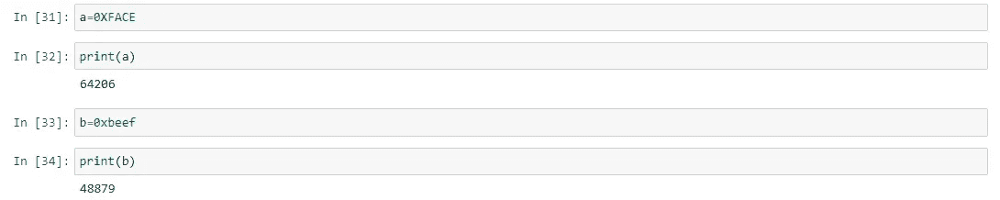
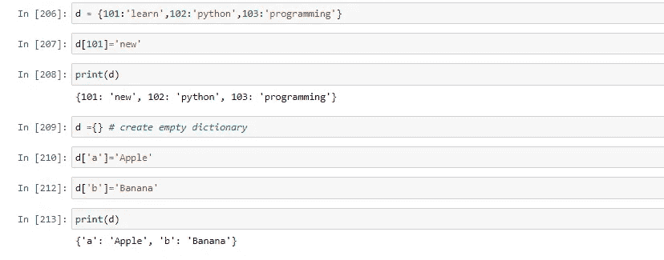
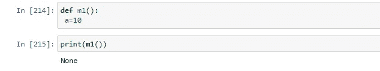

# 学习 Python 编程:语言基础-II

> 原文：<https://medium.com/codex/learning-python-programming-language-fundamentals-ii-f403f64d3c25?source=collection_archive---------7----------------------->

在我们之前的博客中，我们已经讨论了“为什么建议初学者使用 Python”和“Python 的特点和风格是什么”

**现在，是时候开始一点实践经验了**

Python 语言的基础包括:

*   标识符
*   保留字
*   数据类型
*   铅字铸造

# 标识符

python 程序中用于标识类、函数、模块或变量的名称称为标识符

# 在 Python 中定义标识符的规则:

*   python 中唯一允许的标识符字符是**字母符号(小写或大写)、数字(0 到 9)、下划线符号(_)**
*   错误的是，如果我们使用任何其他符号，比如$那么我们将会得到一个语法错误。

-> Short = 20(有效)

-> $hort = 30(无效)

*   标识符不应以数字开头

-> 123number = 123(无效)

->数字 123 = 123(有效)

*   python 中的标识符区分大小写

->苹果= 9

->苹果= 99

# 我们不能使用保留字作为标识符

# 以下哪些是有效的 Python 标识符？

1.  公元前 123 年
2.  abc123
3.  python2learn
4.  现金
5.  *_ 你好*
6.  如果
7.  极好的

请执行上面的变量，给它赋值，增强你的知识。

# 在 Python 中，一些单词被保留来表示某种意义或功能。这些保留字称为关键字

# Python 中有 35 个保留字

*   真、假、无
*   和，或者，不是
*   if，elif，else
*   while，for，break，continue，return，in，yield，async，await
*   尝试，除了，最后，提高，断言
*   导入，从，作为，类，定义，传递，全局，非局部，λ，del，with

# 注意:

1.  python 中的所有保留字只包含字母符号
2.  除了以下 3 个保留字，所有都只包含小写字母符号

*   真实的
*   错误的
*   没有人

-> a=真(无效)

-> A=真(有效)

# 通过代码查看 python 中有哪些关键词？

# 数据类型

数据类型表示变量中存在的数据类型。在 Python 中，我们不需要显式指定类型。根据提供的值，将自动分配类型。因此，Python 是动态类型语言。

# Python 包含以下内置数据类型

1.  （同 Internationalorganizations）国际组织
2.  浮动
3.  复杂的
4.  弯曲件
5.  潜艇用热中子反应堆（submarine thermal reactor 的缩写）
6.  字节
7.  Bytearray
8.  范围
9.  目录
10.  元组
11.  一组
12.  Frozenset
13.  词典
14.  没有人

# python 中的一切都是对象

# Python 包含几个内置函数

*   type():检查变量的类型。
*   id():获取对象的地址
*   print():打印值

# int 数据类型:

int 数据类型用于表示整数(整数值)

*   a =10
*   类型(a)

# 我们可以用以下方式表示 int 值:

*   十进制形式
*   二元形式
*   八进制形式
*   六进制形式

# 十进制形式(以 10 为基数) :

*   这是 Python 中默认的数字系统
*   允许的数字是:0 到 9
*   例如:a = 10

# 二进制形式(基数为 2):

*   允许的数字是:0 和 1
*   文字值应该以 0b 或 0B 为前缀
*   示例:
*   a = 0B1111
*   b = 0B11
*   c = 0b111

# 八进制形式(八进制):

*   允许的数字是:0 到 7
*   文字值应该以 0o 或 0O 为前缀

# 六进制形式(以 16 为基数):

*   允许的数字是 0–9，a-f(小写和大写都允许)
*   文字值应该以 0x 或 0X 为前缀

作为一名程序员，我们可以指定十进制，二进制，八进制和十六进制形式的文字值，但 PVM (Python 虚拟机)将始终只提供十进制形式的值。

# 基本转换

*   bin():我们可以使用 bin()将任何基数转换成二进制数
*   oct():我们可以使用 oct()将任意进制转换成八进制
*   hex():我们可以使用 hex()将任意基数转换成十六进制数

# 浮点数据类型:

我们可以使用 float 数据类型来表示浮点值(十进制值)

示例:

*   f = 1.725
*   类型(f)

# 我们也可以用指数形式(科学记数法)来表示浮点值

示例:

*   g = 1.2e3
*   h = 1.2E3

指数形式的主要优点是我们可以在更少的内存中表示更大的值。

# 注意:

我们可以用十进制、二进制、八进制和六进制来表示 int 值。但是我们不能只用十进制形式来表示浮点值。

# 复杂数据类型:

*   复数的形式是:a + ij 其中 j 2 = -1
*   “a”和“b”包含整数或浮点值
*   例如:a = 3 + 5j

# 注意:

*   在复数数据类型的实部中，如果我们使用 int 值，那么我们可以通过十进制、八进制、二进制或六进制的形式来指定它
*   但是虚部应该用十进制形式来表示

# 甚至我们可以对复杂类型的变量执行操作

# 注意:复杂数据类型有一些内置属性来检索实部和虚部

*   c = 13.5+3.6j
*   c.real -> 13.5
*   c.imag -> 3.6

# 我们通常可以在科学应用和电子工程应用中使用复杂类型。

# 布尔数据类型:

*   我们可以使用这种数据类型来表示布尔值。
*   此数据类型的唯一允许值是:True 和 False。
*   在 Python 内部，True 表示为 1，False 表示为 0

# 字符串数据类型

*   Str 表示字符串数据类型
*   字符串是用单引号或双引号括起来的字符序列
*   s = '花'
*   s = "花"
*   通过使用单引号或双引号，我们不能表示多行字符串文字。对于这个要求，我们应该使用三重单引号(' ')或三重引号(" ")
*   语法:name[开始:停止:步骤]

# 字符串切片:

*   切片的意思是一块
*   []运算符用于切片(检索字符串的某一部分)
*   在 python 字符串中，跟随从零开始的索引
*   该指数可以是正数(+ ve)或负数(- ve)
*   正(+ ve)索引表示从左向右的前进方向
*   负(- ve)索引表示从右向左的向后方向

# 在 Python 中，下面提到的数据类型被认为是基本数据类型

*   （同 Internationalorganizations）国际组织
*   漂浮物
*   复杂的
*   弯曲件
*   潜艇用热中子反应堆（submarine thermal reactor 的缩写）

# 铅字铸造

*   我们可以将一种类型的值转换成另一种类型。这种转换称为类型转换。
*   下面是类型转换的各种内置函数

1.  int()
2.  浮动()
3.  复杂()
4.  布尔()
5.  str()

# int():我们可以使用这个函数将其他类型的值转换为 int。

# 注意:

1.  我们可以从任何类型转换成 int 类型，除了复杂类型。
2.  如果我们要将 str 类型转换为 int 类型，compulsary str 应该只包含整数值，并且应该用 base-10 指定。

# Float():我们可以使用 float()函数将其他类型值转换为 float 类型。

# 注意:

1.  除了复杂类型，我们可以将任何类型的值转换为浮点类型。
2.  每当我们试图将 str 类型转换为 float 类型时，强制 str 应该是整数或浮点文字，并且应该只在 base-10 中指定。

# 复杂():

*   我们可以使用 complex()函数将其他类型转换为复杂类型。
*   表格 1:复杂(x)
*   我们可以用这个函数把 x 转换成实部为 x，虚部为 0 的复数

# 形式 2:复数(x，y)

*   我们可以用这个方法把 x 和 y 转换成复数，这样 x 就是实部，y 就是虚部。

# Bool():我们可以使用这个函数将其他类型的值转换为 bool 类型

# 注意:

*   如果 x 是 int 数据类型，0 表示假，非零表示真
*   如果 x 是浮点数据类型，当总值为零时，结果为假，否则结果为真
*   如果 x 是复杂数据类型，当实部和虚部为零时，则结果为假，否则为真
*   如果 x 是 str 数据类型，当 x 是空字符串时，则结果为假，否则结果为真

# str():我们可以使用这个方法将其他类型的值转换为 str 类型

# bytes: byte 数据类型表示一组字节数，就像数组一样

# 注意:

*   字节数据类型的唯一允许值是 0 到 256。如果我们试图错误地提供任何其他值，那么我们将得到值错误。
*   一旦我们创建了字节类型值，我们就不能改变它的值，否则我们会得到一个类型错误

# bytearray 数据类型:bytearray 与 bytes 数据类型完全相同，只是它的元素可以修改

# 列表数据类型:

*   如果我们希望将一组值表示为单个实体，其中需要保留插入顺序并允许重复，那么我们应该使用列表数据类型。
*   保留插入顺序
*   允许异类对象
*   允许重复
*   自然生长的
*   值应该用方括号括起来

# 列表在本质上是可增长的，根据我们的要求，我们可以增加或减少大小

# 有序的、可变的、异质的元素集合只不过是列表，其中也允许重复

# 元组数据类型:

*   元组数据类型与列表数据类型完全相同，除了它是不可变的，即我们不能改变值
*   元组元素可以用括号中的表示

# 元组是列表的只读版本

# 范围数据类型:

*   范围数据类型代表一系列数字
*   不能修改范围数据类型中存在的元素，即数据类型是不可变的

# 我们可以通过使用 index 来访问 range 数据类型中的元素

# 我们不能修改范围数据类型的值

# 集合数据类型:如果我们想要表示一组没有重复的值，顺序并不重要，那么我们应该选择集合数据类型。

*   不保留插入顺序
*   不允许重复
*   允许异类对象
*   指数概念不适用
*   它是可变的集合
*   自然生长的

# 集合在本质上是可增长的，根据我们的要求，我们可以增加或减少大小。

# frozenset 数据类型:

*   除了不可变之外，它与 set 完全相同。
*   因此，我们不能使用添加或删除功能。

# 字典数据类型:

*   如果我们想将一组值表示为键值对，那么我们应该选择 dict 数据类型。
*   例如:d = {101:'学习'，102:'python '，103:'编程' }
*   不允许重复键，但值可以重复。如果我们试图插入具有重复关键字的条目，那么旧值将被新值替换。

# 注意:字典是可变的，顺序不会被保留

# 注意:通常我们可以使用 bytes 和 bytearray 数据类型来表示二进制信息，如图像、视频文件等

# 无数据类型:

*   无表示没有关联或没有关联值。
*   如果该值不可用，则处理这种类型的情况没有介绍。
*   它类似于 Java 中的空值。

Jupyter 笔记本上传到 Github 上。请参考以下链接登录 Github

Github 简介:[https://github . com/mrmanishbatra/Python _ for _ data science/tree/main/Python](https://github.com/mrmanishbatra/Python_for_datascience/tree/main/Python)