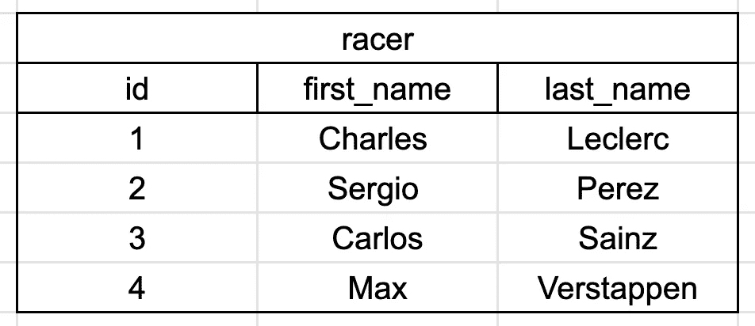
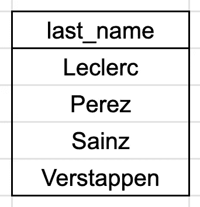
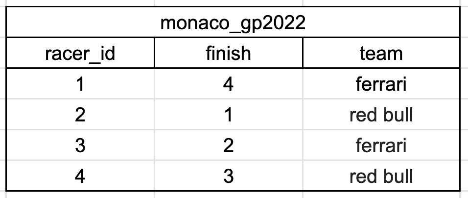
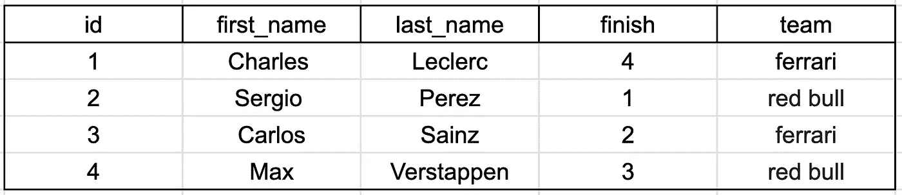
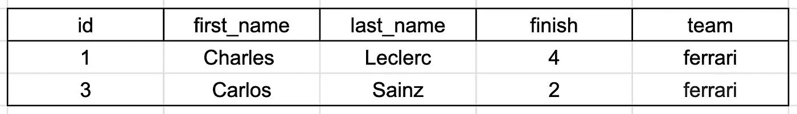
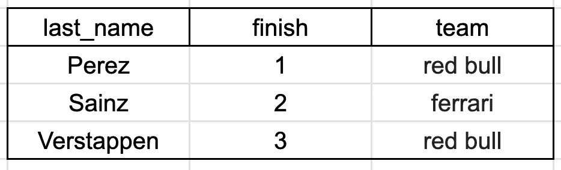

# 在 10 分钟内学会 SQL 的基础知识

> 原文：<https://medium.com/codex/learning-the-basics-of-sql-in-10-min-3bb810c813df?source=collection_archive---------13----------------------->

## SQL 快速入门和运行指南


Anthony DELANOIX 在 [Unsplash](https://unsplash.com?utm_source=medium&utm_medium=referral) 上拍摄的照片

T 他的小指南是建立在这样一个理念之上的，即学习事物的最佳方式是通过快速解决你力所不及的难题。你需要努力找到并记住那块丢失的拼图。

所以，让我们用这种方法来学习 SQL。我们将把它分成三部分。

1.  简单介绍一下 SQL(10 分钟)，
2.  在哪里可以找到可以在浏览器中解决的自由练习问题，
3.  一些卡壳时的参考。

一旦我们完成了这些步骤，你将会希望在问题和其他资源之间不断循环，当你被更难的问题难住时，搜索更难的命令。


照片由 [Jp Valery](https://unsplash.com/@jpvalery?utm_source=medium&utm_medium=referral) 在 [Unsplash](https://unsplash.com?utm_source=medium&utm_medium=referral) 上拍摄

# 1.结构化查询语言简介

SQL 是一组命令，允许您从一种称为关系数据库的特殊数据库中提取数据。关系数据库存储许多表，这些表通常通过一个键相互关联。每列可以存储不同类型的值，如文本字符串、数字或布尔值(真/假)。

SQL 命令是以句子格式编写的。与表格交互有四个主要命令。

*   选择—从表格中提取特定内容
*   插入—向表格中添加内容，如列
*   更新—编辑表格中的内容
*   删除—删除表格中的内容

## 挑选

在这些命令中，SELECT 是最重要的；它让你从数据库中调用数据。假设我们有一个名为 *racer 的表，其中*有三列。



一个名为 racer 的表，有 3 列:id、first_name 和 last_name。

要从表 *racer* 中只输出列 *last_name* 的值，我们可以键入:

```
*SELECT last_name
FROM racer;*
```

请注意，这些命令全部用大写字母书写，并且句子以分号结尾。该命令将为我们提供:



racer 表中的姓氏列。

## 明星*

*符号在 SQL 中非常重要，基本上就是“付出一切”的意思。所以声明

```
SELECT *
FROM racer;
```

将返回一个包含 *racer* 中所有列的所有值的表。


“*”字符从表 racer 中选择所有列。

但是使用*符号并不总是非常“干净”,相反，指定列通常更好，以防新的列和数据被添加到表中。但是在处理较长的查询时，它会很有帮助，这样您就可以跟踪您正在处理的内容。说到干净…

## 清理干净

在 SQL 中，每个人都同意，当您将语句写成:

```
SELECT **r.**last_name
FROM racer **r**;
```

注意我在两个不同的地方添加了一个 **r** 。这基本上就是告诉计算机“嘿， **r** 和 *racer* 是一回事，所以 **r.last_name** 明确表示 *last_name* 在 *racer* 中。当我们处理来自多个不同表的多个列时，这有助于我们跟踪以后的事情。

## 加入

但这是一个关系数据库，对吗？我们把这张桌子和什么联系起来？

好吧，假设我们的数据库中有另一个名为 *monaco_gp2022* 的表。



表 monaco_gp2022，包含列、racer_id、终点和车队。

由于这个表和我们的 *racer* 表都有一个 racer id 列，我们可以将这两个表合并成一个。

```
SELECT *
FROM racer r
JOIN monaco_gp2022 m
ON r.id = m.racer_id;
```

ON 命令允许我们指定我们希望事物排列的位置。该命令将为我们提供下表:



我们的新组合桌。

## 对哪里挑剔

我们的表格很大，可以说我们只想要法拉利车队中的车手的信息。我们将添加一个 WHERE 命令

```
SELECT *
FROM racer r
JOIN monaco_gp2022 m
ON r.id = m.racer_id
WHERE m.team = 'ferrari';
```



使用 WHERE 命令减少答案。

## 把所有的放在一起

好的，对于最后一个例子，在看表之前先看一下代码。你能想出会出现什么样的桌子吗？

```
SELECT r.last_name, m.finish, m.team
FROM racer r
JOIN monaco_gp2022 m
ON r.id = m.racer_id
WHERE finish < 4
ORDER BY m.finish DESC;
```


Maxim Stuij 在 [Unsplash](https://unsplash.com?utm_source=medium&utm_medium=referral) 上拍摄的照片



此处，表格按完成时间列降序排序。另外，请注意，我们只选择了 3 列，并且我们只要求前三名参赛者。

# 2.练习题

现在是有趣的部分——练习问题的时候了！我建议在进入教科书或完整的在线课程之前做 4 或 5 个问题——这样你就会对事情如何运作有所了解。

最快的开始方式是通过一个类似于 [strata](https://platform.stratascratch.com/coding?code_type=1) 的网站，它可以让你建立一个免费账户，立即开始做问题。按**自由题**、难度等级**易**、语言**PostgreSQL**(SQL 的一种风味)进行筛选。

这个帖子里的信息应该足够解决问题**亚马逊:订单详情**。对于**亚马逊:客户详细信息**，您需要在 WHERE 语句中添加一个 or。接下来试试 **Forbes:找到最赚钱的公司**(提示:你需要查找 LIMIT 命令)和**Spotify:Times on the Ranking List**(提示:你需要 COUNT()和 GROUP BY)。

**其他易发问题提示**

万一遇到困难，这些命令可能会很有用。

*   明显的
*   AVG()和分组依据
*   在…里
*   喜欢
*   或/和
*   %

# 3.参考资源

希望这足以让你入门。你会很快发现自己需要新的命令来编写更复杂的查询，所以如果你开始卡住了，就该使用谷歌或其他资源了。以下是一些可能对您有帮助的资源:

*   [W3 Schools](https://www.w3schools.com/sql/default.asp) —查找基本命令和简单示例，
*   [StackOverflow](https://stackoverflow.com/) —排除故障。

另一个好主意是使用部分免费在线课程来填补一些空白。我听说过一些好消息:

*   可汗学院—[SQL 简介](https://www.khanacademy.org/computing/computer-programming/sql)(免费)
*   Coursera — [用于数据科学的 SQL](https://www.coursera.org/learn/sql-for-data-science?irclickid=TA0zQbXwhxyIW6yVg-zTrSkwUkD2AqTVrRTcSU0&irgwc=1&utm_medium=partners&utm_source=impact&utm_campaign=3294490&utm_content=b2c)(免费)

最后，当您开始继续学习时，您还应该了解空值，以及它们在 SQL 中是如何处理的。

希望这足以帮助您涉足 SQL 世界。如果你在旅途中找到任何其他好的资源，请告诉我，祝你好运！