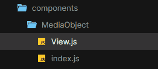

# 学会爱上顺风

> 原文：<https://medium.com/codex/learning-to-love-tailwind-85e36716c61b?source=collection_archive---------20----------------------->


近年来，一些人称之为实用优先的 CSS 框架逐渐兴起:通过将单一用途的类直接组合到 HTML 中，对 CSS 采取原子方法。很容易理解为什么这种格式会流行起来:当您不需要编写自定义 CSS 时，您可以更快地构建布局，并且不需要每次进行更改时都重新构建文件。效用优先的框架也可以被配置成遵循一个严格的设计系统，当你构建一个遵循相同设计系统的设计时，这感觉很好——设计者经常使用一致的空间和宽度度量，所以你的 CSS 与他们的视觉保持一致感觉很好。

一个流行的框架已经上升到主导地位，许多机构和软件公司利用它提供的快速原型制作能力。它被称为 Tailwind，看起来它可能会成为未来前端开发领域的主要参与者。

# 那么问题出在哪里？

顺风 CSS 往往是开发人员之间的一个非常分裂的话题:有点像 Marmite，你要么喜欢它，要么讨厌它。我认为这是一个奇耻大辱，因为大多数反对它的论点都可以通过改变心态来解决。重要的是要记住，就像生活中的任何事情一样，你应该总是为工作选择正确的工具。我不会坐着假装顺风解决一切:它只在正确的情况下有用。

问题是，Tailwind 和其他实用优先的框架根本不像传统的 CSS。如果你看看我们都非常熟悉的方法论，比如 BEM，在风格的真理来源上有很大的不同。

# 真相的新来源

使用像 BEM 这样的方法，重点是在 HTML、CSS 和 JavaScript 之间保持关注点的分离。当谈到样式时，CSS 通常被认为是事实的来源，而 HTML 应该只关注内容。这对于像 Wordpress 或静态 HTML 站点这样的单一站点来说非常有效，在这些站点中，您可能会编写重复出现的 HTML。例如，这里有一个简单的[媒体对象](http://www.stubbornella.org/content/2010/06/25/the-media-object-saves-hundreds-of-lines-of-code/)结构:

```
<div class="media-object">
  <div class="media-object__media">
    
  </div>
  <div class="media-object__content">
    Hello world! Here's some content.
  </div>
</div>$module: 'media-object';.#{$module} {
  display: flex;
  flex-direction: row;

  &__media {
    flex-basis: 48px;
  }

  &__content {
    flex: 1 0 auto;
  }
}
```

这个对象的 HTML 可以无限复制和粘贴，就像构建一个基本的 HTML 页面一样。由于 CSS 存储在它的真实来源中，只要结构保持不变，如果我们重复 HTML 就没有太大关系。以这种方式复制和粘贴并不完美，也不总是感觉正确，但是通过这种方式工作，我们可以保持样式相当一致，即使它后来发生了变化。如果我们稍后通过添加填充来改变`.media-object`，那么这个改变将会在使用这个类的任何地方被反映出来。当转向顺风时，这就是混乱的开始。

问题是，许多开发人员将转向 Tailwind，并以与他们使用 BEM 完全相同的方式使用它:在任何需要的地方复制粘贴 HTML 结构。由于 Tailwind 使用类组合来创建样式，您的真实来源不再是 CSS 文件。HTML 本身成为其外观的真实来源。下面是使用 Tailwind 的实用程序类构建的相同组件:

```
<div class="flex flex-row">
  <div class="w-7">
    
  </div>
  <div class="flex-grow w-auto">
    Hello world! Here's some content.
  </div>
</div>
```

想象一下，我们把这个媒体对象复制粘贴到整个网站上；如果我们想在顶部元素中添加填充，我们必须遍历整个站点，手动将填充类添加到每个实例中。当然，您可以使用查找和替换工具来帮助，但是如果您不小心的话，这种技术可能会导致错误，并且随着站点的增长会变得难以管理。

这就是为什么如果你没有使用基于组件的框架，我不会推荐 Tailwind。这就是为什么这么多人开始讨厌顺风:因为他们在工作中使用了错误的工具，而且这对他们不利。它只是不是为传统意义上的使用而设计的。

# 基于组件的体系结构

Tailwind 真正大放异彩的地方是在现代框架中:无论是 React 和 Vue 这样的 JavaScript 框架，还是 Twig 这样的模板系统，这种 CSS 方法在与基于组件的*架构相结合时都会蓬勃发展。*

在这样的系统中，风格的真实来源可以与网站的结构融合在一起。在这些系统中，鼓励开发人员构建可重用、可组合的组件。例如，下面是使用 React 构建的同一个媒体对象:

```
// MediaObject.js
export default function MediaObject({ children, img}) {
  return (
    <div class="flex flex-row">
      <div class="w-7">
        
      </div>
      <div class="flex-grow w-auto">
        { children }
      </div>
    </div>
  )
}
```

这个文件`MediaObject.js`现在是组件的外观和感觉的绝对真实来源:没有任何 CSS 文件被依赖，没有任何 HTML 需要被复制粘贴无数次。所有的东西都在这个文件里。

正如您所看到的，这个组件并不关心它包含的内容:媒体和文本内容都是在任何地方使用组件时传递下来的道具。下面是一个页面如何调用`MediaObject`的例子:

```
<MediaObject media="avatar.jpg">
  <h3>Person Personson</h3>
  <p>Hello world!</p>
</MediaObject>
```

"但是修饰语呢？"，我听到你问。好吧，基于组件的框架也可以很容易地处理这个问题，并且在处理的时候做更酷的事情。

例如，假设我们也有一个暗灰色背景的媒体对象的暗变体。不仅背景颜色需要改变，里面的文字颜色也需要改变，以与较暗的背景相协调。

```
export default function MediaObject({ children, img, modifiers }) {
  const bgC = modifiers.isDarkBG ? 'bg-dark-grey' : 'bg-transparent';
  const textC = modifiers.isDarkBG ? 'text-white' : 'text-dark-grey';

  return (
    <div class={`flex flex-row ${ bgC }`}>
      <div class="w-7">
        
      <div class={`flex-grow w-auto ${ textC }`}>
        { children }
      </div>
    </div>
  )
}
```

现在，我们可以使用普通的 JavaScript 来控制使用“modifiers”对象的感觉，这为我们提供了更强大的工具来构建条件样式。有太多的方法来使用它，一旦你习惯了这种工作方式，它就会变得非常自然和直观。您可以在组件本身内部定义条件，或者直接传递一串类名来进行额外的控制。

建议在构建组件时利用抽象:您可以将不同级别的逻辑移动到同一个组件的不同文件中。React 中最好的例子是[容器组件与表示组件。](/@yassimortensen/container-vs-presentational-components-in-react-8eea956e1cea)

# 抽象业务逻辑以保持整洁

通过将组件的视图(它看起来的样子)包装在存储业务逻辑(它工作的方式)的容器中，您可以将不同的关注点隔离到不同的文件中。我经常使用一个文件夹结构，其中文件夹名是组件名，有两个文件，`index.js`和`View.js`。`index.js`是容器组件，而`View.js`是表示组件。



通过将我所有的表示逻辑保存在`View.js`中，包括任何基于`modifier`道具的条件样式，我可以确保任何与组件样式无关的逻辑都保存在容器组件`index.js`中。这真的有助于保持整洁和理智，因为每样东西都有一个合理的去处。

```
// View.js
export default function MediaObjectView({ children, img, modifiers }) {
  const bgC = modifiers.isDarkBG ? 'bg-dark-grey' : 'bg-transparent';
  const textC = modifiers.isDarkBG ? 'text-white' : 'text-dark-grey';

  return (
    <div class={`flex flex-row ${ bgC }`}>
      <div class="w-7">
        
      <div class={`flex-grow w-auto ${ textC }`}>
        { children }
      </div>
    </div>
  )
}// index.js
export default function MediaObject({ children, img, modifiers }) {
  // any business logic can go here and be passed to MediaObjectView using props

  return <MediaObjectView {...children, img, modifiers} />
}
```

理论上，你可以继续抽象组件，次数不限。通常建议坚持最大值为 2，但我确信在某些情况下，进一步分离逻辑会有好处。

# 顺风适合我吗？

嗯，也许吧。如果您正在构建静态 HTML 站点，可能不会。如果你正在用 PHP 构建 Wordpress 站点，你最好使用某种模板引擎来维护你的真实来源。但是，如果您正在使用 React 或 Vue 这样的现代 JavaScript 框架，我强烈建议您尝试一下:它非常不同，并且有自己的挑战，但是如果使用方法正确，它会非常有趣并且非常强大。只是不要期望能够使用你在 BEM 中学到的相同概念——这是一个完全不同的盒子。

在[官方网站](https://tailwindcss.com/)上了解更多关于 Tailwind 的信息，[观看这个精彩的演示](https://www.youtube.com/watch?v=J_7_mnFSLDg)了解更多关于如何使用 Tailwind 代替传统 CSS 的细节。