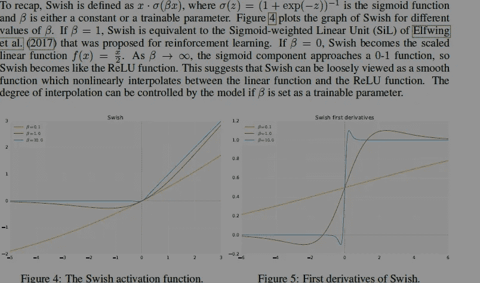

# 从谷歌对激活功能的全面研究中得到的启示

> 原文：<https://medium.com/codex/learnings-from-googles-comprehensive-research-into-activation-functions-4a9d6566ba2c?source=collection_archive---------1----------------------->

## 这是一个正在升温的领域。注意看着它

深度学习是一个复杂且不断发展的领域。随着越来越多的资源投入到研究和开发中，新的网络结构、架构和模型训练协议被创造出来。这些都非常令人兴奋，因为它们释放了新的能力并影响了新的领域([要了解 2022 年 2 月发生的事情，请查看此视频](https://youtu.be/5_Ld8f_cQCY))。

深度学习中使用的一些最常见的激活功能。人们发现非线性激活函数在实践中效果更好

但是，机器学习的研究要比这个全面得多。对于不同的数据插补策略、学习率和批量大小(我在 Medium 上已经介绍过所有这些)有大量的研究来最大化性能。神经网络最重要的方面之一是它的激活函数。*在机器学习中，给定一个输入或一组输入*，节点的激活函数定义该节点的输出。这使得激活函数成为模型管道中最重要的方面之一。自然，有很多研究试图发现好的激活功能。在这篇文章中，我们将涵盖“搜索激活功能”，这是一篇比较谷歌研究人员激活功能的论文。

这家公司在机器学习方面做了很多研究。照片由 [Rajeshwar Bachu](https://unsplash.com/@rajeshwerbatchu7?utm_source=medium&utm_medium=referral) 在 [Unsplash](https://unsplash.com?utm_source=medium&utm_medium=referral) 拍摄

我将浏览这篇论文，一些有趣的学习，以及研究人员在比较了所有发现的功能后推荐的激活功能。让我们开始吧。

# 激活功能真的那么重要吗？

这无疑是你心中的一个问题。这是一个正确的问题。毕竟，在机器学习管道中有许多不同的移动部件。选择研究和优化其中的一个，从另一个方面转移了潜在的资源。当我们做决定时，牢记这个机会成本是非常重要的。所以让我们看看激活函数是否真的能影响性能。看看报纸上的以下引文:

> 在 ImageNet 上，用 Swish 单元替换 ReLUs 在 Mobile NASNet-A 上提高了 0.9%的 top-1 分类精度(Zoph 等人，2017 年)，在 Inception-ResNet-v2 上提高了 0.6%(Szegedy 等人，2017 年)。考虑到从 Inception V3 (Szegedy 等人，2016 年)到 Inception-ResNet-v2 (Szegedy 等人，2017 年)，一年的架构调整和扩大产生了 1.3%的精度改进，这些精度增益是显著的。

如果你不相信，再读一遍。仅仅是将激活功能从 ReLU(目前的标准)替换为 Swish(我们将会介绍它)，改进了性能**几乎相当于将一个巨大的模型调优和放大一年。对各种激活功能以及它们如何与不同类型的输入交互的研究是绝对值得的。**

# 如何找到最佳的激活函数

好了，现在我们已经确定了机器学习激活功能有多重要，让我们来谈谈研究人员是如何发现它们的。虽然激活功能传统上是手动创建的(以符合特定标准)，但这一过程会非常快地变得昂贵(并且缓慢)。因此，该团队使用了穷举搜索(用于较小的搜索空间)和基于 RNN 的控制器(用于较大的搜索空间)的组合。不过这也带来了一个新问题。我们如何定义函数的搜索空间？

他们的搜索算法检查过的函数的完整列表

接下来的问题是，我们如何组合这些函数来创建我们的搜索块？这不是一个无关紧要的问题，因为不同的函数将呈现非常不同的输出。关于这一点，我们可以参考文件的具体部分:

在机器学习中使用“单位”的做法似乎正在获得很大的支持。留意一下。

概括地说，我们从一元和二元函数的组合中创建了核心单元。一旦我们创建了这些单元，我们就将它们与其他单元结合起来，创建我们的激活功能。为了创建激活函数，我们使用基于 RNN 的控制器来预测给定输入的激活函数。

我们使用验证准确性作为奖励，以确保 RNN 预测的是性能最好的函数

这是搜索过程的要点。这是相当复杂的，所以请随意休息一下，重读一遍，以确保你真的明白发生了什么。仅仅是这个设置就令人印象深刻。要了解更多细节，我建议阅读报纸。如果你想要我的论文明细，请随时联系我。

# 什么是唰？Swish 是不是最好的激活功能？

现在我们已经介绍了搜索过程，让我们来看一下结果。

我的内容的追随者知道，当我读到我突出显示的部分时，我被炒作了。要了解我对为什么我们会注意到这一趋势的推测，请查阅我的注释论文。

我们可以清楚地看到，有几个函数具有引人注目的性能。周期函数的性能非常有趣，并为进一步探索提供了一个令人信服的案例。当这些激活功能在多个更大的网络结构上与 ReLU 进行比较时，它们表现得相当好。

注册护士:WRN 雷斯内特:宽雷斯内特，DN: DenseNet

Swish 就是研究人员所说的函数 f(x)=x* sigma( beta*x)。研究人员选择了 Swish，而不是其他“最佳”激活功能，因为它概括得更好。

在机器学习中，根据不完整的信息做出决策是很常见的

Swish 能够将通用性和高性能结合起来。至少在计算机视觉任务上。然而，要真正成为一个有用的激活功能，比得上 ReLU，Swish 必须能够执行一系列任务，并且比得上基线。但首先，让我们在基础层面上理解 Swish。

# 理解嗖嗖声

Swish 有一些非常有趣的数学特性。它的简单性和与 ReLU 的相似性意味着它可以在使用 ReLU 的地方被替代。在特定的选择值下，它开始模仿其他激活功能(这可能是它表现如此出色的原因)。更多细节请看以下内容

Swish 可以变形为其他激活功能的事实非常酷。

你们中一些非数学专业的人可能想知道为什么我们关心 Swish 的一阶导数。1) [去学习 ML 基础知识](/geekculture/how-to-learn-machine-learning-in-2022-9ef2ea904986)。2)一阶导数告诉你相对于输入，你的增长/变化有多快。大的导数意味着输入的小变化会带来大的变化(反之亦然)。因此，研究激活函数的导数是很重要的(一些学习率函数也广泛使用导数)。对 Swish 一阶导数的分析表明:

最后一句话很有意思，值得单独考察。

还有更多的事情我可以涵盖，但它们会使文章太长。如果你想让我涵盖我遗漏的任何具体的东西，请告诉我。现在让我们来看看使用 Swish 的结果。

# 基准测试的结果

该文件的第 5 节以下列引文开始:

> 我们在具有挑战性的数据集上对 Swish 和 ReLU 以及最近提出的一些激活函数进行了基准测试，发现 Swish 在几乎所有任务上都匹配或超过了基线。

这是字面上的第一句话。这显然是非常令人兴奋的，但是让我们深入细节，看看改进是否是实质性的。对性能的高层次概述当然是强有力的，跨任务的性能也很强。

这场演出令人印象深刻。这可能会成为新的标准激活功能。

ImageNet 被认为是机器学习中最重要的图像分类任务之一。这就是为什么大多数计算机视觉论文总是在评估和测试中提到它。当比较 Swish 和 ReLU 时，Swish 完全胜过 ReLU

Swish 与其他更专业的功能相比具有竞争力。这令人印象深刻。

我们在 CIFAR 10 和 CIFAR 100 数据集上看到了类似的性能。因此，对于计算机视觉，Swish 似乎远远领先于 ReLU(并与其他更精细的变体竞争)。自然语言处理(NLP)任务呢？为此，研究人员使用了标准的 WMT 英语→德语数据集。这里的结果不言自明:

令人印象深刻的结果。“嗖嗖”似乎越来越强劲了。

# 关闭

很难反驳这篇论文的作者迄今为止所展示的结果。Swish 在多个标准任务上的表现明显更好。它的简单性和变形为其他激活功能的能力绝对令人信服，值得进一步探索。

然而，对我来说最突出的是本文提供的可能的扩展。[进化算法已经被证明在搜索问题中非常有用](/mlearning-ai/why-you-should-implement-evolutionary-algorithms-in-your-machine-learning-projects-ee386edb4ecc)，而这篇论文提出了一个令人信服的论点，探索周期函数作为激活函数的基础。微调 Swish 也可能有很好的效果。因此，不仅仅是 Swish，这篇论文对机器学习的研究论述贡献良多。

要真正擅长机器学习，软件工程的基础将是至关重要的。他们将帮助你概念化，建立和优化你的 ML。我的每日时事通讯，[编码采访变得简单](https://codinginterviewsmadesimple.substack.com/)涵盖了算法设计、数学、最近的科技事件、软件工程等主题，让你成为更好的开发者。我目前全年都在打八折，所以一定要去看看。

想想这个学生通过订阅获得的投资回报。

我创造了[编码面试，使用通过指导多人进入顶级科技公司而发现的新技术，使面试变得简单](https://codinginterviewsmadesimple.substack.com/)。时事通讯旨在帮助你成功，避免你在 Leetcode 上浪费时间。

为了帮助我写更好的文章和了解你[填写这份调查(匿名)](https://forms.gle/7MfQmKhEhyBTMDUD7)。最多花 3 分钟，让我提高工作质量。

如果你也有任何有趣的工作/项目/想法给我，请随时联系我。总是很乐意听你说完。

以下是我的 Venmo 和 Paypal 对我工作的金钱支持。任何数额都值得赞赏，并有很大帮助。捐赠解锁独家内容，如论文分析、特殊代码、咨询和特定辅导:

https://account.venmo.com/u/FNU-Devansh

贝宝:[paypal.me/ISeeThings](https://www.paypal.com/paypalme/ISeeThings)

# 向我伸出手

使用下面的链接查看我的其他内容，了解更多关于辅导的信息，或者只是打个招呼。另外，查看免费的罗宾汉推荐链接。我们都得到一个免费的股票(你不用放任何钱)，对你没有任何风险。所以不使用它就等于失去了免费的钱。

查看我在 Medium 上的其他文章。:【https://rb.gy/zn1aiu 

我的 YouTube:【https://rb.gy/88iwdd 

在 LinkedIn 上联系我。我们来连线:[https://rb.gy/m5ok2y](https://rb.gy/f7ltuj)

我的 insta gram:[https://rb.gy/gmvuy9](https://rb.gy/gmvuy9)

我的推特:[https://twitter.com/Machine01776819](https://twitter.com/Machine01776819)

如果你正在准备编码/技术面试:[https://codinginterviewsmadesimple.substack.com/](https://codinginterviewsmadesimple.substack.com/)

获得罗宾汉的免费股票:[https://join.robinhood.com/fnud75](https://www.youtube.com/redirect?redir_token=QUFFLUhqa0xDdC1jTW9nSU91WXlCSFhEVkJ0emJvN1FaUXxBQ3Jtc0ttWkRObUdfem1DZzIyZElfcXVZNGlVNE1xSUc4aVhSVkxBVGtHMWpmei1lWWVKNzlDUXVJR24ydHBtWG1PSXNaMlBMWDQycnlIVXNMYjJZWjdXcHNZQWNnaFBnQUhCV2dNVERQajFLTTVNMV9NVnA3UQ%3D%3D&q=https%3A%2F%2Fjoin.robinhood.com%2Ffnud75&v=WAYRtSj0ces&event=video_description)