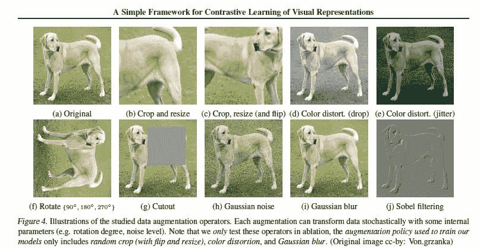
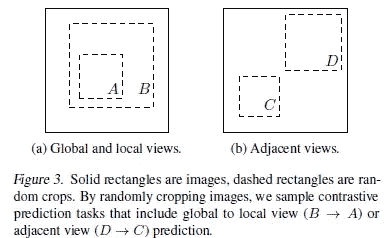
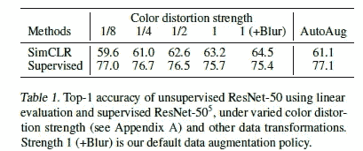
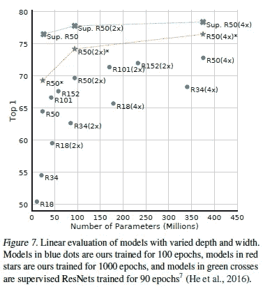
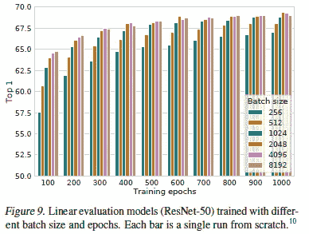
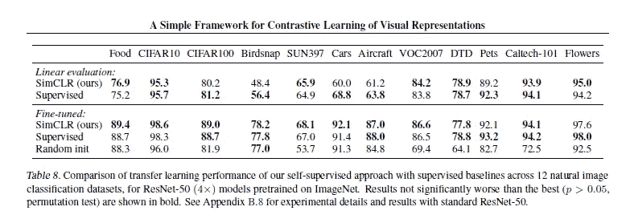

# 来自 SimCLR 的学习:视觉表征的对比学习框架

> 原文：<https://medium.com/codex/learnings-from-simclr-a-framework-contrastive-learning-for-visual-representations-6c145a5d8e99?source=collection_archive---------6----------------------->

## 框架更简单，胜过一切

沙哈达特·拉赫曼在 [Unsplash](https://unsplash.com?utm_source=medium&utm_medium=referral) 上拍摄的照片

机器学习是一个多样化的领域，有许多不同的方面。ML 的主要关注点之一是视觉表现的学习(对应于区域的图片/图表等)。这在各种各样的问题中都有应用，从计算机视觉，物体检测，到更未来的应用，比如学习和开发图表。最近，人们开始将对比学习作为监督学习和非监督学习的替代方法。它包括通过教导模型哪些数据点相似或不同来教导模型学习没有标签的数据集的一般特征。因此，焦点转移到了解是什么使两个样本不同。我将会更详细地介绍这种技术，所以一定要关注我的跨平台内容以保持更新。

> 对比学习是一种机器学习技术，用于通过教导模型哪些数据点相似或不同来学习没有标签的数据集的一般特征。

“T4 视觉表征对比学习的简单框架”的作者决定研究对比学习在视觉表征学习中的应用。自然地，我很兴奋地想了解更多。自我监督学习是一个很有前途的领域，有很多潜在的应用。在这篇文章中，我将分享我发现的最有趣的研究和他们的发现。一如既往，这篇论文的注释版本将在下面分享，这样你就可以自己看一看并阅读这篇论文(以及我的评论)。如果你认为我错过了什么，或者有任何其他意见，请务必与我分享。很高兴听到你们的消息。

# 要点 1:简单的数据增强工作

众所周知，我是数据增强的超级粉丝。无论是我的 Deepfake 检测研究，还是我的很多内容，经常说它有多有用。然而，根据作者的说法，“*虽然数据增强已广泛用于监督和非监督表示学习(Krizhevsky 等人，2012；海纳夫等人，2019；Bachman et al .，2019)，它没有被认为是一种定义对比预测任务的系统方法。”*本文展示了数据扩充在对比学习中的作用。

所使用的增强功能的种类

上图列出了所有不同的变换，这些变换可以应用于原始图像以增加数据(在论文中)。

为了理解论文的意义，我们应该理解两种观点(全局到局部和相邻)。两者都涉及通过聚焦于特定区域(称为感受野)来预测图像。然而，这可能相当复杂。但是有个好消息。*我们证明，这种复杂性可以通过对目标图像执行简单的随机裁剪(调整大小)来避免，这将创建一系列包含上述两种任务的预测任务，如图 3 所示*这种“*将预测任务与神经网络架构等其他组件分离开来”。*简而言之，我们能够通过简单的随机裁剪创造出大量不同的可能结果。

色彩失真改善了模拟时钟，但损害了监督

我们还发现对比学习需要更强的强化。强化强度越高，对比学习者的表现越好。我们还发现，复杂的增强协议实际上不如简单的裁剪有效。*在这种背景下，AutoAugment (Cubuk et al .，2019)，一种使用监督学习发现的复杂增强策略，并不比简单的裁剪+(更强)颜色失真*更好。在上表中，我们看到了简单裁剪(具有强增强)相对于复杂协议的优越性。

AlphaSignal 是人工智能、机器学习和数据科学领域顶级发展的免费每周摘要。他们使用人工智能来排名并向你发送该领域的顶级发展，从而节省你大量的时间。如果你正在寻找一些帮助你跟上机器学习步伐的东西，去看看吧。阅读它们是与这个领域保持联系的一个很好的方式，并且支持我的写作，不需要你付出任何代价。

 [## 阿尔法信号|机器学习的极品。艾总结的。

### 留在循环中，不用花无数时间浏览下一个突破；我们的算法识别…

alphasignal.ai](https://alphasignal.ai/?referrer=Devansh) 

# 要点 2:批量越大，型号越大，性能越好

虽然这句话似乎显而易见，但数字 7 告诉了我们一个有趣的故事。我们看到，随着模型规模的增加，对比学习开始赶上监督模型。正如研究团队所指出的那样，“*图 7 显示，增加深度和宽度都会提高性能，这或许并不令人意外。虽然类似的发现适用于监督学习(He et al .，2016)，但我们发现，随着模型大小的增加，监督模型和基于非监督模型训练的线性分类器之间的差距缩小，这表明非监督学习比监督学习从更大的模型中受益更多。*“这里的无监督学习是指无监督的对比学习。

由此我们看到了另一个有趣的趋势。我们看到对比学习模型更多地受益于大批量/更多的训练时期。

> 随着更多的训练步骤/时期，不同批次大小之间的差距减小或消失，只要这些批次被随机重新取样。与监督学习(Goyal 等人，2017 年)相比，在对比学习中，较大的批量提供了更多的负样本，有助于收敛(即，对于给定的准确度，需要较少的时期和步骤)。训练时间越长，反面例子越多，结果越好。”

# 要点 3:对比学习有潜力

以上是 SimCLR 与一些基础学习者相比的表现。本文的第 6 部分介绍了在各种环境下进行的各种测试，将 SimCLR 的性能与最先进的模型进行了比较。由于解释测试和各种任务本身就需要一系列内容，所以我不会详细介绍整个部分，但是我建议您阅读本文。如果任何人有任何疑问，请在评论中留下(或联系我)，我们可以讨论。然而，基于共享的结果，我们可以得出结论，对比学习可以是一个非常强大的工具，并应进一步研究。

# 最终注释

报纸上还有其他你可能感兴趣的内容。我选择关注这三个，因为我发现它们最有可能被推广到更多种类的任务中。对比学习的表现证实了作者的陈述，即它被低估了。我相信对比学习可能会帮助我们解决传统上监督学习难以解决的问题(例如，标记可能非常昂贵的问题)。我建议密切关注对比学习正在解决的更多问题。

# 纸

正如所承诺的，这是这篇论文的注释版本

# 向我伸出手

如果那篇文章让你对联系我感兴趣，那么这一部分就是为你准备的。你可以在任何平台上联系我，或者查看我的其他内容。如果你想讨论什么，发短信给我，在 LinkedIn，IG 或 Twitter 上。为了支持我，请使用我的推荐链接到罗宾汉。它是完全免费的，我们都可以得到免费的股票。不使用它实际上是失去了免费的钱。

查看我在 Medium 上的其他文章。:[https://rb.gy/zn1aiu](https://rb.gy/oaojch)

我的 YouTube:【https://rb.gy/88iwdd 

在 LinkedIn 上联系我。我们来连线:【https://rb.gy/m5ok2y】T4

我的 insta gram:[https://rb.gy/gmvuy9](https://rb.gy/gmvuy9)

我的推特:[https://twitter.com/Machine01776819](https://twitter.com/Machine01776819)

我的子栈:【https://devanshacc.substack.com/】T2

twitch 现场对话:【https://rb.gy/zlhk9y 

获得罗宾汉的免费股票:[https://join.robinhood.com/fnud75](https://www.youtube.com/redirect?redir_token=QUFFLUhqa0xDdC1jTW9nSU91WXlCSFhEVkJ0emJvN1FaUXxBQ3Jtc0ttWkRObUdfem1DZzIyZElfcXVZNGlVNE1xSUc4aVhSVkxBVGtHMWpmei1lWWVKNzlDUXVJR24ydHBtWG1PSXNaMlBMWDQycnlIVXNMYjJZWjdXcHNZQWNnaFBnQUhCV2dNVERQajFLTTVNMV9NVnA3UQ%3D%3D&q=https%3A%2F%2Fjoin.robinhood.com%2Ffnud75&v=WAYRtSj0ces&event=video_description)