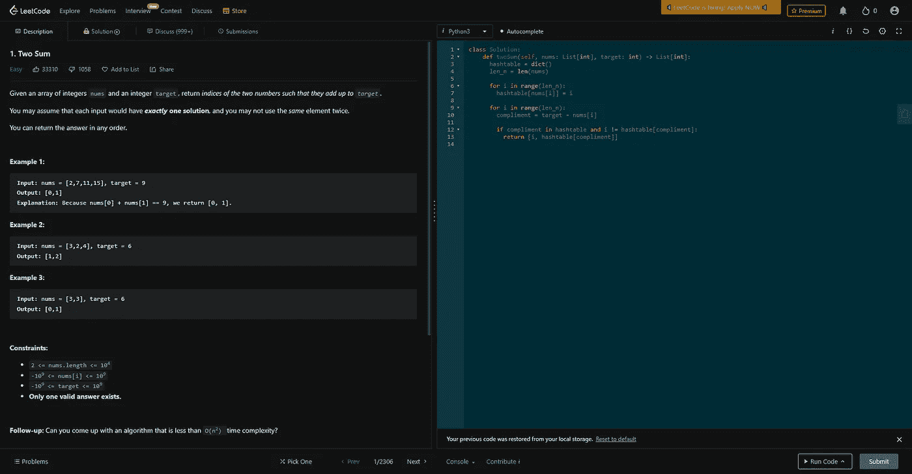

# LeetCode 1。两总和 Python 解决方案

> 原文：<https://medium.com/codex/leetcode-1-two-sum-python-solution-programming-technical-interview-question-8f19ea881194?source=collection_archive---------24----------------------->

## 盲 75 —编程和技术面试问题—解释系列

## 问题是:

给定一个整数数组 ***nums*** 和一个整数 ***target*** ，返回这两个数字的索引【在 ***nums*** 数组中】，使它们加起来等于 target。

## 制约因素:

1.  你可以**而不是**使用同一个*元素两次。*
2.  只存在一个有效答案。
3.  2 <= nums.length <= 104
4.  -109 <= nums[i] <= 109
5.  -109 <= target <= 109

## The explanation:

This problem in ones head is actually pretty simple; you pass through the array and for each number in that array you check if there is another number in that array that, in combination with your first number, add up to the target.

## Solution #1 — Nested For-Loops — O(n²)

Using the explanation in your head makes coming up with the brute force solution pretty easy. You pass through the array using a for-loop, then *嵌套*在那个 for 循环中你再次遍历数组，检查第一个 for 循环中的 ***nums*** 的值和第二个 for 循环中的 ***nums*** 的值加起来是否等于目标值，如果是，返回这两个索引。

这里我建立了 ***len_nums*** 变量，因为 ***nums*** 数组的长度被多次使用。第一个 for 循环从 0 遍历到数组末尾减 1。这是因为您不能使用相同的索引两次，如约束中所述，并且第二个 for-loop 一直循环到最后一个值。第二个 for 循环从 ***i + 1*** 开始遍历，因为不需要检查从 0 到 ***len_n*** 的值，那样会多次检查值，影响我们的效率。然后我们检查 ***nums*** 的两个值加起来是否等于 ***target*** 以及它们是否返回那些索引。不需要在 for 循环后放一个 return 语句，因为正如约束中所述,**总是**有解。

```
class Solution:
  def twoSum(self, nums: List[int], target: int) -> List[int]:
    len_nums = len(nums)

    for i in range(0, len_n — 1):
      for j in range(i + 1, len_n):
        if nums[i] + nums[j] == target:
          return [i, j]
```

## 解决方案#2 —哈希表— O(n)

这无疑是更困难的解决方案，并且需要哈希表的知识。虽然，如果你能想出这个解决方案的时间效率要比以前的解决方案好得多。类似前面的解决方案，我们保存了 ***nums*** 数组的长度。我们引入一个新的变量作为我们的哈希表: ***哈希表。*** 这被初始化为 ***dict()*** ，在 Python 中，它保存键和值。第一个 for 循环遍历 ***nums*** 数组，将其值用作键，并将索引 ***i*** 存储为该键的值。这在查看第二个 for 循环时更有意义，在这里我们可以检查 ***哈希表*** 是否包含某个值。我们将检查的这个特定值是 ***目标*** 的补充值和***nums【I】***的当前值，它存储在 ***补充值*** 变量中，因为它的值将被多次使用。接下来是这个解决方案的最后一部分，检查 compliment 是否是 ***哈希表*** 中的一个值，但是**不是 ***nums[i]*** 的当前值**，因为在约束中我们不能两次返回相同的索引。因为我们保证有一个解，所以在 for 循环之后不需要 return 语句，你已经解决了 LeetCode 1。两个总和！

```
class Solution:
  def twoSum(self, nums: List[int], target: int) -> List[int]:
    hashtable = dict()
    len_n = len(nums)

    for i in range(len_n):
      hashtable[nums[i]] = i

    for i in range(len_n):
      compliment = target — nums[i]

      if compliment in hashtable and i != hashtable[compliment]:
        return [i, hashtable[compliment]]
```



## 信息:

网址:[nkwade . dev](http://www.nkwade.dev)
LinkedIn:[linkedin.com/in/nkwade](http://www.linkedin.com/in/nkwade/)
GitHub:[github.com/nkwade](http://www.github.com/nkwade)
邮箱: [nicholas@nkwade.dev](mailto:nicholas@nkwade.dev)