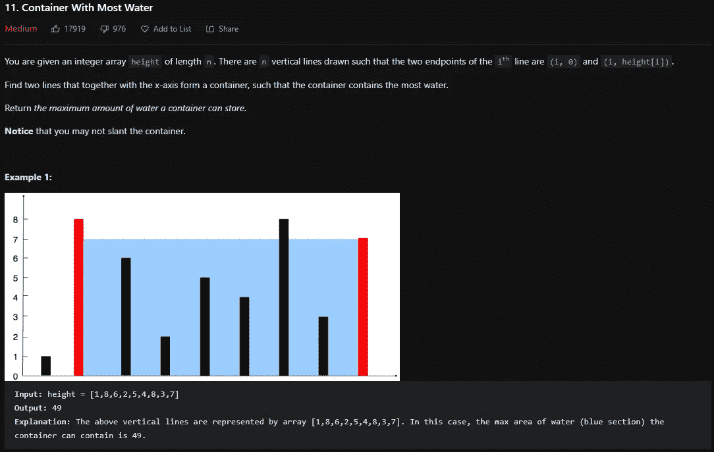

# LeetCode 11。盛水最多的容器— Python 解决方案

> 原文：<https://medium.com/codex/leetcode-11-container-with-most-water-python-solution-3e922b0dc9aa?source=collection_archive---------8----------------------->

## [盲 75 —编程&技术面试问题—讲解系列](/codex/leetcode-121-best-time-to-buy-and-sell-stock-python-solution-bdb5f5e7836?source=your_stories_page-------------------------------------)

## 问题是:



LeetCode 11。盛水最多的容器

## **约束:**

*   `n == height.length`
*   `2 <= n <= 105`
*   `0 <= height[i] <= 104`

## 解释是:

这是一个很好的使用左右指针的数组问题。从最左侧和最右侧开始，您可以使用循环来确定是减少右侧指针还是增加左侧指针。所有这些 if 语句是，如果左边比右边小，为什么我们要减少右边，我们应该增加左边。否则减少右边。然后，对于循环的每一次迭代，计算面积并跟踪要返回的最大面积。这是一个非常简单的问题，对于学习如何使用指针来获得更低时间复杂度的答案非常有用。

## 指针解— O(n):

如上所述，初始化指针并将答案设置为 0。当左边小于右边时(否则我们会得到负的面积)，确定面积以及是增加左边还是减少右边。我们把答案设定为本身的最大值，然后进行面积计算。计算的面积是宽度(右减去左)乘以两个指针的最小高度。我们必须做最小的，因为如果我们选择更大的，水就会溢出，这是没有意义的。现在，如果左边的高度小于右边的高度，那么我们增加左边的高度，以获得更大的面积，否则减少右边的高度。在 while 循环后返回最大面积。

```
class Solution:
 def maxArea(self, height: List[int]) -> int:
  l, r, ans = 0, len(height) — 1, 0

  while l < r:
   ans = max(ans, 
             min(height[l], height[r]) * (r - l))

   if height[l] < height[r]:
    l += 1
   else:
    r -= 1

 return ans
```

# 信息:

网址:[nkwade . dev](http://www.nkwade.dev/)
LinkedIn:[linkedin.com/in/nkwade](http://www.linkedin.com/in/nkwade/)
GitHub:[github.com/nkwade](http://www.github.com/nkwade)
邮箱: [nicholas@nkwade.dev](mailto:nicholas@nkwade.dev)