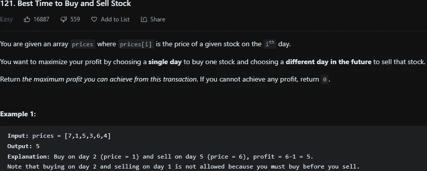
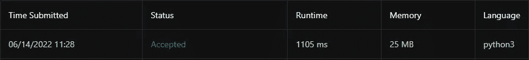
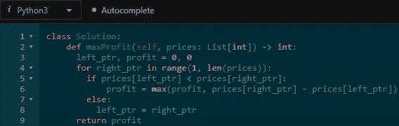

# LeetCode 121。买卖股票的最佳时机— Python 解决方案

> 原文：<https://medium.com/codex/leetcode-121-best-time-to-buy-and-sell-stock-python-solution-bdb5f5e7836?source=collection_archive---------15----------------------->

## 盲 75 —编程和技术面试问题—解释系列

## 问题是:

给你一个数组 ***价格*** 其中 ***价格【I】***是给定股票在第***I***日的价格。

你想通过选择某一天买入一只股票，并在未来的某一天卖出这只股票来实现利润最大化。

回报你能从这笔交易中获得的最大利润。如果你不能获得任何利润，返回 0。



## 制约因素:

*   1<= ***prices . length***<= 105
*   0 <= ***价格【I】***<= 104

## 解释是:

对于这个问题，直觉很简单，买一天，卖一天。这个问题的最佳解决方案是 O(n)时间复杂度。为此，[滑动窗口技术](https://www.geeksforgeeks.org/window-sliding-technique/)是最佳选择。简而言之，这种技术使用左右指针变量，对于数组中的每个价格，检查左右价格之间的差异，并相应地进行更新。

## 解—滑动窗口— O(n)

首先，将 ***left_ptr*** 和 ***profit*** 变量初始化为零。然后从索引 1 开始遍历价格数组，因为 ***left_ptr*** 已经在索引 0 处。在这个 for 循环中，检查***left _ ptr***price 是否小于***right _ ptr***price，如果是，则将利润设置为利润和计算的差值的最大值。如果 ***left_ptr*** 大于或等于 ***right_ptr*** 则设置 ***left_ptr*** 为 ***right_ptr*** 。换句话说，如果当前价格低于先前的低价，则将 ***left_ptr*** 更新为这个新的低价。经过 for 循环后，保证你有最大的利润。如果价格只在给定的时间段内下降，那么将返回 0，因为利润变量被初始化为 0。

```
class Solution:
  def maxProfit(self, prices: List[int]) -> int:
    left_ptr, profit = 0, 0
    for right_ptr in range(1, len(prices)):
      if prices[left_ptr] < prices[right_ptr]:
        profit = max(profit, prices[right_ptr] — prices[left_ptr])
      else:
        left_ptr = right_ptr
    return profit
```



运行时和内存使用



LeetCode 上的 Python 解决方案

# 信息:

网址:[nkwade . dev](http://www.nkwade.dev/)
LinkedIn:[linkedin.com/in/nkwade](http://www.linkedin.com/in/nkwade/)
GitHub:[github.com/nkwade](http://www.github.com/nkwade)
邮箱: [nicholas@nkwade.dev](mailto:nicholas@nkwade.dev)