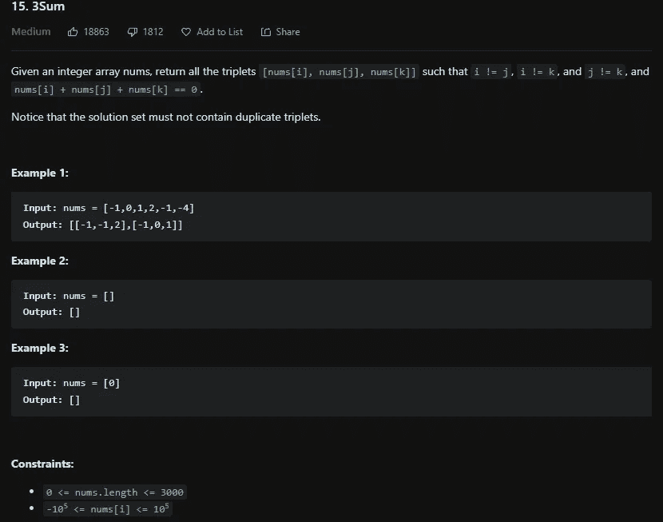

# LeetCode 15。3Sum — Python 解决方案

> 原文：<https://medium.com/codex/leetcode-15-3sum-python-solution-237a1fd4e8af?source=collection_archive---------8----------------------->

## [盲 75 —编程&技术面试题—讲解系列](/codex/leetcode-167-two-sum-ii-input-array-is-sorted-python-solution-daa49d13215f?source=your_stories_page-------------------------------------)

## 问题是:

我推荐阅读 [167。二总和 II](/codex/leetcode-167-two-sum-ii-input-array-is-sorted-python-solution-daa49d13215f?source=your_stories_page-------------------------------------) 这个问题之前。



## 解释是:

这个问题是对 sum 问题的一个很好的补充，和两个 Sum 有很大的不同，但是建立在两个 Sum II 的基础上。基本的解决方案是 O(n ),并使用三个 for 循环来检查每一个组合，这当然会花费非常长的时间，并且不是最有效的解决方案。使用同样的直觉，这可以压缩成 O(n)解。这个解决方案的第一步是对数组进行排序，这允许我们使用一个非常类似于两个 Sum II 的解决方案。你能做的是遍历整个数组，保持元素不变，然后使用左右指针收敛到一个 0 和。

## 排序解— O(n):

首先我们存储数组的长度，然后初始化结果数组。现在如果数组连三个元素都没有，返回一个空数组。现在我们对数组进行排序，然后枚举整个数组(可以只使用 nums[i]，但是枚举更干净)。在这个循环中，如果值和之前的值相同，我们已经确定了这个数的解，所以我们可以继续。然后我们把左边的指针初始化为 i + 1，因为我们不想重复解，右边的指针指向数组长度减一。现在就像两个 Sum II 解一样，我们使用 while 循环来确定是否有解。我们存储所有三个元素的总和，如果它小于零，则增加左边的，如果它大于零，则减少右边的。现在，如果这两个都不为真，那么它的和必须为零，所以将值追加到结果数组中。现在，追加下面有一点令人困惑的地方。因为只有 for 循环开始时检查重复值，而没有 while 循环，所以我们必须在这里进行检查，并增加左指针，直到值不再重复。一旦 while 循环结束，我们就可以返回结果数组。

```
class Solution:
 def threeSum(self, nums: List[int]) -> List[List[int]]:
  len_n, res = len(nums), []

  if len_n < 3: return []

  nums.sort()

  for i, val in enumerate(nums):
   if i > 0 and val == nums[i — 1]:
    continue

   l, r = i + 1, len_n — 1

   while l < r:
    three = val + nums[l] + nums[r]

    if three < 0:
     l += 1
    elif three > 0:
     r -= 1
    else:
     res.append([val, nums[l], nums[r]])
     l += 1
     while nums[l] == nums[l — 1] and l < r:
      l += 1

  return res
```

# 信息:

网址:[nkwade . dev](http://www.nkwade.dev/)
LinkedIn:[linkedin.com/in/nkwade](http://www.linkedin.com/in/nkwade/)
GitHub:[github.com/nkwade](http://www.github.com/nkwade)
邮箱: [nicholas@nkwade.dev](mailto:nicholas@nkwade.dev)