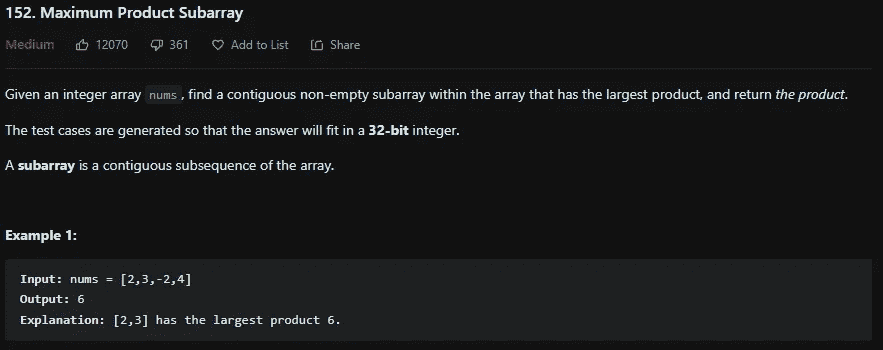
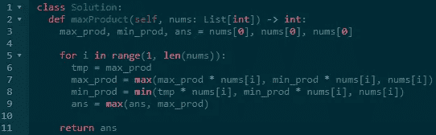

# LeetCode 152。最大产品子阵列— Python 解决方案

> 原文：<https://medium.com/codex/leetcode-152-maximum-product-subarray-python-solution-f30f7c4e76f3?source=collection_archive---------3----------------------->

## 盲 75 —编程和技术面试问题—解释系列

## 问题是:

给定一个整数数组 ***nums*** ，在该数组中找出一个具有最大乘积的连续非空子数组，并返回乘积。

子数组是数组的连续子序列。



## 示例:

**例 1:**

```
**Input:** nums = [2,3,-2,4]
**Output:** 6
**Explanation:** [2,3] has the largest product 6.
```

**例 2:**

```
**Input:** nums = [-2,0,-1]
**Output:** 0
**Explanation:** The result cannot be 2, because [-2,-1] is not a subarray.
```

## 制约因素:

*   答案将适合 32 位整数
*   `1 <= ***nums.length*** <= 2 * 104`
*   `-10 <= ***nums[i]*** <= 10`
*   ***nums*** 的任何前缀或后缀的乘积**保证**适合一个 **32 位**整数。

## 解释是:

乍一看这似乎是一个超级简单的动态规划问题，将***DP【I】***设置为***DP【I—1】* nums【I】***和***nums【I】***的最大值。然后跟踪最大乘积并返回。这种解决方案的问题在于 ***nums*** 中有负数。

为了解决这个问题，不使用数组来记录总数，而是记录三个数字:最大乘积、最小乘积和答案。你跟踪最小乘积的原因是因为这是一个负数，然后 ***nums*** 中的下一个数是另一个负数，将这两个相乘可能会得到一个比当前最大乘积更大的数。然后在计算了最大和最小乘积之后，将答案设置为它自身和当前最大乘积的最大值并返回。

## 最大最小解— O(n)

初始化 nums 的第一个元素的最大、最小和答案。然后从 1 开始循环到 nums 的长度。在这个循环中，将一个临时变量设置为最大乘积，因为它将被改变并用于最小值的计算。然后将最大乘积设置为自身乘以 nums[i]的最大值，乘以 nums[i]的最小值，然后就 nums[i]本身。现在至少。将其设置为自身乘以 nums[i]的最小值，临时乘以 nums[i]，然后再乘以 nums[i]本身。现在设置了 max 和 min，现在设置答案为自身的 max 和 max 乘积。在这个循环之后返回答案。

```
class Solution:
 def maxProduct(self, nums: List[int]) -> int:
  max_prod, min_prod, ans = nums[0], nums[0], nums[0]

  for i in range(1, len(nums)):
   tmp = max_prod
   max_prod = max(max_prod * nums[i], min_prod * nums[i], nums[i])
   min_prod = min(tmp * nums[i], min_prod * nums[i], nums[i])
   ans = max(ans, max_prod) return ans
```



# 信息:

网址:[nkwade . dev](http://www.nkwade.dev/)
LinkedIn:[linkedin.com/in/nkwade](http://www.linkedin.com/in/nkwade/)
GitHub:[github.com/nkwade](http://www.github.com/nkwade)
邮箱: [nicholas@nkwade.dev](mailto:nicholas@nkwade.dev)