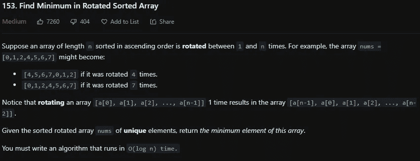
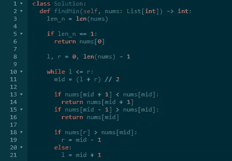

# LeetCode 153。在旋转排序数组中查找最小值 Python 解决方案

> 原文：<https://medium.com/codex/leetcode-153-find-minimum-in-rotated-sorted-array-python-solution-8e3c6818b0e7?source=collection_archive---------9----------------------->

盲 75 —编程和技术面试问题—解释系列

## 问题是:

假设按升序排序的长度为 n 的数组被旋转 1 到 n 次。例如，数组 ***nums*** = [0，1，2，4，5，6，7]可能变成:

[4，5，6，7，0，1，2]如果旋转 4 次。
【0，1，2，4，5，6，7】如果旋转 7 次。
注意，将数组[a[0]，a[1]，a[2]，…，a[n-1]]旋转 1 次，得到数组[a[n-1]，a[0]，a[1]，a[2]，…，a[n-2]]。

给定唯一元素的排序旋转数组 ***nums*** ，返回该数组的最小元素。

## 示例:

**例 1:**

```
**Input:** nums = [3,4,5,1,2]
**Output:** 1
**Explanation:** The original array was [1,2,3,4,5] rotated 3 times.
```

**例 2:**

```
**Input:** nums = [4,5,6,7,0,1,2]
**Output:** 0
**Explanation:** The original array was [0,1,2,4,5,6,7] and it was rotated 4 times.
```

**例 3:**

```
**Input:** nums = [11,13,15,17]
**Output:** 11
**Explanation:** The original array was [11,13,15,17] and it was rotated 4 times.
```

输入:nums = [4，5，6，7，0，1，2]
输出:0
说明:原数组为[0，1，2，4，5，6，7]，旋转了 4 次。
例 3:

输入:nums = [11，13，15，17]
输出:11
说明:原数组为[11，13，15，17]，旋转了 4 次。

## 制约因素:

*   你必须写一个在 O(log n)中运行的算法
*   ***time . n***= =***nums . length***
*   1<= n <= 5000
*   -5000 <= ***nums【I】***<= 5000



## 解释是:

要在 O(登录)时间内做到这一点，必须使用二分搜索法。否则你可以遍历数组寻找最小值。对于二分搜索法，你需要有一个左右指针。因为数组在通过二分搜索法时是排序的，如果中间的元素小于前一个元素或者中间的元素大于下一个元素，那么你就找到了最小值。如果没有找到最小值，则更新左指针或右指针。如果右边的元素大于中间的元素，那么右边的可以被设置为中间减 1，否则将左边的指针设置为中间加 1。更新左右指针只是基本的二分搜索法。

## 解决方案— O(logn):

首先将变量初始化为数组的长度。如果长度只有一个，那么你返回一个元素，因为它必须是最小值。现在将数组左边的长度初始化为零，右边的长度减一。当左边小于或等于右边时，进行解释中提到的计算。计算 mid，然后检查 mid、mid + 1 或 mid-1 是否是最小值，如果是，则返回该数字。如果没有找到最小值，使用基本二分搜索法相应地更新左或右指针。这样就可以保证找到最小值，所以在 while 循环之后不需要 return 语句。

```
class Solution:
 def findMin(self, nums: List[int]) -> int:
  len_n = len(nums)

   if len_n == 1:
    return nums[0]

   l, r = 0, len_n — 1

   while l <= r:
    mid = (l + r) // 2

    if nums[mid + 1] < nums[mid]:
     return nums[mid + 1]
    if nums[mid — 1] > nums[mid]:
     return nums[mid]

    if nums[r] > nums[mid]:
     r = mid — 1
    else:
     l = mid + 1
```



# 信息:

网址:[nkwade . dev](http://www.nkwade.dev/)
LinkedIn:[linkedin.com/in/nkwade](http://www.linkedin.com/in/nkwade/)
GitHub:[github.com/nkwade](http://www.github.com/nkwade)
邮箱: [nicholas@nkwade.dev](mailto:nicholas@nkwade.dev)

*   ***nums*** 的所有整数都是唯一的。
*   ***nums*** 排序并旋转 1 到 n 次。