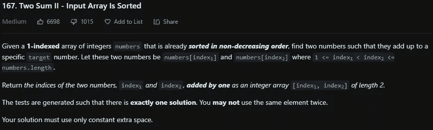
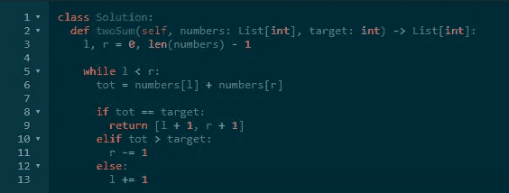

# LeetCode 167。两个 Sum II-输入数组已排序 Python 解决方案

> 原文：<https://medium.com/codex/leetcode-167-two-sum-ii-input-array-is-sorted-python-solution-daa49d13215f?source=collection_archive---------7----------------------->

## 盲 75 —编程和技术面试问题—解释系列

## 问题是:

给定一个已经按非降序 排序 ***的 **1 索引**整数数组`numbers`，找出两个数，使它们相加成为一个特定的`target`数。设这两个数字是`numbers[index1]`和`numbers[index2]`其中`1 <= index1 < index2 <= numbers.length`。
返回*两个数的索引，* `index1` *和*`index2`****加一*** *作为长度为 2 的整数数组* `[index1, index2]` *。* 生成测试，使得**恰好有一个解决方案**。你**不能**使用同一个元素两次。
您的解决方案必须只使用恒定的额外空间。****

*示例:*

***例 1:***

```
***Input:** numbers = [2,7,11,15], target = 9
**Output:** [1,2]
**Explanation:** The sum of 2 and 7 is 9\. Therefore, index1 = 1, index2 = 2\. We return [1, 2].*
```

***例二:***

```
***Input:** numbers = [2,3,4], target = 6
**Output:** [1,3]
**Explanation:** The sum of 2 and 4 is 6\. Therefore index1 = 1, index2 = 3\. We return [1, 3].*
```

***例 3:***

```
***Input:** numbers = [-1,0], target = -1
**Output:** [1,2]
**Explanation:** The sum of -1 and 0 is -1\. Therefore index1 = 1, index2 = 2\. We return [1, 2].*
```

## ***约束:***

*   *`2 <= numbers.length <= 3 * 104`*
*   *`-1000 <= numbers[i] <= 1000`*
*   *`numbers`按**非降序**排序。*
*   *`-1000 <= target <= 1000`*
*   *测试的生成使得**只有一个解决方案**。*

**

## *解释是:*

*这个问题是 [1 的后续问题。两个和](/codex/leetcode-1-two-sum-python-solution-programming-technical-interview-question-8f19ea881194)的区别在于数组是按非降序排序的。这允许更快的搜索，但是应该使用不同于哈希映射或暴力的方法。使用设置为零的左右指针和减一的数组长度，并使用 while 循环最适合解决这个问题。如果左加右等于目标，那么我们可以返回这些索引，然后我们只有一个简单的问题要问:左加右是大于还是小于目标？如果它更大，那么我们当然必须减少右指针，以减少下一个总和，如果它更小，那么我们增加左指针。*

## *左右解— O(n)*

*首先，初始化左右指针。现在进入 while 循环。我们将在左小于右，而不是小于或等于时进行迭代，因为我们不能使用同一个元素两次。为了使代码更简洁，我们将左右两边的和保存到一个变量中。然后检查它是否等于目标值，如果是，则返回索引值加 1，因为在问题中，它表示它是 1 索引的，而不是 0 索引的。如果不相等，它要么大于目标值，要么小于目标值。如果大于，则右减 1，否则左增 1。如问题中所述，我们保证会找到一个解决方案，所以我们不需要在循环后有一个返回语句。*

```
*class Solution:
 def twoSum(self, numbers: List[int], target: int) -> List[int]:
  l, r = 0, len(numbers) — 1

  while l < r:
   tot = numbers[l] + numbers[r]

   if tot == target:
    return [l + 1, r + 1]
   elif tot > target:
    r -= 1
   else:
    l += 1*
```

**

# *信息:*

*网址:[nkwade . dev](http://www.nkwade.dev/)
LinkedIn:[linkedin.com/in/nkwade](http://www.linkedin.com/in/nkwade/)
GitHub:[github.com/nkwade](http://www.github.com/nkwade)
邮箱: [nicholas@nkwade.dev](mailto:nicholas@nkwade.dev)*