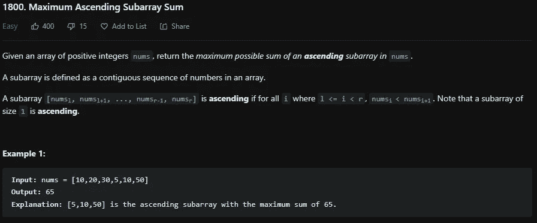
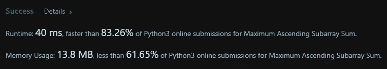

# LeetCode 1800。最大升序子数组 Python 解

> 原文：<https://medium.com/codex/leetcode-1800-maximum-ascending-subarray-python-solution-a9680010e997?source=collection_archive---------18----------------------->

## 盲 75 —编程和技术面试问题—解释系列

## 问题是:

给定一个正整数数组*，返回 ***nums*** 中一个升序子数组的最大可能和。*

*子数组被定义为数组中连续的数字序列。*

*一个子数组***【nums[l]，nums[l+1]，…，nums[r-1]，nums[r]*** 是升序如果对于所有 ***i*** 其中***l<= I<r***，***nums[I]<nums[I+1]***。注意，大小为 1 的子数组是升序的。*

**

## *制约因素:*

*   *1<= ***nums . length***<= 100*
*   *1<= ***nums【I】***<= 100*

## ****解释:****

*这个问题类似于 [LeetCode 53。最大子数组](/codex/leetcode-53-maximum-subarray-python-solution-dab6b038c2c7)，但是更简单，因为我们知道子数组必须按升序排列。要获得这个问题的解决方案，首先需要使用动态编程技术创建一个数组来保存当前值，在本例中是子数组的总和。然后我们需要一个 max sum 变量来保存计算出的子数组中最大和的返回值。显然，我们必须循环遍历 ***nums*** 数组，并开始计算这些和。循环后，我们只返回我们的最大和。*

## *动态规划解— O(n):*

*首先我们把 ***nums*** 数组的长度保存成一个变量来节省一点时间。然后我们创建 sums 数组，用 0 填充，长度与数组 ***nums*** 相同。然后我们将这个数组的第一个元素设置为 ***nums*** 数组的第一个元素，因为它总是这个值。然后，我们将最大和的值设置为相同的值。现在是循环通过 ***nums*** 数组的时候了。我们将 sums 数组的当前元素设置为 sums 数组的前一个元素加上 ***nums*** 数组的当前值，也就是说，升序。如果不是升序，那么 sums[i]就被设置为 ***nums[i]*** 。现在我们通过取其自身的最大值和这个新计算的和来计算最大和。然后一旦完成循环，返回这个最大和。*

```
*class Solution:
 def maxAscendingSum(self, nums: List[int]) -> int:
  len_n = len(nums)
  sums = [0] * len_n
  sums[0] = nums[0]
  max_sum = sums[0]

  for i in range(1, len_n):
   sums[i] = sums[i-1] + nums[i] if nums[i] > nums[i-1] else nums[i]

   max_sum = max(sums[i], max_sum)

    return max_sum*
```

**

# *信息:*

*网址:[nkwade . dev](http://www.nkwade.dev/)
LinkedIn:[linkedin.com/in/nkwade](http://www.linkedin.com/in/nkwade/)
GitHub:[github.com/nkwade](http://www.github.com/nkwade)
邮箱: [nicholas@nkwade.dev](mailto:nicholas@nkwade.dev)*