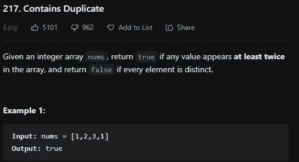
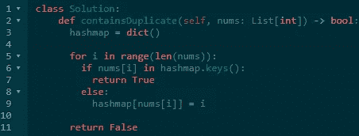

# LeetCode 217。包含重复 Python 解决方案

> 原文：<https://medium.com/codex/leetcode-217-contains-duplicate-python-solution-a246f93eed9c?source=collection_archive---------10----------------------->

## 盲 75 —编程和技术面试问题—解释系列

## 问题是:

给定一个整数数组 ***nums*** ，如果任意值在数组中出现至少两次，则返回 true，如果每个元素都不同，则返回 false。

**约束:**

*   1<= nums.length <= 105
*   -109 <= nums[i] <= 109



## The explanation:

This problem is one of the easier problems to do as long as you understand [hashmap](https://www.coursera.org/lecture/data-structures-optimizing-performance/core-hash-tables-m7UuP)以及如何在你所推崇的语言中使用它们以及它们的方法。为了获得 O(n)时间复杂度，必须遍历数组一次，并将 hashmap 键设置为数组的元素，将该键的值设置为索引。如果你想强行得到 O(n)的时间复杂度，你只需要使用嵌套的 for 循环，并对照数组的其他值来硬检查每个值。

## Solution — Hashmap — O(n):

首先，将 hashmap 变量声明为一个字典(python 中的 hashmap)，然后开始遍历数组。然后，对于数组中的每个元素，检查该值是否已经是 hashmap 中的一个键，如果是，则返回 true。如果为假，那么将新键和值添加到 hashmap 中。如果循环结束时没有返回值，则返回 false，因为数组中不能有出现两次的值。

```
class Solution:
 def containsDuplicate(self, nums: List[int]) -> bool:
   hashmap = dict()

   for i in range(len(nums)):
   if nums[i] in hashmap.keys():
     return True
   else:
     hashmap[nums[i]] = i

   return False
```



LeetCode 上的 Python 解决方案

# 信息:

网址:[nkwade . dev](http://www.nkwade.dev/)
LinkedIn:[linkedin.com/in/nkwade](http://www.linkedin.com/in/nkwade/)
GitHub:[github.com/nkwade](http://www.github.com/nkwade)
邮箱: [nicholas@nkwade.dev](mailto:nicholas@nkwade.dev)