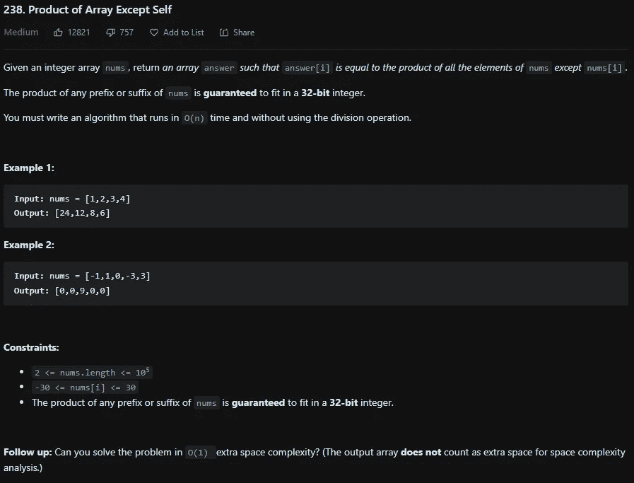
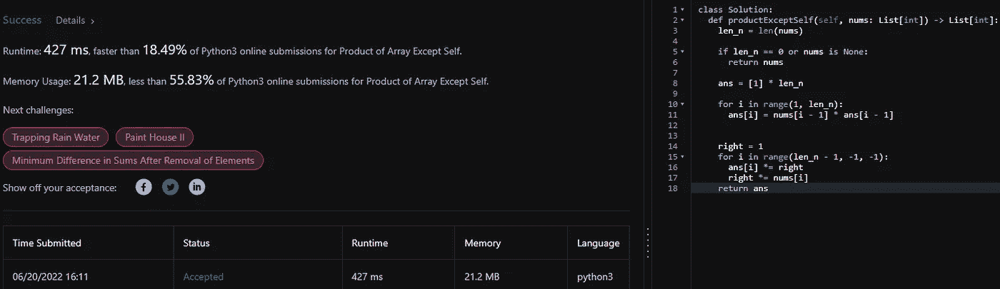
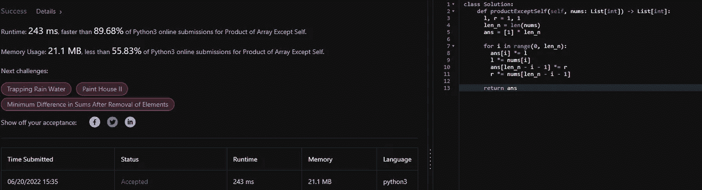

# LeetCode 238。除自身之外的数组乘积— Python 解决方案

> 原文：<https://medium.com/codex/leetcode-238-product-of-array-except-self-python-solution-2ec1a6f855ae?source=collection_archive---------8----------------------->

盲 75 —编程和技术面试问题—解释系列

## 问题是:

给定一个整数数组 ***nums*** ，返回一个数组答案使得 ***答案【I】***等于 ***nums*** 除***nums【I】***之外的所有元素的乘积。

## 制约因素:

*   ***nums*** 的任何前缀或后缀的乘积保证适合 32 位整数。
*   你必须写一个运行时间为 O(n)的算法
*   不能使用除法运算。

## 示例:

例 1:

```
**Input:** ***nums*** = [1,2,3,4]
**Output:** [24,12,8,6]
```

**例 2:**

```
**Input:** ***nums*** = [-1,1,0,-3,3]
**Output:** [0,0,9,0,0]
```



## 解释是:

这个问题是动态规划的一个很好的例子。更明显的方法当然是更长的方法。这种方式就是从左到右遍历 ***nums*** 数组并设置 ***答案【I】***到 ***答案【I-1】***乘以***nums【I-1】***然后从右到左乘以 ***答案【I】***乘 ***nums 之所以 ***答案【I】***从来不乘以 ***nums*** 或者答案 at ***i*** ，而是 ***i +/- 1*** 是因为这样会乘以 ***答案【I】***本身，这是我们不做的约束之一。这种解决方案称为两遍，时间复杂度为 O(2 * n)，非常接近最佳时间复杂度，但这可以在一遍中完成，时间复杂度为 O(n)。***

O(n)的解决方案是只遍历数组一次，但是跟踪数组的左右乘积，并将这些乘积乘以 ***答案【I】***。

## 双通解— O(2 * n)

首先，创建一个保存 ***nums*** 长度的变量，这样可以节省时间，而不是每次都调用 ***len(nums)*** ，如果长度经常被使用，这是一个好习惯。然后是极限情况，如果数组的长度为零或者数组没有内存，那么就返回数组本身，因为什么都不会改变。然后初始化 ***ans*** 数组，该数组保存所有的 1，而不是 0，因为当应用乘法时，它永远不会改变。这是第一遍将要完成的地方，如前所述，将 ***ans[i]*** 设置为 ***nums*** 中的前一个数字乘以 ans 中的前一个数字。一旦完成，初始化一个右变量为 1 以保存正确的乘积，否则索引 0 处的数字将保存错误的值。它不会乘以索引 1 处的值。然后在 for 循环内部将***ans【I】***乘以右乘积**，然后将右乘积**乘以***nums【I】***处的值。经过这一过程后，阵列就完成了，可以返回。

```
class Solution:
  def productExceptSelf(self, nums: List[int]) -> List[int]:
    len_n = len(nums)

    if len_n == 0 or nums is None:
      return nums

    ans = [1] * len_n 

    for i in range(1, len_n):
      ans[i] = nums[i — 1] * ans[i — 1] right = 1

    for i in range(len_n — 1, -1, -1):
      ans[i] *= right
      right *= nums[i]

    return ans
```



## 一步解——O(n)

对于一次通过的解决方案，您将左右乘积都声明为 1，并像以前一样初始化 ***len_n*** 变量。同样，如果 ***nums*** 中没有元素，则返回 ***nums*** 。然后用 1 初始化 ***ans*** 数组，现在我们迭代 ***nums*** 数组。for 循环内部的前两行和后两行可以交换，先左后右更有意义。对于左侧，将***ans【I】***乘以左侧乘积，然后更新左侧乘积。与前面的解决方案一样，在 for 循环中使用了左右乘积之后，您必须更新它们，以确保***【ans】***没有乘以***nums【I】***。然后通过乘以***nums【I】***来更新左边的乘积。那么对于正确的产品，你先更新***ans【len _ n-I-1】***，减一是因为***ans【len _ n】***会出界。然后将右积乘以***nums【len _ n-I-1】***。在 for 循环结束时，你可以返回 ***ans*** 数组。

```
class Solution:
  def productExceptSelf(self, nums: List[int]) -> List[int]:
    l, r = 1, 1
    len_n = len(nums)

    if len_n == 0 or nums is None:
      return nums ans = [1] * len_n

    for i in range(0, len_n):
      ans[i] *= l
      l *= nums[i]
      ans[len_n — i — 1] *= r
      r *= nums[len_n — i — 1]

    return ans
```



# 信息:

网址:[nkwade . dev](http://www.nkwade.dev/)
LinkedIn:[linkedin.com/in/nkwade](http://www.linkedin.com/in/nkwade/)
GitHub:[github.com/nkwade](http://www.github.com/nkwade)
邮箱: [nicholas@nkwade.dev](mailto:nicholas@nkwade.dev)