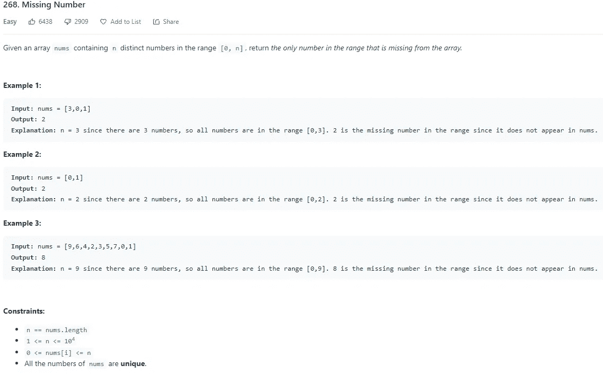

# LeetCode 268。缺少数字 Python 解决方案

> 原文：<https://medium.com/codex/leetcode-268-missing-number-python-solution-a47b842ae1ac?source=collection_archive---------6----------------------->

## 盲 75 —编程和技术面试问题—解释系列

## 问题是:



LeetCode 268。缺少数字 Python 解决方案

## 解释是:

这个问题有两种不同的解决方案，位操作解决方案并不真正直观，但总和解决方案是。因为我们知道数组的值是从 0 到 n，其中有一个数字缺失，索引是从 0 到 n-1，所以我们可以使用这些值和索引的总和来查找缺失的数字。您首先将 sum 初始化为 n，因为您无法通过迭代获得该值，然后遍历数组并添加索引的和减去该值。位操作有点难以理解。因为我们使用的是 XOR 而不是 OR，所以这两位必须不同才能变成 1。因为我们对每个值和它的索引进行异或运算，所以所有相同的数字都被异或为 0，因为当你对一个数字本身进行异或运算时，这些位被设置为零。这意味着循环中唯一剩下的位将是创建丢失数字的位。

## 和解— O(n):

首先，我们将 len_n 变量初始化为数组的长度，因为它将被多次使用，然后我们将结果也初始化为数组的长度。现在我们遍历数组，将索引和数组值之间的差相加。然后我们返回结果。

```
class Solution:
 def missingNumber(self, nums: List[int]) -> int:
  len_n = len(nums)
  res = len_n

  for i in range(len_n):
   res += i — nums[i]

  return res
```

## 位操作解决方案— O(n):

首先，我们存储数组的长度，并将结果设置为该长度。然后我们遍历数组，用索引和数组值的 OR 对结果进行 XOR 运算。然后我们在循环后返回那个值。

```
class Solution:
 def missingNumber(self, nums: List[int]) -> int:
  len_n = len(nums)
  res = len_n

  for i in range(len_n):
   res ^= i ^ nums[i]

  return res
```

# 信息:

网址:[nkwade . dev](http://www.nkwade.dev/)
LinkedIn:[linkedin.com/in/nkwade](http://www.linkedin.com/in/nkwade/)
GitHub:[github.com/nkwade](http://www.github.com/nkwade)
邮箱: [nicholas@nkwade.dev](mailto:nicholas@nkwade.dev)