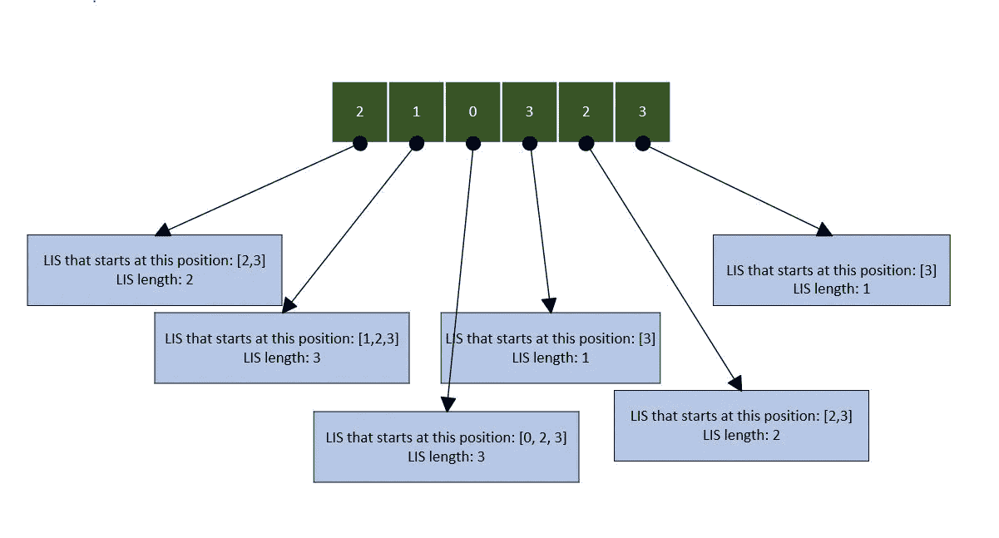
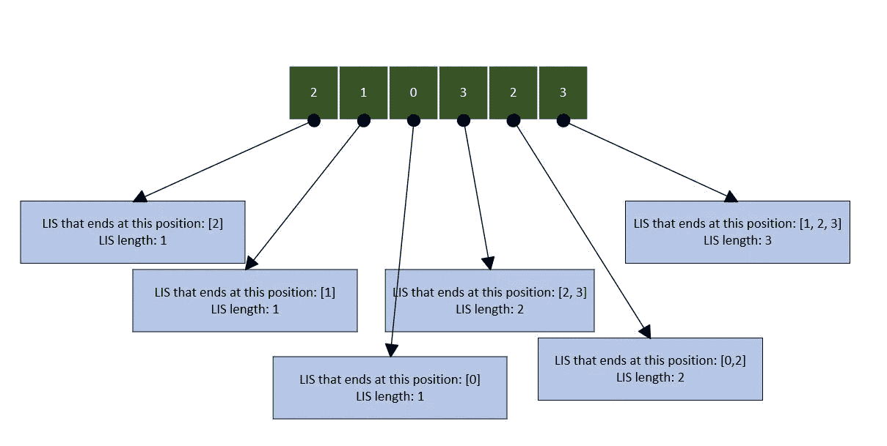
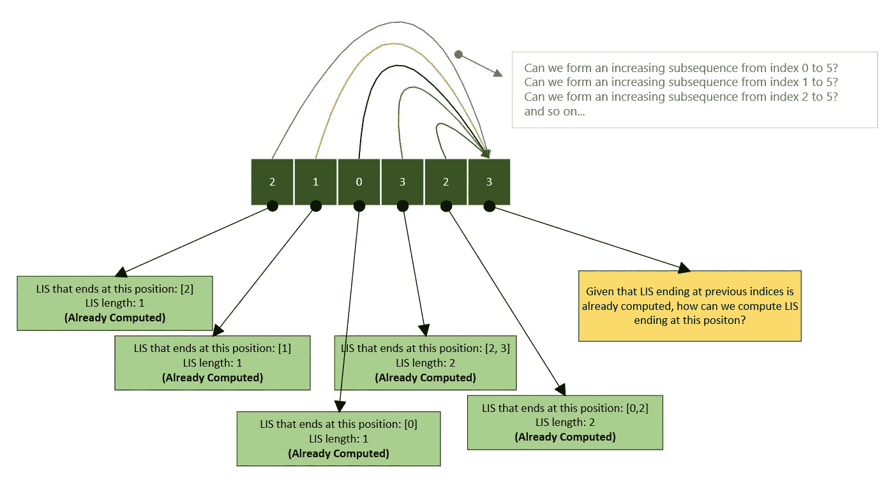

# Leetcode 300:最长递增子序列

> 原文：<https://medium.com/codex/leetcode-300-longest-increasing-subsequence-b5eaba41e407?source=collection_archive---------0----------------------->

给定一个整数数组`nums`，返回最长严格递增子序列的长度。

**子序列**是可以通过删除一些元素或不删除元素而不改变剩余元素的顺序从数组中导出的序列。例如，`[3,6,2,7]`是数组`[0,3,1,6,2,2,7]`的子序列

**举例:**

```
**Input:** nums = [2, 1, 0, 3, 2, 3]
**Output:** 3
**Explanation:** The longest increasing subsequence is [1, 2, 3], therefore the length is 3Note that there can be multiple longest increasing subsequences of same length
```

这是一个练习递归和动态编程的好问题。我将展示如何使用这两种方法在 Go 中编写解决方案。

**方法 1:递归——强力方法**

当面对一个复杂的问题时，想出一个强力的解决方案是一个很好的起点。这种方法有助于对问题有一个清楚的了解。一旦暴力解决方案被正确编码，人们就可以思考该解决方案暴露了什么样的模式，并相应地提出最佳解决方案。

为了用蛮力方法解决它，我可以用一个稍微不同的问题来表达原来的问题。如果我能找到从特定索引开始的最长递增子序列的长度会怎样？我可以用这些信息把原来的问题重新表述为—

> 找出从每个索引开始的 LIS 长度，并处理这些结果，以得出原始问题所需的解决方案。

下图显示了从输入数组中的每个位置开始的 LIS 以及相应的长度。



一旦我们获得了与每个索引相对应的 LIS 长度信息，我们就可以对它们进行处理，以找到最终结果，在本例中，就是找到所有这些 LIS 长度中的最大值。下面的代码片段说明了这一点。

现在，问题变成了如何找出从特定索引开始的 LIS 长度。这可以用递归来简单地编码。使用递归时，必须仔细考虑会破坏递归的基本情况。也就是说，基本情况的解决方案是琐碎的，必须进行编码。这种情况下的基本情况是找到从输入的最后一个索引开始的序列的 LIS 长度。这个值就是 1，不需要递归就可以返回。

就是这样。在程序中连接这两个代码片段应该是可行的。然而，这个解决方案会非常慢。这是因为我们一次又一次地解决同样的子问题，也就是说，我们在重复同样的工作。可以通过使用一种叫做动态编程(DP)的编程范式来改进这个解决方案。使用动态规划技术解决问题是非常令人满意的，如果我们遵循系统的方法，这并不困难。一般来说，在 DP 中有两种方法您会经常遇到。这些是—

*   自顶向下的方法—这种技术缓存中间结果以避免重新计算
*   自下而上的方法——这种技术以自下而上的方式构建最终解决方案(即首先解决较小的子问题，然后使用这些结果来计算较大的子问题的解决方案)

在看到这个问题的 DP 解决方案之前，让我们看一下方法 2，它也是一种强力方法，但是解决它的方式几乎没有什么不同。

**方法 2 递归—强力方法**

在方法 1 中，我们将原始问题表述如下:

> 找出从每个索引开始的 LIS 长度，并处理这些结果以得出所需的解决方案

然而，我们也可以用下列术语来表达它:

> 找出在每个索引处结束的 LIS 长度，并处理这些结果以得出所需的解

下图显示了输入中每个位置的 LIS 结尾的详细信息以及相应的长度。



这样，我们可以很容易地编写顶层函数，如下所示。

编写计算以特定索引结尾的 LIS 长度的函数也非常类似于方法 1。这里的基本情况是检查结束索引是否为 0，并跳出递归。它的代码显示在下面的要点。

与方法 1 相比，这个版本的程序在速度上没有什么不同。我这样做的原因是为了展示如何将这个想法应用到代码中。另外，我在方法 3 中通过使用动态编程改进了这个解决方案。

**方法 3 动态规划自下而上求解**

正如我前面提到的，DP 有两种风格——自顶向下的方法和自底向上的方法。我将在这里展示如何使用自底向上的技术来解决这个问题。自底向上方法的思想很简单。我们先解决较小实例的问题，然后用这些结果来解决较大的子问题。我们使用一个表来存储子问题的结果。

第一步是创建一个表(即一个数组)，并用容易解决的子问题初始化它。下面的代码片段就是这样做的。

下一步是计算所有不断增长的子问题的 LIS 长度。

为了计算每个`dp[i]`，我将使用先前计算的较小子问题的结果。这些值可从`dp[0 to i-1]`的表格中获得。

为了了解如何做到这一点，让我们假设我已经计算了。LIS 结束于索引 0、1、2、3、4，我需要计算结束于索引 5 的 LIS。下图是细节。



正如你所看到的，代码中的内部循环是先前计算的结果被用来寻找当前子问题的解决方案的地方，这个子问题由索引`i`标记。

感谢阅读。我希望你喜欢这篇文章。