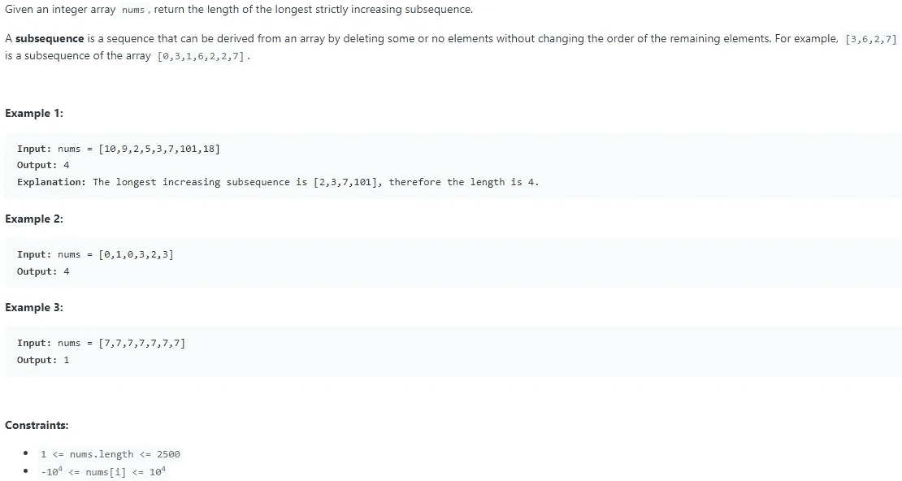

# LeetCode 300。最长递增子序列— Python 解决方案

> 原文：<https://medium.com/codex/leetcode-300-longest-increasing-subsequence-python-solution-239657985745?source=collection_archive---------9----------------------->

盲 75 —编程和技术面试问题—解释系列

## 问题是:



## 解释是:

总是使用深度优先搜索 O(2^n).的野蛮解决方案然后是动态规划解 O(n)。这也是另一个 O(nlogn)解决方案，我不会解释，因为这是一个困难的解决方案，可能不会在面试中出现。动态编程解决方案从数组的末尾反向工作到开始。原因是很容易计算出最后几个指数的最长增长序列，但是越往后越难。

为了解决这个问题，如果您缓存反向工作的解决方案，您可以使用这些保存的计算，而不是重做工作。对此需要注意的是，您不能只使用之前计算的 LIS，因为这可能不会导致最长的递增子序列。为了解决这个问题，你必须遍历所有先前计算的列表，以找到该特定值的最佳子序列，因此这个问题是 O(n)。现在，为了确定每个先前计算清单的子序列，您将当前清单设置为其自身和 1 加上先前计算的清单的最大值。这将保证数组中每个索引的最大 LIS。

## 动态规划解:O(n)

首先初始化数组来保存每个索引的 LIS，然后开始向后遍历所有值。在这个循环中，创建另一个从 i+1 到数组中最后一个值的循环。然后确定当前值是否可以添加到 LIS[j]子序列中(因为我们是向后工作的，所以它必须小于 nums[j])。如果是，则将当前 LIS 设置为其自身和 1 加上 LIS[j]的最大值。在循环之后，只返回列表的最大值。超级简单的代码，但是很难理解。

```
class Solution:
 def lengthOfLIS(self, nums: List[int]) -> int:
  LIS = [1] * len(nums)

  for i in range(len(nums) — 1, -1, -1):
   for j in range(i + 1, len(nums)):
    if nums[i] < nums[j]:
     LIS[i] = max(LIS[i], 1 + LIS[j])

  return max(LIS)
```

# 信息:

网址:[nkwade . dev](http://www.nkwade.dev/)
LinkedIn:[linkedin.com/in/nkwade](http://www.linkedin.com/in/nkwade/)
GitHub:[github.com/nkwade](http://www.github.com/nkwade)
邮箱: [nicholas@nkwade.dev](mailto:nicholas@nkwade.dev)