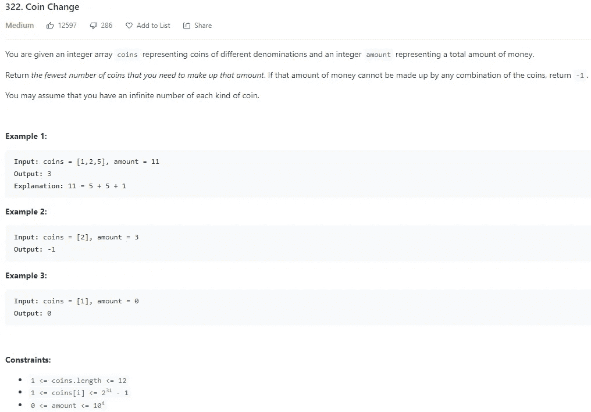

# LeetCode 322。硬币兑换 Python 解决方案

> 原文：<https://medium.com/codex/leetcode-322-coin-change-python-solution-3ee10793cd6b?source=collection_archive---------3----------------------->

## 盲 75 —编程和技术面试问题—解释系列

## 问题是:



## 解释是:

最初我认为这个解决方案很简单，将硬币分类，然后从最大的硬币到最小的硬币，直到总数为 0。这个解决方案的问题是，数量可能大于最大的硬币，但如果使用最大的硬币，你就无法达到 0。这就是问题变得更加复杂的地方。使用自底向上的动态编程技术效果最好。你可以从 0.01 美元(总数是一美分，而不是美元总数)一直计算到总数，然后对每一整美元检查每一枚硬币，如果硬币少于或等于总数，在硬币总数上再加一枚硬币，以达到先前的总数。在这个循环之后，返回最小数量的硬币来增加这个数量。

## 动态规划解:O(n * k)

首先创建一个数组，用来记录需要的最小硬币数量。将该数组中的每个索引设置为数量加 1。这在返回声明中使用，以检查硬币的总和是否达到该金额，并确定所需硬币的最小金额。为了计算出总数，你必须将 0-index 设置为 0。这是因为一旦你到达一个硬币，将设置金额为 0，你可以添加一个硬币到硬币计数。现在从 1 到数量(n)循环，对于每个数量循环所有的硬币(k)。对于每个硬币，你要断言硬币小于或等于金额。如果是，您希望将数组中的索引设置为自身的最小值(如果另一个硬币有效，这将是该数量)和 1 加上该数量的硬币计数减去该硬币(达到前一数量所需的硬币数量)。这将是每个数额将有最低数额的硬币需要达到该数额。顶层循环完成后，返回达到该数量所需的硬币数量，只要它不等于该数量加 1(其初始值)。如果等于该值，则返回-1，因为没有硬币组合可以达到该值。

```
class Solution:
 def coinChange(self, coins: List[int], amount: int) -> int:
  dp = [amount + 1] * (amount + 1)
  dp[0] = 0

  for a in range(1, amount + 1):
   for c in coins:
    if a — c >= 0:
     dp[a] = min(dp[a], 1 + dp[a — c])

  return dp[amount] if dp[amount] != amount + 1 else -1
```

# 信息:

网址:[nkwade . dev](http://www.nkwade.dev/)
LinkedIn:[linkedin.com/in/nkwade](http://www.linkedin.com/in/nkwade/)
GitHub:[github.com/nkwade](http://www.github.com/nkwade)
邮箱: [nicholas@nkwade.dev](mailto:nicholas@nkwade.dev)