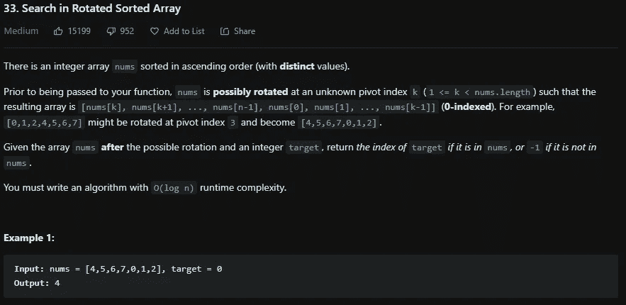
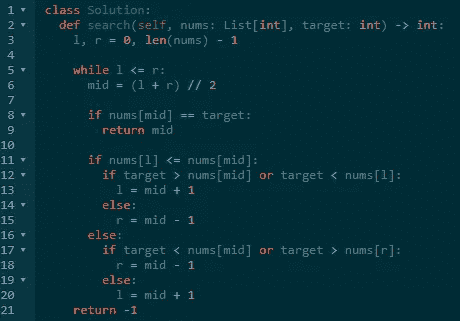

# LeetCode 33。在旋转排序数组中搜索 Python 解决方案

> 原文：<https://medium.com/codex/leetcode-33-search-in-rotated-sorted-array-python-solution-428e6bd56182?source=collection_archive---------8----------------------->

## 盲 75 —编程和技术面试问题—解释系列

## 问题是:

有一个按升序排序的整数数组`nums`(带有**个不同的**值)。

在传递给你的函数之前，`nums`可能被**旋转**到一个未知的旋转索引`k` ( `1 <= k < nums.length`，这样得到的数组就是`[nums[k], nums[k+1], ..., nums[n-1], nums[0], nums[1], ..., nums[k-1]]`(**0-索引**)。例如，`[0,1,2,4,5,6,7]`可能在旋转索引`3`处旋转，变成`[4,5,6,7,0,1,2]`。

给定数组`nums`**后可能的旋转和一个整数`target`，如果在 `nums` *中则返回*`target`*的索引，如果不在* `nums`中则返回* `-1` *。****

***你必须写一个运行时复杂的算法。***

******

## ***示例:***

*****例 1:*****

```
***Input:** nums = [4,5,6,7,0,1,2], target = 0
**Output:** 4*
```

*****例 2:*****

```
***Input:** nums = [4,5,6,7,0,1,2], target = 3
**Output:** -1*
```

*****例 3:*****

```
***Input:** nums = [1], target = 0
**Output:** -1*
```

## ***制约因素:***

*   ***`1 <= nums.length <= 5000`***
*   ***`-104 <= nums[i] <= 104`***
*   ***`nums`的所有值都是**唯一的**。***
*   ***`nums`是一个可能旋转的升序数组。***
*   ***`-104 <= target <= 104`***

## ***解释是:***

***这类似于[在旋转排序数组](/codex/leetcode-153-find-minimum-in-rotated-sorted-array-python-solution-8e3c6818b0e7?source=your_stories_page-------------------------------------)中查找最小值，除了你不是在查找最小值，而是在搜索一个目标元素。这就是一些额外的 if-else 语句发挥作用的地方。同样，这个解决方案将使用二分搜索法，因此设置变量和 while 循环是非常标准的。所以在这个数组中，我们不知道左右指针的中点是大于还是小于左指针。因此，我们的第一个 if 语句将检查这一点。那么在这个 if 语句内部，我们不知道目标是大于还是小于中间元素，但是我们也不知道目标是小于还是大于左指针。所以我们必须检查这两种情况是否属实。如果目标大于中间元素或者目标小于左指针，那么我们必须将左指针设置为中间加一。记住我们可以检查目标是否小于左指针，因为我们已经知道左指针小于中间元素。这是大量的 if-else 和检查，它肯定会变得混乱和难以记忆，所以我建议只需编码并绘制它，并真正考虑每一种边缘情况，以提出这种解决方案。所以现在如果目标不大于中间元素，目标大于等于左指针，我们可以把右指针设置为中间减一。现在，在第一个 if 语句之外，如果左边的指针大于中间的元素，我们做类似的检查。在这个 else 语句中，我们检查目标是否小于中间的元素，或者目标是否大于右边的指针，如果是，那么我们将右边的指针设置为中间减一。否则，将左指针设置为中间加 1。这将确保您能够找到目标(如果它存在于数组中)。***

## ***二分搜索法解— O(logn):***

***首先将左右指针初始化为零，并将**的长度 *nums* 的长度**减一。现在，当 left 小于或等于 right 指针时，我们停留在这个 for 循环中。我们计算这些左边和右边的中间。这个 while 循环中的第一个检查是我们是否找到了目标，然后当然根据请求返回索引。现在进入 if-else 的网络。我这里不打算再解释了，你可以看解决方案了解这些。如果我们没有找到目标就退出这个 while 循环，我们返回-1。***

```
*class Solution:
 def search(self, nums: List[int], target: int) -> int:
  l, r = 0, len(nums) — 1

  while l <= r:
   mid = (l + r) // 2

   if nums[mid] == target:
    return mid

   if nums[l] <= nums[mid]:
    if target > nums[mid] or target < nums[l]:
     l = mid + 1
    else:
     r = mid — 1
   else:
    if target < nums[mid] or target > nums[r]:
     r = mid — 1
    else:
     l = mid + 1

  return -1*
```

******

# ***信息:***

***网址:[nkwade . dev](http://www.nkwade.dev/)
LinkedIn:[linkedin.com/in/nkwade](http://www.linkedin.com/in/nkwade/)
GitHub:[github.com/nkwade](http://www.github.com/nkwade)
邮箱: [nicholas@nkwade.dev](mailto:nicholas@nkwade.dev)***