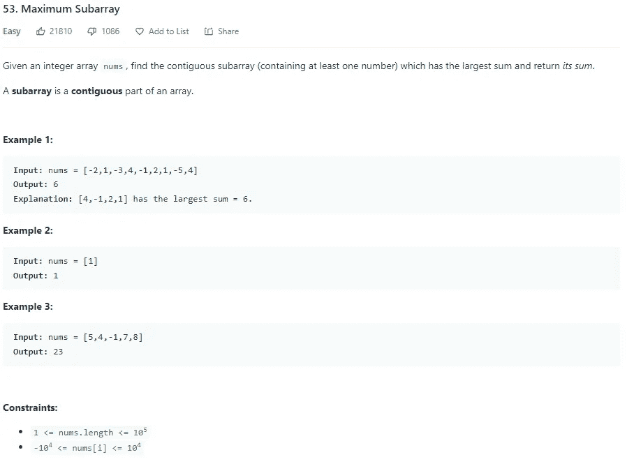
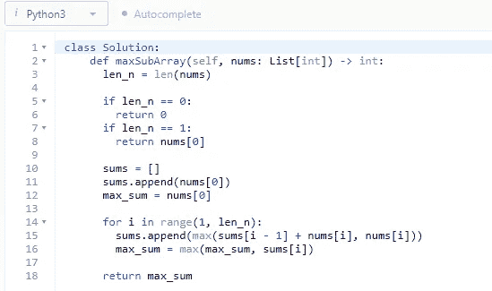

# LeetCode 53。最大子阵列 Python 解决方案

> 原文：<https://medium.com/codex/leetcode-53-maximum-subarray-python-solution-dab6b038c2c7?source=collection_archive---------5----------------------->

## 盲 75 —编程和技术面试问题—解释系列

## 问题是:

给定一个整数数组 ***nums*** ，找出具有最大和的连续子数组(至少包含一个数)并返回其和。
**注意**:子数组是一个数组的连续部分。

## 制约因素:

*   1<= *<= 105*
*   *-104<= ***nums【I】***<= 104*

## *示例:*

***例 1:***

```
***Input:** nums = [-2,1,-3,4,-1,2,1,-5,4]
**Output:** 6
**Explanation:** [4,-1,2,1] has the largest sum = 6.*
```

***例 2:***

```
***Input:** nums = [1]
**Output:** 1*
```

***例 3:***

```
***Input:** nums = [5,4,-1,7,8]
**Output:** 23*
```

**

## *解释是:*

*这是一个动态编程问题，即使考虑到这一点，也很容易被这个问题绊倒。与大多数 DP 问题一样，您创建一个数组来跟踪您计算的值。对于这个问题，这将是子阵列的总和。当然还有强力解决方案 O(n ),其中使用嵌套的 for 循环并计算每一个和，但是 DP 解决方案是 O(n ),并且代码行更少。如果面试官说你有无限的时间，但空间只能容纳 1 个变量，即最大和(这是假设的，可能不会发生)，那么理解暴力解决方案是有好处的。继续 DP 解决方案，您需要一个与 nums 长度相同的数组，以及一个要跟踪以返回的 max sum。对于数组中的每个元素，它将等于先前的总和加上当前元素 **nums** 或当前元素**nums*nums*中的较大值。那么最大和将被更新为其自身和这个新计算的和的最大值。一旦 ***nums*** 数组迭代完毕，返回最大和。***

## *强力解— O(n)*

*LeetCode 上的这个解决方案会超过时间限制，但会起作用。我只是把它放在这里让大家看看。首先保存 ***nums*** 数组的长度只是为了一点时间提升。然后检查拐角情况，如果长度是 1，那么只返回一个元素。之后，将最大和设置为数组的第一个元素。然后遍历数组从 0 到长度为 ***nums*** 减 1，做一个当前的 sum 变量并设置为***nums【I】***，然后使用嵌套 for-loop 从 i + 1 迭代到长度为 ***nums*** 。将 ***nums[j]*** 加到当前总和，并将最大总和设置为自身、当前总和和 ***nums[j]的最大值。一旦循环结束，返回最大和。****

```
*class Solution:
 def maxSubArray(self, nums: List[int]) -> int:
  len_n = len(nums) if len_n == 1:
   return nums[0]

  max_sum = nums[0]

  for i in range(len_n — 1):
   curr_sum = nums[i]

  for j in range(i + 1, len_n):
   curr_sum += nums[j]
   max_sum = max(max_sum, curr_sum, nums[j])

  return max_sum*
```

## *动态规划解— O(n):*

*同样，由于 ***nums*** 数组的长度将被多次使用，将其保存到一个变量中。然后检查拐角情况，如果长度为 1，则返回数组中唯一的元素。然后创建一个数组来保存总和。然后追加第一个元素 ***nums*** ，因为元素 0 永远只是它自己。然后将最大总和设置为该值。然后从 1 开始迭代到 ***nums*** 的长度，并在这个 for 循环中追加前一个总和的最大值加上***nums【I】***和 just***nums【I】***。然后将 max sum 设置为自身和当前 sum 的最大值(***【sums【I】***)。一旦完成这个循环的迭代，返回最大和。*

```
*class Solution:
 def maxSubArray(self, nums: List[int]) -> int:
  len_n = len(nums)

  if len_n == 1:
   return nums[0]

  sums = []
  sums.append(nums[0])
  max_sum = nums[0]

  for i in range(1, len_n):
   sums.append(max(sums[i — 1] + nums[i], nums[i]))
   max_sum = max(max_sum, sums[i])

  return max_sum*
```

**

# *信息:*

*网址:[nkwade . dev](http://www.nkwade.dev/)
LinkedIn:[linkedin.com/in/nkwade](http://www.linkedin.com/in/nkwade/)
GitHub:[github.com/nkwade](http://www.github.com/nkwade)
邮箱: [nicholas@nkwade.dev](mailto:nicholas@nkwade.dev)*