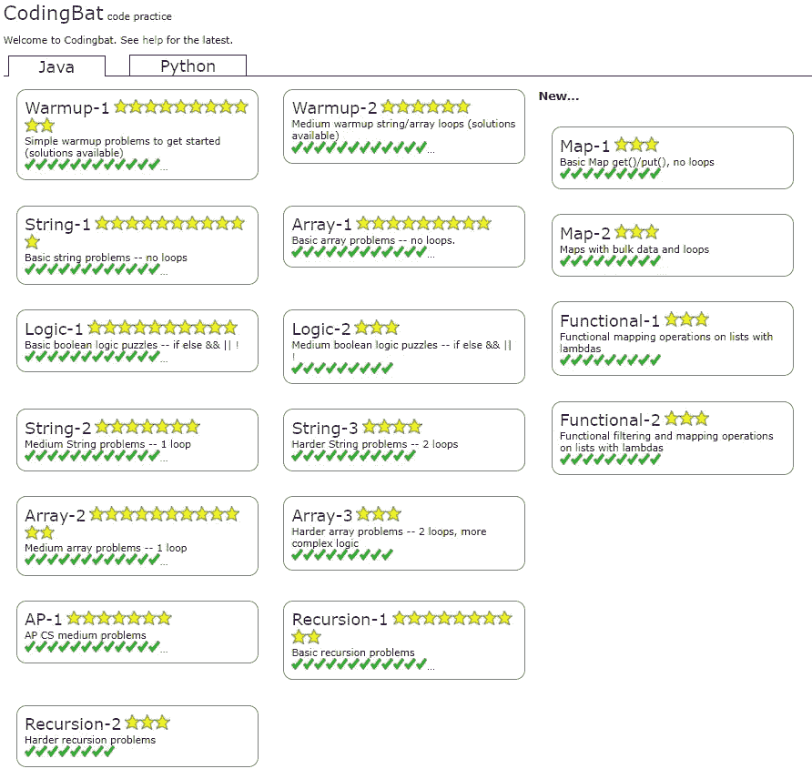
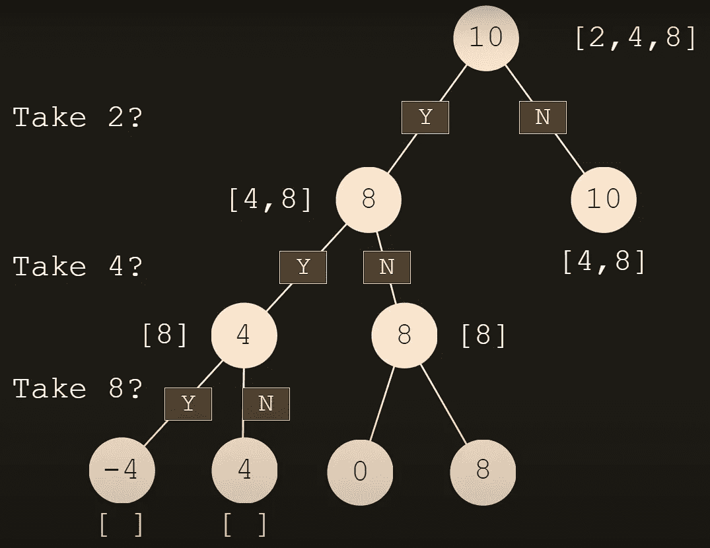

# LeetCode 太难了？先从这里开始。

> 原文：<https://medium.com/codex/leetcode-too-difficult-start-here-first-b3469ebca32?source=collection_archive---------0----------------------->


**源代码:**[**【https://github.com/lwoluke/CodingBat-Completed】**](https://github.com/lwoluke/CodingBat-Completed)

在看到 LeetCode 是最知名的编码面试准备网站之一，或者它对提高你的编码和创造性解决问题的技能非常有益之后，你有没有尝试过？如果你有，你可能已经注意到非常陡峭的学习曲线，并且即使是网站上最简单的问题也太难了，除非你有足够的经验。我自己亲身经历过这一点，当时我甚至不知道如何在不看答案的情况下解决网站上任何最简单的问题。

作为这次经历的结果，我对自己说，我可以去哪里学习技能，以便我能够解决这个网站上最简单的问题？

在我尝试的许多网站上，我遇到了两种主要的问题。第一个是问题开始时非常容易，然后突然之间，问题变得非常困难，我甚至不知道如何着手解决它们。其次，有些问题太难了，没有适当的准备。为什么没有一个网站可以从一个简单的困难开始，然后逐步建立起来呢？我以为每个网站都是这样，直到我发现[编码 Bat](https://codingbat.com/java) 。这个网站之所以对我来说如此伟大，是因为它实际上遵循了一致的难度进展，一般问题不需要太长时间就能解决。这让我能够在一个小时左右的时间里快速解决许多问题。此外，该网站有我需要的一切，以解决没有不必要的功能的问题。虽然我仍然需要时不时地查找解决方案，偶尔还需要查看视频，但我几乎从未觉得被问到的问题对我来说太难了，至少我知道解决网站上每个问题的可能方法。

在这篇博文的剩余部分，我将与你分享我在 CodingBat 上完成所有 317 个 Java 问题的过程中所学到的关键东西。



首先，你可能会问我为什么要完成 CodingBat 上的每个问题，因为问题太多了！或者你也可能想知道，如果我走同样的路，我能学到什么？或者，我最初是如何发现这个网站的？我将在下面解释我对每一个问题的推理。

去年夏末，在浏览了许多网站来提高我的编码技能却没有任何收获之后，我的一个朋友建议我去看看 CodingBat。虽然我可能尝试了一天，但此时我并没有意识到这个网站会有多好，直到锡耶纳学院 2021 年秋季学期的中途。在我的软件开发课程中的一天，我的教授让我们使用 CodingBat，并以小组为单位，看看谁能解决字符串和数组问题集中的最多问题。虽然我们没有使用它超过一天，但这让我意识到我有多喜欢在这里解决问题，而且我注意到问题的难度一直在增加。在这学期剩下的时间里，我已经设法解决了网站上的 100 多个问题，但直到今年早些时候，我才决定要完成剩下的问题。我发现在 CodingBat 上完成问题的过程非常有益，但我也知道我将在这个春季学期学习数据结构，并注意到那里的许多问题对学习与这门课程相关的知识非常有益。这导致我想把剩下的题做完，在过去的一个月里，我做完了大约 100 道剩下的题！

## **涵盖的具体事物**

CodingBat 上的问题涵盖了许多不同的主题。一般领域包括:

1.  逻辑
2.  环
3.  数组和数组列表
4.  地图
5.  功能的
6.  递归

甚至还有 AP 计算机科学的问题，我也很喜欢。这些建立在我之前完成的逻辑、循环和数组问题的难度之上。虽然我对这三个主题感到很舒服，但这些问题确实提高了我在这些领域的技能。我最喜欢的 AP CS 问题集中的一个问题叫做 mergeTwo，它涉及到使用两个按字母顺序排列的数组，并返回一个按顺序排列的前 n 个字符的数组，没有重复。虽然我第一次提出的解决方案具有 O(N ) 的[效率，但问题明确表示可以在](https://www.freecodecamp.org/news/big-o-notation-why-it-matters-and-why-it-doesnt-1674cfa8a23c/) [O(N)](https://adrianmejia.com/most-popular-algorithms-time-complexity-every-programmer-should-know-free-online-tutorial-course/) 中解决。为此，我重新编写了代码，如下所示:

```
public String[] mergeTwo(String[] a, String[] b, int n) {

  String[] firstOrdered = new String[n];

  int posA = 0;
  int posB = 0;
  int resultsIndex = 0;

  while (resultsIndex < n) {

    if (a[posA].compareTo(b[posB]) < 0) {
      firstOrdered[resultsIndex] = a[posA];
      posA++;
    } else if (a[posA].compareTo(b[posB]) > 0) {
      firstOrdered[resultsIndex] = b[posB];
      posB++;
    } else {
      firstOrdered[resultsIndex] = a[posA];
      posA++;
      posB++;
    }
    resultsIndex++;
  }

  return firstOrdered;
}
```

这意味着每次通过 while 循环时，将比较字符串数组 a 和 b 的当前索引，较小的那个将递增到索引中的下一个位置。当涉及到语句的 else 部分时，两个索引的值是相等的。由于问题指出不能有重复的元素，我选择了字符串数组 a 中当前索引处的元素，然后将两者都递增。这样做，就不可能将 b 的当前索引位置的元素添加到最终要返回的数组中。

**功能编程**

这是一个我只短暂接触过的话题，当我在构建[我的第一个 web 应用](/@luke_o/web-app-development-java-spring-postgres-rest-api-3c302e28d571)时，我最终发现了什么是 lambda 表达式和→运算符。在 CodingBat 问题涉及的所有主题中，这是我碰巧用得最少的一个，但当我有机会时仍然非常喜欢使用它。主要的好处是它使得编码非常简洁。下面是函数式编程与使用 for 循环的对比示例:

```
public ArrayList<String> functionalNoZ(ArrayList<String> strings) { strings.removeIf(s -> s.contains("z"));
    return strings;
}

public ArrayList<String> iterativeNoZ(ArrayList<String> strings) {

    for (int i = 0; i < strings.size(); i++) { if (strings.get(i).contains("z"))
        {
            strings.remove(strings.get(i));
        }
    } return strings;
}
```

正如您所看到的，这表明基于所需的行数，函数式编程要简洁 3 倍以上！因为这是一个简单的例子，想象一下当创建更复杂的函数语句时会有什么不同！

**递归**

在所有这些话题中，这是最难把握的。我第一次接触递归是在我使用 Python 的计算机科学导论课程的最后。我记得看了这么多视频来理解到底发生了什么，幸运的是我当时没有被测试过。

上周在我的数据结构课程开始时，我们已经进入了这个话题，但幸运的是，自从上了 CS 入门课程后，我获得了更多的经验。对于我的数据结构课程，在课程开始的前几周，我已经完成了所有的 ZyBooks 家庭作业，这有助于我对课程后面要涉及的每个主题有一个大致的了解。与此同时，我刚刚在 CodingBat 上开始了递归的第一个问题集，所以我感觉更有信心了，尽管仍然对正在发生的事情感到困惑。在第一堂课中，我的数据结构教授做了一件非常有趣的事情，这是我用来学习递归的其他资源从未做过的。我们用字符串做例子，而在其他地方，我试图只用整数例子来学习递归。这非常有用，因为我可以在不同的环境中理解如何用递归来解决问题，让我自己学习其他策略。因为字符串有一定的长度，所以很容易看出它们的大小上限和基本情况的递归模式。在课堂上讲述了各种字符串和整数的例子后，我能够很快地完成递归问题的前半部分。但是当问题的后半部分变得困难时，它又上升了一个等级。前半部分讲述了基本的递归，但后半部分讲述了所谓的[递归回溯](https://brilliant.org/wiki/recursive-backtracking/)。根据维基百科上的定义:

> ***回溯*** *可以定义为一种通用的算法技术，它考虑搜索每一个可能的组合，以便解决一个计算问题。*

在递归的后半部分的所有问题中，我发现第一个问题是最具挑战性的，因为这是我第一次接触这种类型的问题，其中涵盖了递归的所有剩余问题。从 CodingBat 中，名为 groupSum 的问题陈述如下:

> 给定一个整数数组，有没有可能选择一组整数，使得这组整数的和等于给定的目标？这是一个经典的回溯递归问题。一旦你理解了这个问题中的递归回溯策略，你就可以对许多问题使用相同的模式来搜索选择空间。我们的惯例不是查看整个数组，而是考虑从索引 **start** 开始一直到数组末尾的数组部分。调用者可以简单地通过将 start 作为 0 来指定整个数组。不需要循环——递归调用沿着数组向下进行。

在查看提示和解决方案之前，我能想到的这个问题的唯一部分是查看 start 是否大于或等于 int 数组的长度，并根据 target 是否等于 0 返回 true 或 false。为了完全理解这个问题，我需要分析多个来源。这样做之后，我能够理解问题是如何解决的。要做到这一点，需要有这样的递归情况，即起始位置的值被选择，或者不被选择。这意味着，为了确定目标值是否存在，将会查看许多组合。下面是我从 YouTube 视频中找到的一个非常有用的图表，解释了递归回溯是如何解决这个特殊问题的。



来自[YouTube 频道的丹尼尔·苏坦约](https://www.youtube.com/channel/UC0WUbyfQ4hL1kNE5vf7o2Wg)

这显示了在各种递归调用中目标值当前所处位置的每种可能的组合。最初，选择取值的每种情况，这导致目标值变为-4。在这之后，检查另一个递归调用是否没有选择最后一个值。这个过程继续检查递归调用的其他组合，直到目标等于 0。

```
// What I came up with
public boolean groupSum(int start, int[] nums, int target) {if (start >= nums.length) return (target == 0);

  if (groupSum(start + 1, nums, target - nums[start])) return true;

  if (groupSum(start + 1, nums, target)) return true;

  return false;
}// Optimized solution
public boolean groupSum(int start, int[] nums, int target) {if (start >= nums.length) return (target == 0);

  return (groupSum(start + 1, nums, target - nums[start])) 
      || (groupSum(start + 1, nums, target));}
```

## TLDR 版本

虽然去年夏天我非常渴望开始 LeetCode，但我发现即使是网站上最简单的问题对我来说也太难了。出于这个原因，我花了很多时间寻找另一个网站来提高我的编码技能。我发现 CodingBat 最适合我，很高兴我花时间完成了 317 个 Java 问题中的每一个。现在完成了这个，我当然准备好了 LeetCode。

特别感谢 Nick Parlante，他是 CodingBat 的创始人，也是斯坦福大学计算机科学的讲师。这个网站确实帮助提高了我的编码技能，想到这些年来他的努力帮助了多少学生，真是令人惊讶。

## 自 2022 年 10 月 4 日发布原始帖子以来的更新

当谈到编码面试时，在意识到 Python 将是最适合我的整体编程语言后，我决定回去完成所有 72 个 Python 问题。我过去经常使用 Python，非常喜欢它的简洁和可读性。由于这个原因，当以一种定时的形式回答问题时，更容易分享我的思维过程。这样，我就不会陷入对数据类型、异常处理以及其他编程语言至关重要的事情的思考中。

因为我完成了所有的 Java 问题，所以完成所有的 Python 问题非常快，这无疑帮助我再次熟悉了 Python 语法。

总的来说，Python 将允许我更好地利用我的问题解决技能，我向每个人强烈推荐 CodingBat。

**作品引用:**

递回回溯。数学&辉煌，科学维基*，辉煌，【https://brilliant.org/wiki/recursive-backtracking/.】T4*

“回溯。”*维基百科*，维基媒体基金会，2022 年 2 月 16 日，[https://en.wikipedia.org/wiki/Backtracking.](https://en.wikipedia.org/wiki/Backtracking.)

黄，沈。"大 O 符号解释的是什么:空间和时间的复杂性."*freecodecamp.org*，FreeCodeCamp.org，2021 年 6 月 9 日，[https://www . freecodecamp . org/news/big-o-notation-why-it-matters-and-why-it-stunts-1674 CFA 8 a 23 c/。](https://www.freecodecamp.org/news/big-o-notation-why-it-matters-and-why-it-doesnt-1674cfa8a23c/.)

谈吧，尼克。“CodingBat。”*编码蝙蝠*，[https://codingbat.com/about.html.](https://codingbat.com/about.html.)

苏坦约丹尼尔。" CP-3.002 —递归回溯—分组和(CodingBat). "*YouTube.com*，谷歌[，https://www.youtube.com/watch?v=dmAJMyJyxoY&t = 911s。](https://www.youtube.com/watch?v=dmAJMyJyxoY&t=911s.)