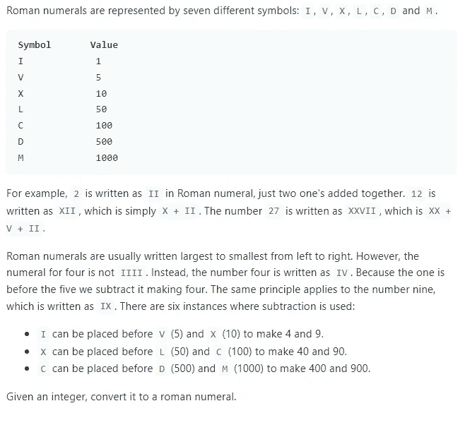

# 带 Golang 的 Leetcode:整数到罗马的转换

> 原文：<https://medium.com/codex/leetcode-with-golang-integer-to-roman-conversion-12ba9da5265f?source=collection_archive---------6----------------------->

Golang 解决方案的运行时间和内存性能比公认的 Golang 解决方案好 95%


Golang:为什么你应该在 2021 年学习围棋

# 动机

最近，我决定我要准备面试，编码比赛，并学习一门新的编程语言。为了一箭双雕，我决定每天用 Golang 练习 Leetcode 问题。用你不熟悉的语言解决算法问题，迫使你思考实际需要解决的问题，这有助于你成为更好的开发者。当然，在获得正确的语法时会遇到一些小问题，但是最重要的是不管使用什么工具都能解决问题。

旅程开始后不久，我注意到 Golang 中对 Leetcode 问题的支持远不如 C++、Python 或 Java。鉴于这些语言的历史，像 Go 这样的现代语言得不到同等水平的支持也就不足为奇了。然而，这篇文章将是我为 Golang 中的 Leetcode 问题提供解决方案的系列文章的第一篇。

***免责声明*** *:如前所述，我还在学习围棋。如果有人有任何建议可以让我的代码更地道，请在评论中提供。*

## 整数到罗马

难度:中等

通过率:58.9%



## 问题分解

这个问题在概念上并不太难。本质上，我们得到一个数字，需要将其转换为罗马数字格式。这个问题旨在测试你处理边缘案例的逻辑能力。正如问题描述中提到的，当我们打破罗马转换的标准规则时，有六种例外情况。这些是这个问题希望我们解决的核心问题。

需要注意的是约束条件。我们不会得到一个大于 3999 的数字。注意这一点非常重要，我将在接下来的章节中解释原因

## 天真的解决方案

在简单的和优化的解决方案中，我们算法的核心部分本质上是相同的。我们检查目标数字是否大于对应于罗马数字的数字。如果是，我们从目标数中减去第二个数，然后重复。我们最终将到达 0，循环将终止。

例如:

7 是我们的目标数字

5 是与罗马数字关联最接近的值

我们从 7 中减去 5，剩下 2

2 是我们新的目标数字

重复直到 0

在这些操作之间，我们将把相关的罗马数字添加到字符串中，以形成正确的对应序列。

天真来自于边缘案例。我们可以编写一个 If/else 分支的长决策序列，进行硬比较，并确定要显示的适当数字。或者，我们可以注意到显式和隐式的问题约束

## 优化解决方案

我们的约束是目标数的初始值永远不会大于 3999。这意味着我们必须转换的最大罗马数字是“M”。这有助于减少我们处理问题的不确定性。另一个隐含的约束是映射到它们的值和罗马数字是固定的。“I”永远是 1，“IV”永远是 4。

这对我们有什么帮助？知道了这一点，我们就不必担心处理任何不确定性或复杂的案件。事实上，我们可以简单地使用切片或地图将这些值联系在一起，因为它们是固定的。

我们可以按升序排列这些值，然后从最大值到最小值进行处理。从后面开始将帮助我们避免越界错误，或者维护多个指针以防止所述越界错误。当主指针到达零时，问题就已经解决了。

以下是优化的解决方案:

```
func intToRoman(num int) string {
    var roman string = ""
    var numbers = []int{1,4,5,9,10,40,50,90,100,400,500,900,1000}
    var romans = []string{"I","IV","V","IX","X","XL","L","XC","C","CD","D","CM", "M"}
    var index = len(romans)-1

    for num > 0 {
        for numbers[index]<=num {
            roman += romans[index]
            num -= numbers[index]
        }
        index -= 1
    }

    return roman
}
```

## 结束语

以下是优化解决方案的性能指标


由于我仍在学习围棋，我试图在这个解决方案中使用地图，而不是两个独立的部分。我遇到了以适合我的简单解决方案的简洁方式提取密钥的问题。如果谁有什么推荐，请提供！