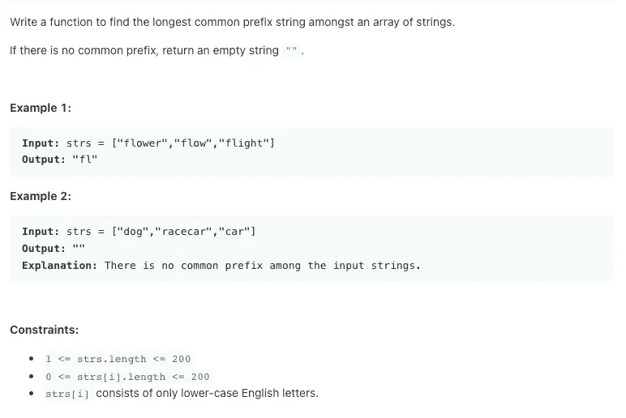
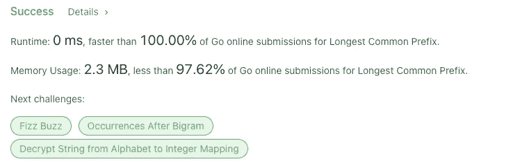

# 带 Golang 的 Leetcode:最长的公共前缀

> 原文：<https://medium.com/codex/leetcode-with-golang-longest-common-prefix-89d856b0749b?source=collection_archive---------5----------------------->

Golang 中的 Leetcode 问题#14 解决方案


来源:[https://www . freecodecamp . org/news/what-is-go-programming-language/](https://www.freecodecamp.org/news/what-is-go-programming-language/)

# 动机

最近，我决定我要准备面试，编码比赛，并学习一门新的编程语言。为了一箭双雕，我决定每天用 Golang 练习 Leetcode 问题。用你不熟悉的语言解决算法问题，迫使你思考实际需要解决的问题，这有助于你成为更好的开发者。当然，在获得正确的语法时会遇到一些小问题，但是最重要的是不管使用什么工具都能解决问题。

旅程开始后不久，我注意到 Golang 中对 Leetcode 问题的支持远不如 C++、Python 或 Java。鉴于这些语言的历史，像 Go 这样的现代语言得不到同等水平的支持也就不足为奇了。然而，这篇文章将是我为 Golang 中的 Leetcode 问题提供解决方案的系列文章的第一篇。

***免责声明*** *:如前所述，我还在学习围棋。如果有人有任何建议可以让我的代码更地道，请在评论中提供。*

# 最长公共前缀

难度:容易

合格率:38.8%



# 天真的方法

我们得到一段字符串，并被告知找到最常见的前缀。需要执行几项基本任务。我们需要遍历切片，并比较切片中字符串的各个字符。当比较切片中的字符时，我们需要检查它们是否相等。如果是这样，我们将跟踪常见的字符并返回最长的一个。同样重要的是要注意，最常见的前缀意味着所有条目都必须有这个前缀。

简单/强力的方法是遍历切片和单个字符来执行所需的任务。尽管这是正确的，但它会产生一个次优的 O(n)解。然而，现在我们有了这个问题的框架，我们可以优化我们的方法。

# 优化解决方案

有各种各样的策略可以用来解决这个问题，比如分而治之以及各种排序和搜索方法。分而治之将允许我们使用递归方法来解决问题，而排序和搜索方法将允许我们减少需要进行的比较的数量。这两种方法都允许我们将问题规模从 O(n)减少到更有效的解决方案。

我们将使用一种排序方法按字典顺序对字符串进行排序。虽然分而治之的方法通常提供了漂亮而简单的解决方案，但是用来实现利用排序来查找最长公共前缀的解决方案的逻辑本身就非常迷人和漂亮。利用排序，我们只需要查看数组中的两个元素:第一个和最后一个元素，就能够找到整个切片的解决方案，而不管切片的大小。

一旦切片被排序，我们就能够获取切片中的第一个和最后一个条目，并且只比较这两个条目来确定最长的公共前缀。该逻辑的工作方式是，如果在对数组排序后，片的第一个和最后一个条目中的第一个元素相等，则该元素和其余相等的元素形成最长的公共前缀。一旦第一个和最后一个片条目之间的字符不相等，那么就找到了最长的公共前缀。这个逻辑也解决了没有公共前缀的情况；如果第一个和最后一个片条目的第一个字符不相等，那么就没有共同的前缀。

以下是 Golang 的解决方案:

```
func longestCommonPrefix(strs []string) string {
    var longestPrefix string = ""
    var endPrefix = false

    if len(strs) > 0 {
        sort.Strings(strs)
        first := string(strs[0])
        last := string(strs[len(strs)-1])

        for i := 0; i < len(first); i++ {
            if !endPrefix && string(last[i]) == string(first[i]) {
                longestPrefix += string(last[i])
            } else {
                endPrefix = true
            }
        }
    }
    return longestPrefix
}
```

***免责声明:*** *利用分而治之的方法通常产生 O(nlogn)解，其中在 Golang 中利用 sort 是 O(nlogn)除了比较片的第一个和最后两个索引中的字符，这是 O(n)最坏情况。所以在运行时方面，这个解决方案仍然优化到 O(n ),但是分而治之的方法可能提供更强大的优化*

# 结束语

以下是我们解决方案的性能指标:



请在评论中提供任何反馈！