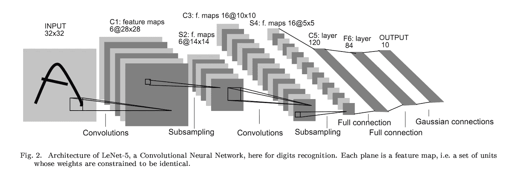
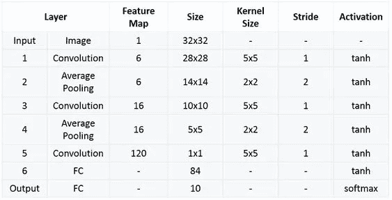
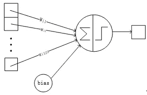
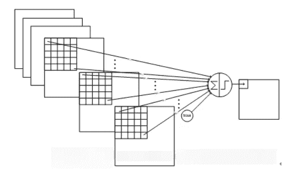
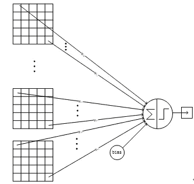
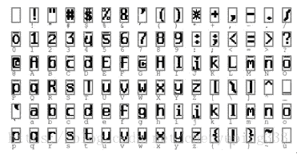
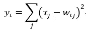
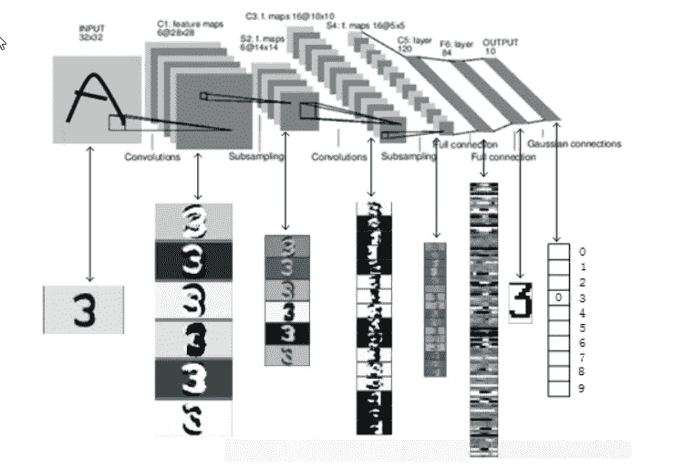

# LeNet-5 完整架构

> 原文：<https://medium.com/codex/lenet-5-complete-architecture-84c6d08215f9?source=collection_archive---------10----------------------->

LeNet-5 是一个非常有效的用于手写字符识别的卷积神经网络，来自应用于文档识别的基于纸张梯度的学习。

[论文:基于梯度的学习应用于文档识别](http://yann.lecun.com/exdb/publis/pdf/lecun-98.pdf)

**作者** : Yann LeCun、Léon Bottou、Yoshua Bengio 和 Patrick Haffner
T5，发表于:IEEE 会议录(1998)

# LeNet 网络的结构

LeNet5 是一个小型网络，它包含深度学习的基本模块:卷积层、池化层和全链路层。它是其他深度学习模型的基础。这里我们深入分析 LeNet5。同时，通过实例分析，加深对卷积层和池层的理解。



LeNet-5 共有七层，不包含一个输入，每层包含一个可训练参数；每一层都有多个特征映射，每个输入特征映射的特征通过卷积滤波器提取，然后每个特征映射有多个神经元。



图 2

各层参数的详细说明:

# 输入层

首先是数据输入层。输入图像的大小被统一归一化为 32 * 32。

> *注:此层不算 LeNet-5 的网络结构。传统上，输入层不被认为是网络层次之一。*

# C1 层-卷积层；

*   **输入图片** : 32 * 32
*   **卷积核大小** : 5 * 5
*   **卷积核类型** : 6
*   **输出特性贴图尺寸**:28 * 28(32–5+1)= 28
*   **神经元数量** : 28 * 28 * 6
*   **可训练参数** : (5 * 5 + 1) * 6 (5 * 5 =每个滤波器 25 个单位参数和一个偏置参数，共 6 个滤波器)
*   **连接数** : (5 * 5 + 1) * 6 * 28 * 28 = 122304

## 详细描述:

*   对输入图像执行第一次卷积运算(使用大小为 5 * 5 的 6 个卷积核)以获得 6 个 C1 特征图(大小为 28 * 28，32–5+1 = 28 的 6 个特征图)。
*   我们来看看需要多少个参数。卷积核的大小是 5 * 5，总共有 6 * (5 * 5 + 1) = 156 个参数，其中+ 1 表示一个核有偏差。
*   对于卷积层 C1，C1 的每个像素连接到输入图像中的 5 * 5 个像素和 1 个偏置，所以总共有 156 * 28 * 28 = 122304 个连接。有 122，304 个连接，但是我们只需要学习 156 个参数，主要是通过权重共享。

# S2 图层-共用图层(缩减像素采样图层):

*   **输入** : 28 * 28
*   **采样面积** : 2 * 2
*   **采样方法**:增加 4 个输入，乘以一个可训练参数，加上一个可训练偏移量。通过乙状结肠的结果
*   **取样类型** : 6
*   **输出特性地图尺寸** : 14 * 14 (28/2)
*   **神经元数量** : 14 * 14 * 6
*   **可训练参数** : 2 * 6(总和的权重+偏移量)
*   **连接数** : (2 * 2 + 1) * 6 * 14 * 14
*   S2 每幅专题地图的尺寸是 C1 专题地图尺寸的 1/4。

## 详细描述:

*   在第一次卷积之后，立即进行汇集操作。使用 2 * 2 个内核和 S2 来执行汇集，获得 14 * 14 (28/2 = 14)的 6 个特征图。
*   S2 的池图层是 C1 2 * 2 区域的像素之和乘以一个权重系数加上一个偏移量，然后结果被再次映射。
*   所以每个池化核心有两个训练参数，所以有 2×6 = 12 个训练参数，但是有 5×14×14×6 = 5880 个连接。

# C3 层-卷积层；

*   **输入**:S2 所有 6 个或多个特征地图组合
*   **卷积核大小** : 5 * 5
*   **卷积核类型** : 16
*   **输出特征映射大小**:10 * 10(14–5+1)= 10
*   C3 的每个特征地图与 S2 的所有 6 个或几个特征地图相连，表明该层的特征地图是从上一层提取的特征地图的不同组合。
*   一种方法是 C3 的前 6 个特征地图以 S2 的 3 个相邻特征地图子集作为输入。接下来的 6 个特征地图以 S2 的相邻特征地图的 4 个子集作为输入。接下来的三个以不相邻的 4 个特征地图子集作为输入。最后一个以 S2 所有的特征地图作为输入。
*   **可训练参数为**:6 *(3 * 5 * 5+1)+6 *(4 * 5 * 5+1)+3 *(4 * 5 * 5+1)+1 *(6 * 5 * 5+1)= 1516
*   **连接数** : 10 * 10 * 1516 = 151600

## 详细描述:

*   第一次汇集后，第二次卷积，第二次卷积的输出是 C3，16 个 10×10 的特征图，卷积核的大小是 5 * 5。我们知道 S2 有 6 幅 14 * 14 的地形图，如何从 6 幅地形图得到 16 幅地形图？这是由 S2 的地形图特殊组合而成的 16 幅地形图。详情如下:
*   C3 的前 6 张要素地图(对应上图第一个红框的第 6 列)连接到与 S2 图层(上图第一个红框)连接的 3 张要素地图，接下来的 6 张要素地图连接到 S2 图层，4 张要素地图连接(上图第二个红框)， 接下来的 3 个要素地图与未在 S2 层连接的 4 个要素地图相连接，最后一个要素地图与 S2 层的所有要素地图相连接。 卷积核大小还是 5 * 5，所以有 6 *(3 * 5 * 5+1)+6 *(4 * 5 * 5+1)+3 *(4 * 5 * 5+1)+1 *(6 * 5 * 5+1)= 1516 个参数。图像大小是 10 * 10，所以有 151600 个连接。



*   C3 和 S2 前三个图的卷积结构如下所示:



# S4 图层-共用图层(缩减像素采样图层)

*   **输入** : 10 * 10
*   **采样面积** : 2 * 2
*   **采样方法**:增加 4 个输入，乘以一个可训练参数，加上一个可训练偏移量。通过乙状结肠的结果
*   **采样类型** : 16
*   **输出特性映射尺寸** : 5 * 5 (10/2)
*   **神经元数量** : 5 * 5 * 16 = 400
*   **可训练参数** : 2 * 16 = 32(总和的权重+偏移量)
*   **连接数** : 16 * (2 * 2 + 1) * 5 * 5 = 2000
*   S4 每幅专题地图的尺寸是 C3 专题地图尺寸的 1/4

## 详细描述:

*   S4 为池化图层，窗口大小仍为 2 * 2，共 16 幅特征地图，C3 图层的 16 幅 10x10 地图以 2x2 为单位池化，得到 16 幅 5x5 特征地图。这一层共有 32 个训练参数 2x16，5x5x5x16 = 2000 个连接。

> 该连接类似于 S2 层。

# C5 层-卷积层

*   **输入**:S4 图层全部 16 个单元特征图(全部连接到 S4)
*   **卷积核大小** : 5 * 5
*   **卷积核类型** : 120
*   **输出特性映射尺寸**:1 * 1(5–5+1)
*   **可训练参数/连接** : 120 * (16 * 5 * 5 + 1) = 48120

## 详细描述:

*   C5 层是卷积层。由于 S4 层的 16 个图像的大小是 5×5，这与卷积核的大小相同，所以卷积后形成的图像的大小是 1×1。这导致 120 个卷积结果。每一个都连接到上一层的 16 个地图。所以有(5x5x16 + 1) x120 = 48120 个参数，也有 48120 个连接。C5 层的网络结构如下:



# F6 层-全连接层

*   **输入** : c5 120 维向量
*   **计算方法**:计算输入向量和权重向量的点积，加上一个偏移量，结果通过 sigmoid 函数输出。
*   **可训练参数** : 84 * (120 + 1) = 10164

## 详细描述:

*   第 6 层是完全连接的层。F6 层有 84 个节点，对应一个 7×12 的位图，-1 表示白色，1 表示黑色，所以每个符号位图的黑白对应一个代码。该层的训练参数和连接数为(120 + 1) x84 = 10164。ASCII 编码图如下:



*   F6 层的连接方法如下:


# 输出层-完全连接的层

*   输出层也是全连通层，共有 10 个节点，分别代表数字 0 到 9，如果节点 I 的值为 0，则网络识别的结果为数字 I，采用径向基函数(RBF)网络连接。假设 x 是前一层的输入，y 是 RBF 的输出，RBF 输出的计算公式为:



*   上述公式 w_ij 的值由 I 的位图编码确定，其中 I 的范围是 0 到 9，j 的范围是 0 到 7 * 12–1。RBF 输出的值越接近 0，就越接近 I，即越接近 I 的 ASCII 编码数字，就意味着当前网络输入的识别结果是字符 I，这一层有 84x10 = 840 个参数和连接。



# 摘要

*   LeNet-5 是用于手写字符识别的非常有效的卷积神经网络。
*   卷积神经网络可以很好地利用图像的结构信息。
*   卷积层的参数较少，这也是由卷积层的主要特性决定的，即本地连接和共享权重。

**代码实现:**

使用以手写数字闻名的 MNIST 数据集。

```
#If not available on your system
pip install keras
pip install tensorflow import keras
from keras.datasets import mnist
from keras.layers import Conv2D, MaxPooling2D
from keras.layers import Dense, Flatten
from keras.models import Sequential# Loading the dataset and perform splitting
(x_train, y_train), (x_test, y_test) = mnist.load_data()# Peforming reshaping operation
x_train = x_train.reshape(x_train.shape[0], 28, 28, 1)
x_test = x_test.reshape(x_test.shape[0], 28, 28, 1)# Normalization
x_train = x_train / 255 
x_test = x_test / 255
#As the pixel values range from 0 to 256, apart from 0 the range is #255\. So dividing all the values by 255 will convert it to range #from 0 to 1# One Hot Encoding
y_train = keras.utils.to_categorical(y_train, 10)
y_test = keras.utils.to_categorical(y_test, 10)
#Here we are taking 10 because we have 10 different digits ranging from 0-9. # Building the Model Architecture
model = Sequential()
# Select 6 feature convolution kernels with a size of 5 * 5 (without offset), and get 66 feature maps. The size of each feature map is 32−5 + 1 = 2832−5 + 1 = 28.
# That is, the number of neurons has been reduced from 10241024 to 28 ∗ 28 = 784 28 ∗ 28 = 784.
# Parameters between input layer and C1 layer: 6 ∗ (5 ∗ 5 + 1)
model.add(Conv2D(6, kernel_size=(5, 5), activation='relu', input_shape=(28, 28, 1)))
# The input of this layer is the output of the first layer, which is a 28 * 28 * 6 node matrix.
# The size of the filter used in this layer is 2 * 2, and the step length and width are both 2, so the output matrix size of this layer is 14 * 14 * 6.
model.add(MaxPooling2D(pool_size=(2, 2)))
# The input matrix size of this layer is 14 * 14 * 6, the filter size used is 5 * 5, and the depth is 16\. This layer does not use all 0 padding, and the step size is 1.
# The output matrix size of this layer is 10 * 10 * 16\. This layer has 5 * 5 * 6 * 16 + 16 = 2416 parameters
model.add(Conv2D(16, kernel_size=(5, 5), activation='relu'))
# The input matrix size of this layer is 10 * 10 * 16\. The size of the filter used in this layer is 2 * 2, and the length and width steps are both 2, so the output matrix size of this layer is 5 * 5 * 16.
model.add(MaxPooling2D(pool_size=(2, 2)))
# The input matrix size of this layer is 5 * 5 * 16\. This layer is called a convolution layer in the LeNet-5 paper, but because the size of the filter is 5 * 5, #
# So it is not different from the fully connected layer. If the nodes in the 5 * 5 * 16 matrix are pulled into a vector, then this layer is the same as the fully connected layer.
# The number of output nodes in this layer is 120, with a total of 5 * 5 * 16 * 120 + 120 = 48120 parameters.
model.add(Flatten())
model.add(Dense(120, activation='relu'))
# The number of input nodes in this layer is 120 and the number of output nodes is 84\. The total parameter is 120 * 84 + 84 = 10164 (w + b)
model.add(Dense(84, activation='relu'))
# The number of input nodes in this layer is 84 and the number of output nodes is 10\. The total parameter is 84 * 10 + 10 = 850
model.add(Dense(10, activation='softmax'))
```

正如你在图 2 中看到的。研究人员将激活函数视为输出为 **(-1 到 1)** 的 **tanh** ，但在代码块中，我们将其视为输出为 **max(0，x)的**relu**:x 为输入。**2011 年发现，与 2011 年之前广泛使用的激活函数相比，它能够更好地训练更深的网络，例如，逻辑 sigmoid(受概率论启发)及其更实用的对应物双曲正切。

```
model.compile(loss=keras.metrics.categorical_crossentropy, optimizer=keras.optimizers.Adam(), metrics=['accuracy']) model.fit(x_train, y_train, batch_size=128, epochs=20, verbose=1, validation_data=(x_test, y_test)) score = model.evaluate(x_test, y_test)
print('Test Loss:', score[0])
print('Test accuracy:', score[1])
```

这里，研究人员再次将损失函数作为 MSE(均方误差),但我们采用了分类交叉熵和 20 个时期，所以这是一个可以做的实验，所以你可以用更高的时期和不同的损失函数进行训练。