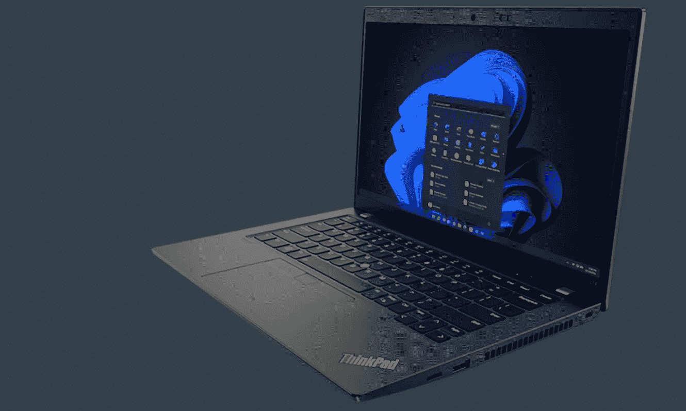
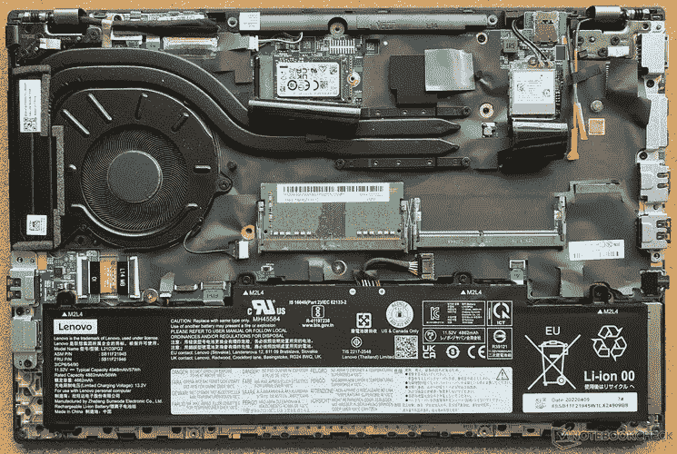
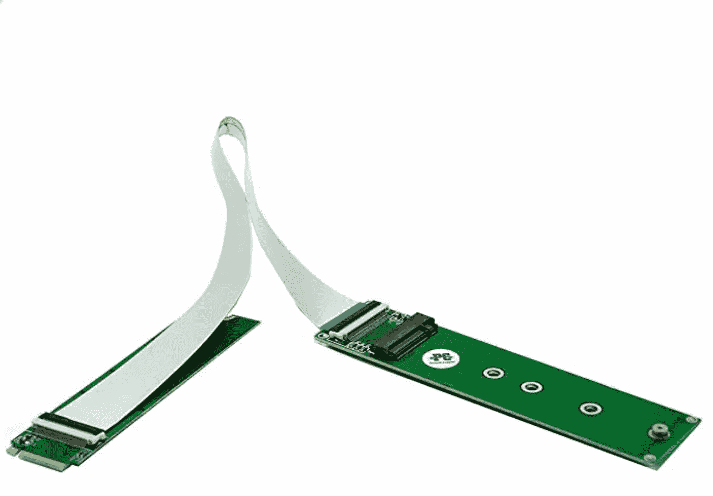

# 联想 L14 AMD G1 G2 G3:2023 年锐龙手机选择哪个更好？(答案不明显)

> 原文：<https://medium.com/codex/lenovo-l14-amd-g1-vs-gen2-vs-gen3-which-is-the-better-mobile-ryzen-choice-for-2023-3300b0a4055?source=collection_archive---------7----------------------->

联想最近宣布了他们 L14 AMD 锐龙笔记本的新版本:L14 AMD Gen3 有一些更新，但并不都是更好的。

这里没有太多的信息，只有很少的评论——[的一篇 notebookcheck 的评论](https://www.notebookcheck.net/Lenovo-ThinkPad-L14-G3-AMD-laptop-review-Long-battery-life-plus-AMD-power.662866.0.html)、[的 Reddit 帖子](https://www.reddit.com/r/AMDLaptops/comments/xsxfnh/lenovo_thinkpad_l14_gen3_amd_21c5_21c6_pcie_40/)和[的 Twitter 讨论](https://twitter.com/audiores/status/1575514474437550082)。L14 和 L15 的最新版本好吗？升级有意义吗，还是拿到打折的老款和便宜版比较好？请继续阅读，以获得完整的图片。

Tldr:买旧的 [L14 Gen2 AMD](https://www.lenovo.com/us/en/p/laptops/thinkpad/thinkpadl/l14-amd-g2/22tpl14l4a2) ，因为它仍然是更好的选择。即使是锐龙 5 版本也很出色，新的价格约为 700 美元，锐龙 3 版本在售后市场的价格低至 350 美元。

图片来自联想的新款 [ThinkPad L14 Gen 3 (14 英寸 AMD)笔记本电脑](https://www.lenovo.com/us/en/p/laptops/thinkpad/thinkpadl/thinkpad-l14-gen-3-(14-inch-amd)/len101t0025?orgRef=https%253A%252F%252Fwww.google.com%252F)。

我是联想笔记本的忠实粉丝，但仅限于某些型号(如 L14 和 L15)。其他型号甚至更贵的线(T14)不允许你升级你的内存:他们是焊接的，不能扩展。此外，[联想笔记本通过了 Linux 认证](https://ubuntu.com/certified/laptops?vendor=Lenovo)，带来了卓越的开箱即用 Linux 体验。

联想 L14 和 L15 价格低廉，物超所值(L14 Gen2 AMD 在美国的售价为 850 美元)，而且它们完全支持 Linux。我已经写了几篇关于他们的文章。你可以阅读我关于“[寻找一款 100%支持 Linux 的 AMD 锐龙笔记本电脑](/swlh/the-quest-for-a-good-amd-ryzen-notebook-with-linux-support-winner-lenovo-thinkpad-l15-84a12edf510e)”的文章，以了解最新进展。

有一些元素你想改变你的股票 L14 和 L15 笔记本电脑，这是:内存和 NVMe 固态硬盘。以下是我对升级任何 L14 或 L15 的最新建议(因为各代的硬件规格几乎相同)。

## 随机存取存储

你必须小心你选择的内存，因为网上的信息可能会误导。L14 和 L15 不支持 XMP，所以首先大量的内存不能在你的机器上工作，其次你会得到宣传的其他延迟([来源](https://www.reddit.com/r/AMDLaptops/comments/j29rpt/what_ram_will_work_in_your_new_ryzen_4000_laptop/))。以下是我可以推荐的三款 RAM 套件，任何型号总共 64 GB RAM。

*   [G.Skill RipJaws DDR4 SO-DIMM 系列 64 GB (2 x 32 GB) 260 针 SO-DIMM DDR 4 3200 CL22–22–22–52 1.20v 双通道内存](https://amzn.to/3SsdyTc)
*   [金士顿 FURY Impact 64gb(2x 32gb)3200 MHz DDR 4 CL20](https://amzn.to/3D0vDBY)
*   [海盗船复仇性能 SODIMM 64gb(2x 32gb)DDR 4 3200 MHz CL22](https://amzn.to/3CYGFI6)

## 存储升级选项

这是我对新的联想 L14 AMD Gen3 的问题:他们限制了你可以使用的固态硬盘的选项。他们将外形尺寸缩减至 M.2 2242，这使得您升级的选择非常渺茫。此外，与 L14 Gen2 相比，库存 NVMe 硬盘的性能明显更差。

[Notebookcheck 发布了一篇关于 L14 Gen3 AMD](https://www.notebookcheck.net/Lenovo-ThinkPad-L14-G3-AMD-laptop-review-Long-battery-life-plus-AMD-power.662866.0.html) 的评论。我很失望，现在将坚持 L14 Gen2，主要是因为 M.2 2280 NVMe 支持。

引用 notebookcheck 的话“由于空间限制，不得不使用更短的 M.2 2242 外形规格的驱动器。因此，ThinkPad L14 G3 的存储速度甚至比其前身的 PCIe 3.0 固态硬盘还要慢。"

目前为联想 L14 G3 升级固态硬盘的最佳固态硬盘是 [Sabrent Rocket Nano 2 TB](https://amzn.to/3gLoZIx) ，M.2，理论值为 2500 MB/s 读取速度，2100 MB/s 写入速度。

照片来自一个开放的 L14 Gen3 AMD。来源:[Notebookcheck.net](https://www.notebookcheck.net/Lenovo-ThinkPad-L14-G3-AMD-laptop-review-Long-battery-life-plus-AMD-power.662866.0.html)。您可以在顶部看到一个黑色金属部件，它阻止安装 2280 尺寸的 NVMe。也许这仍然是可能的，但联想不建议这样做。

随着 M2.2242 固态硬盘的当前可用性，您可以选择 L14 Gen3 并自行安装 M.2 2242 硬盘，您可以获得的最大速度将在 1500 MB/s 范围内。如果你够勇敢，你可以[用像这个](https://amzn.to/3TuG2Nl)的 M.2 扩展器改装你的 L14 Gen3，但是肯定硬件改装不是每个人都想做的。

这里有一个想法来修改你的联想 L14 或 L15 Gen3:安装一个 [M.2 NVME 扩展器(NGFF M-Key PCIe SSD 扩展卡)](https://amzn.to/3TuG2Nl)，将驱动器放在机箱中空间更大的地方。有了这个技巧，你可能可以让 Kioxia Exceria Plus G2 2 TB 运行在 L14 AMD Gen3 上。

# 结论

联想 ThinkPad L14 和 L15 在基础上变化不大。这意味着，即使是该系统的锐龙 3 版本也具有很高的价值(售后市场价格为 350 美元)，并且仍然可以像更大的版本一样进行扩展。

**如果你需要一款价格实惠且可扩展的笔记本:**第一代 L14 和 L15 是你能买到的最便宜的产品，在美国[联想 L14 Gen1 的起价为 700 美元](https://ebay.us/SvMR3v)(见[这是 Amazon.com](https://amzn.to/3smb1iI)的二级链接)。在欧洲，价格更低。 [$350 是锐龙 3 版本的售后价格](https://ebay.us/GOOl18)。它不会便宜很多。

**如果你是为了性能:**获得一个 L14 Gen2(或 L15 Gen2)，更新到 64 GB 的内存，并安装一个[KIO Xia Exceria Plus G2 2tb SSD](https://amzn.to/3F7TUcc)([在此阅读更多有关该驱动器的信息](https://www.techpowerup.com/review/kioxia-exceria-plus-g2-2-tb/17.html))以获得高达 3400 MB/s 的写入和 3200 MB/s 的读取速度以及 5 年的保修。该驱动器的唯一问题是在美国不可用，[但你可以在易贝找到它，](https://ebay.us/URa7F1)因为人们正在使用同一驱动器升级他们的 PlayStation 5。

*请* [*在 Twitter @audiores*](http://opengears.medium.com/subscribe) *上关注我的 medium**&*[*如果你对这篇文章有任何其他反馈或补充，请在评论中告诉我。你可以在我的清单上阅读更多我的硬件和装备建议"*](https://twitter.com/audiores) [***为游牧书呆子提供的工具和服务***](https://github.com/z3cko/digital-services/blob/main/README.md) *。*