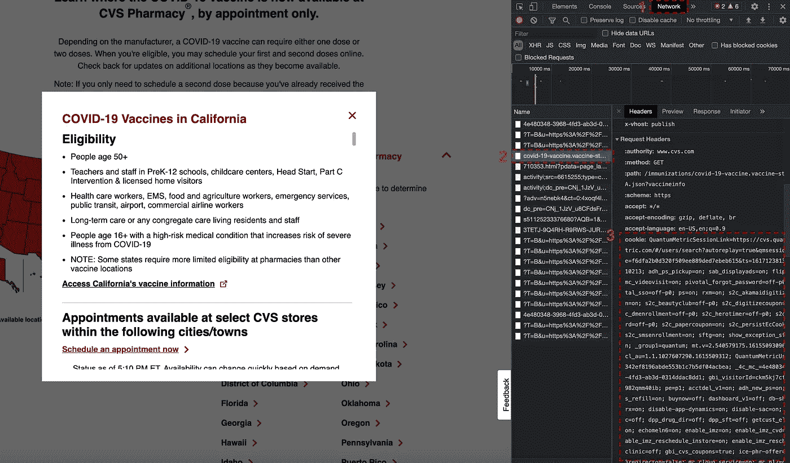
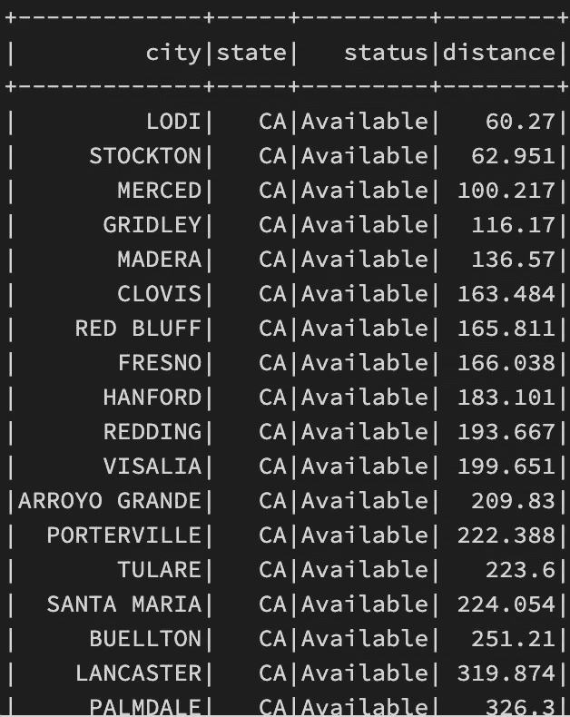

# 如何使用 Spark 预订您的 COVID 疫苗

> 原文：<https://medium.com/codex/let-data-decide-where-to-book-your-covid-appointment-8c747e0e387a?source=collection_archive---------7----------------------->


拉斯·金勒在 [Unsplash](https://unsplash.com?utm_source=medium&utm_medium=referral) 上拍摄的照片

如果你和我一样，渴望接种 COVID 疫苗，我开发了一种快速简便的方法，通过数据分析找出最接近的预约。你可能已经注意到了，一旦你试图通过 CVS 网站，或者其他像 My Turn 这样的推荐网站预约，你会很快发现你的搜索往往被限制在 50 英里以内，根据你住在哪里，你不会发现任何可用性。太阳出来了，天气变暖了，期待着再次与朋友见面，这足以激励我开车去相当远的地方，寻找恢复“正常”生活的方法。我打赌你们中的一些人也会很乐意这么做。

考虑到这一点，我决定使用 Apache Spark 和一个简单的 web 抓取技术来返回所有城市及其点到点距离的列表。我们开始吧！

## 正在检索 CVS 网站 Cookie:

在谷歌 Chrome 中打开 [CVS 疫苗](https://www.cvs.com/immunizations/covid-19-vaccine)网站，然后打开开发者工具窗口点击查看→开发者→开发者工具。打开网络选项卡(步骤 1)，然后找到新冠肺炎疫苗有效载荷，我发现它更容易清除结果，并重新单击您感兴趣的州(步骤 2)，最后复制 cookie。



## 创建 ETL 管道:

我发现从该平台的免费版本 [Databricks CE edition](https://community.cloud.databricks.com/login.html) 运行笔记本既简单又有用，它将 Spark 封装到了运行时中。在本文中，我们假设您已经有了一个正在运行的集群(如果没有，您可以按照这些说明)，并且它连接到了笔记本电脑上。

## 检索 JSON:

我们准备使用 URLLib 发出请求，并检索有效负载。您可以使用下面的代码，并用上面复制的 cookie 替换<cookie>标志:</cookie>

```
from urllib.request import Request, urlopen
import json
import gzipurl = "[https://www.cvs.com//immunizations/covid-19-vaccine.vaccine-status.CA.json?vaccineinfo](https://www.cvs.com//immunizations/covid-19-vaccine.vaccine-status.CA.json?vaccineinfo)"req = Request(url, headers={'User-Agent': 'Mozilla/5.0', 'Accept-Encoding': 'gzip'})req.add_header('Accept-Encoding', 'gzip')req.add_header("Cookie", 'cookie=<COOKIE>')
req.add_header('Referer', '[https://www.cvs.com/immunizations/covid-19-vaccine?icid=cvs-home-hero1-link2-coronavirus-vaccine'](https://www.cvs.com/immunizations/covid-19-vaccine?icid=cvs-home-hero1-link2-coronavirus-vaccine'))response = urlopen(req)
content = gzip.decompress(response.read())
decomp_req = content.splitlines()
temp = []
for line in decomp_req:
    temp.append(line.decode())
```

既然您已经重试了有效负载，那么最好将它存储在一个临时数据存储中，并有可能将其移动到文件系统中。请随意指定您自己的自定义路径:

```
dbutils.fs.rm("/tmp/covid.json")
dbutils.fs.put("/tmp/covid.json", temp[0])
dbutils.fs.mv("/tmp/covid.json","dbfs:/FileStore/CUSTOM_PATH/covid.json")
```

您已经准备好使用 Spark 数据帧来检索 JSON，对其进行处理以检索有效负载，最后仅通过可用位置过滤到一个新的数据帧中，我们将其命名为“df_avail”:

```
from pyspark.sql import functions as Fdf = spark.read.json('dbfs:/FileStore/CUSTOM_PATH/covid.json')
df = df.select(
    F.array(F.expr('responseMetaData.*')).alias('responseMetadata'),
    F.array(F.expr('responsePayloadData.data.*')).alias('payload'),
    )
df = df.select(df['payload'][0])
df = df.withColumnRenamed('payload[0]', 'payload')
df = df.withColumn("new", F.explode("payload"))
df = df.withColumn('city', df['new']['city']) \
       .withColumn('state', df['new']['state'] ) \
       .withColumn('status', df['new']['status']) \
       .drop('payload') \
       .drop('new')df_avail = df.filter(df['status'] == 'Available')
```

## 地理定位 API:

对于这个解决方案，我们使用的是 [OpenCage 地理编码 API](https://opencagedata.com/) ，在这里您可以注册一个帐户，打开您的仪表板，然后创建一个新项目并生成一个密钥。此外，您将需要 geopy 库。对于这个例子，您可以使用 PyPI 进行[导入:](https://docs.databricks.com/libraries/index.html)

*   地理坐标== 2.0.1
*   opencage == 1.2.2

我们将根据您的当前位置创建一个用于“df_avail”数据框架的 UDF，当然您可以将其更改为您居住的城市或地址:

```
# Suggest to use Secrets
open_cage_key = <OPEN_CAGE_KEY>from opencage.geocoder import OpenCageGeocode
from geopy.distance import geodesic, great_circle# Change to your location
current_location = 'San Francisco, CA'def find_distance(B):
    geocoder = OpenCageGeocode(open_cage_key)
    A = current_location
    result_A = geocoder.geocode(A)
    lat_A = result_A[0]['geometry']['lat']
    lng_A = result_A[0]['geometry']['lng']

    B = str(B +',CA')
    result_B = geocoder.geocode(B)
    lat_B = result_B[0]['geometry']['lat']
    lng_B = result_B[0]['geometry']['lng']  
    return float("{:.3f}".format((geodesic((lat_A,lng_A), (lat_B,lng_B)).miles)))distance = udf(find_distance)
```

## 最终结果:

在最后一步中，我们可以将 UDF 应用于数据帧:

```
df_avail.withColumn('distance', distance('city').cast("float")).orderBy('distance', ascending=True).show()
```

因此，您可以从您所在的位置以直线点到点的距离检索您的最终表。请记住，这只是一个指南，并不代表实时交通信息:



显示从当前位置到所有可用城市的距离的最终表格

# 此处提供完整代码:

```
from urllib.request import Request, urlopen
import json
import gzip
from pyspark.sql import functions as F
from opencage.geocoder import OpenCageGeocode
from geopy.distance import geodesic, great_circle# Set the API Key
open_cage_key = <OPEN_CAGE_KEY>url = "[https://www.cvs.com//immunizations/covid-19-vaccine.vaccine-status.CA.json?vaccineinfo](https://www.cvs.com//immunizations/covid-19-vaccine.vaccine-status.CA.json?vaccineinfo)"
req = Request(url, headers={'User-Agent': 'Mozilla/5.0', 'Accept-Encoding': 'gzip'})
req.add_header('Accept-Encoding', 'gzip')
req.add_header("Cookie", 'cookie=<COOKIE>')
req.add_header('Referer', '[https://www.cvs.com/immunizations/covid-19-vaccine?icid=cvs-home-hero1-link2-coronavirus-vaccine'](https://www.cvs.com/immunizations/covid-19-vaccine?icid=cvs-home-hero1-link2-coronavirus-vaccine'))response = urlopen(req)
content = gzip.decompress(response.read())
decomp_req = content.splitlines()
temp = []
for line in decomp_req:
    temp.append(line.decode())
print(temp)dbutils.fs.rm("/tmp/covid.json")
dbutils.fs.put("/tmp/covid.json", temp[0])
dbutils.fs.mv("/tmp/covid.json", "dbfs:/FileStore/CUSTOM_PATH/covid.json")df = spark.read.json('dbfs:/FileStore/CUSTOM_PATH/covid.json')
df = df.select(
    F.array(F.expr('responseMetaData.*')).alias('responseMetadata'),
    F.array(F.expr('responsePayloadData.data.*')).alias('payload'),
    )
df = df.select(df['payload'][0])
df = df.withColumnRenamed('payload[0]', 'payload')
df = df.withColumn("new", F.explode("payload"))
df = df.withColumn('city', df['new']['city']) \
       .withColumn('state', df['new']['state'] ) \
       .withColumn('status', df['new']['status']) \
       .drop('payload') \
       .drop('new')df_avail = df.filter(df['status'] == 'Available') def find_distance(B):
    geocoder = OpenCageGeocode(open_cage_key)
    A = current_location
    result_A = geocoder.geocode(A)
    lat_A = result_A[0]['geometry']['lat']
    lng_A = result_A[0]['geometry']['lng']

    B = str(B +',CA')
    result_B = geocoder.geocode(B)
    lat_B = result_B[0]['geometry']['lat']
    lng_B = result_B[0]['geometry']['lng']  
    return float("{:.3f}".format((geodesic((lat_A,lng_A), (lat_B,lng_B)).miles)))distance = udf(find_distance)df_avail.withColumn('distance', distance('city').cast("float")).orderBy('distance', ascending=True).show()
```

> 请关注我关于数据工程和数据科学的最新消息:[保罗·斯凯利](https://medium.com/u/1578151e227b?source=post_page-----8c747e0e387a--------------------------------)