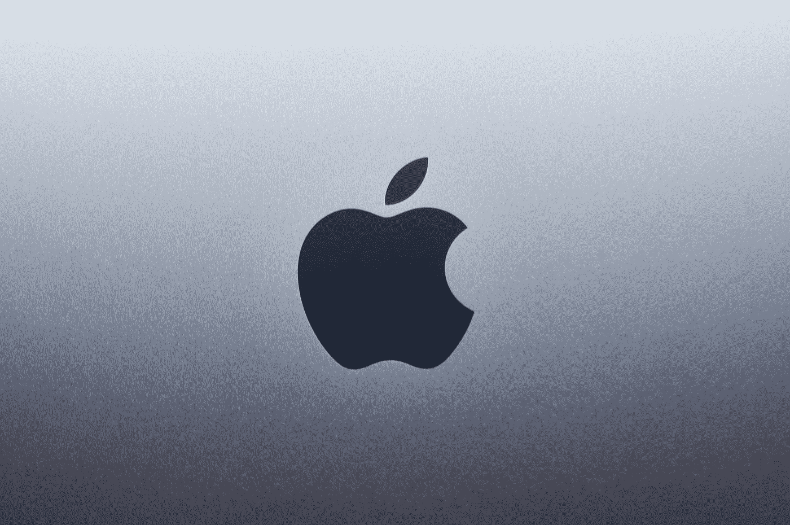

# 让我告诉你一些关于苹果的事情。

> 原文：<https://medium.com/codex/let-me-tell-you-something-about-apple-3a240bba53fc?source=collection_archive---------1----------------------->

照片由 [Sumudu Mohottige](https://unsplash.com/@stm_2790?utm_source=medium&utm_medium=referral) 在 [Unsplash](https://unsplash.com?utm_source=medium&utm_medium=referral) 上拍摄

在过去的一年里，苹果公司真的用他们的“M1”CPU 吸引了人们的眼球。ARM 在性能功耗比方面一直名列前茅，尽管它传统上有一些警告，如更高的 RAM 使用率，每条指令的总线性能差(由于正交布局)，以及每时钟的 IPC 更像奔腾 II 而不是现代 CPU。