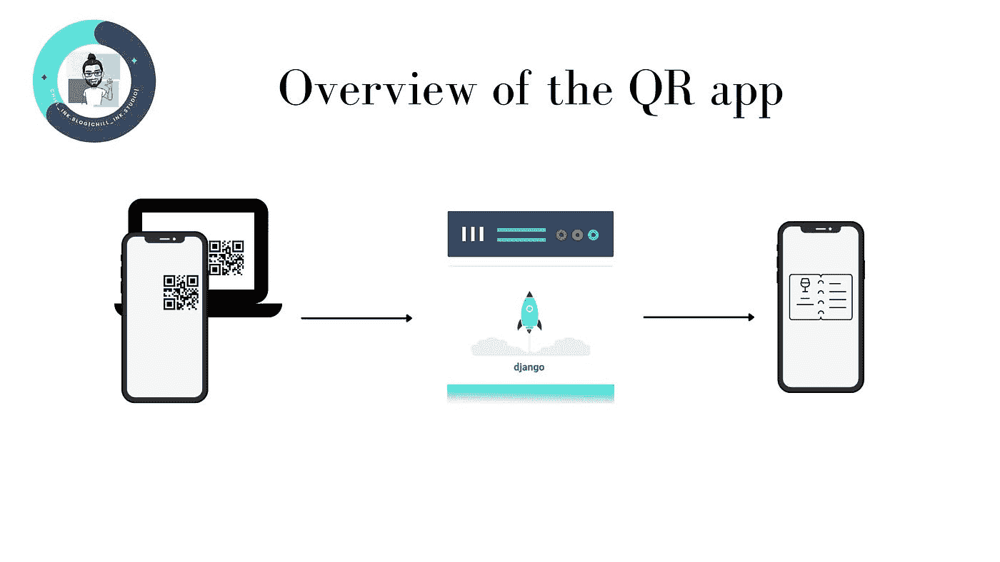
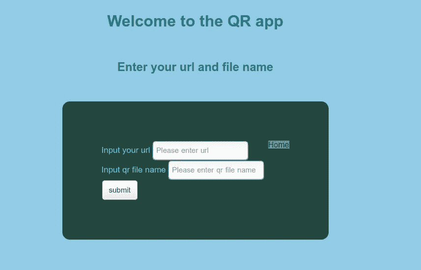
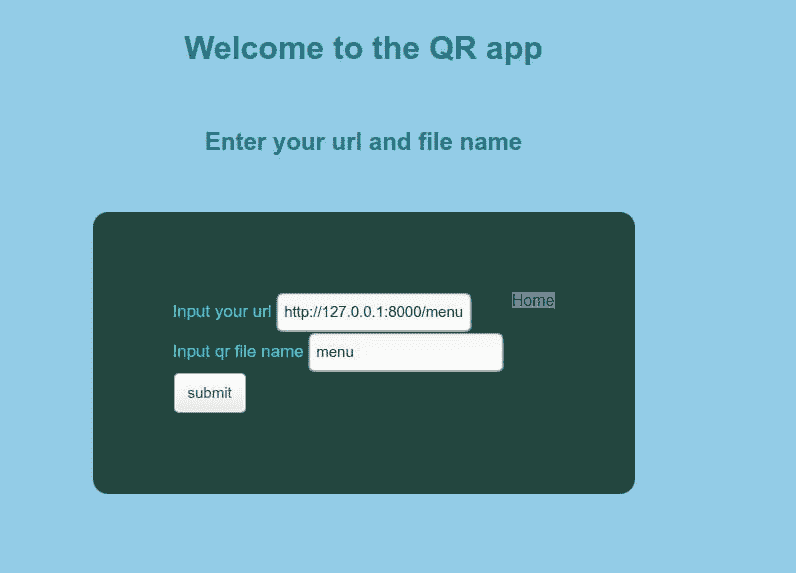
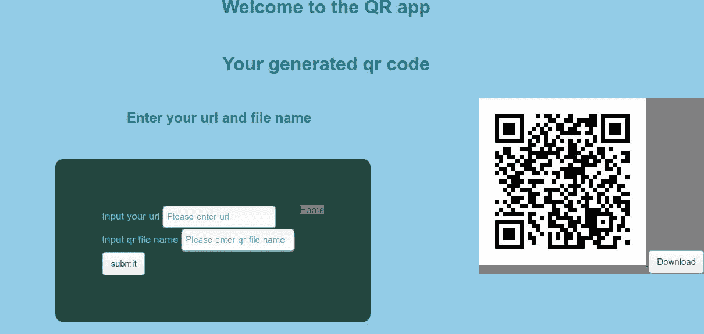

# 让我们为 Django 应用程序添加 QR 特性！

> 原文：<https://medium.com/codex/lets-add-qr-feature-for-our-django-application-2cee136503b8?source=collection_archive---------13----------------------->


最近，我在一家餐厅吃饭，有人告诉我扫描二维码，然后用手机获取菜单。当我回家时，我只是想知道我们如何将它作为一个特性添加进来，或者构建一个在任何现有项目或新项目中复制相同内容的特性。我想尝试一下，只是做了一个简单的 qr 码生成器，以及如何在 Django 驱动的应用程序中添加 qr 功能！

移动电话已经成为我们日常生活中的必需品，并且非常有用，因为它是最简单的通信、共享和创建数据的手段。共享数据的一个简单方法是使用 QR。我们经常在餐厅和餐桌上看到嵌入二维码的小板子，要求我们扫描代码以获得菜单。这种设置可能有多种原因，我发现的原因就像是遵循 COVID 的规范，其中包括不接触菜单卡，因为餐厅中的许多人都会接触它，而且一旦扫描到 QR 码，就会重定向到一个网页，这可能会提供有关用户使用的一些详细信息，并且用户可能会重新打开菜单，也可能会从同一家餐厅点菜。

# 现在让我们深入了解博客的细节:

博客的想法很简单，有一个 django 应用程序，一个 html 页面，上面有我们餐厅的详细信息，以及相应的视图。通过为该 URL 制作一个二维码并在我们的应用程序中渲染，我们就完成了。我们分享可以嵌入的 qr，并尝试使用 QR 阅读器和测试它。我已经使用了 Django，我们可以使用 **flask** 或者我们选择的任何其他框架，但是这个想法在所有框架中都是一样的。这个想法的概述可以在下图中看到:



以下软件包用于构建应用程序:

```
# django 
pip install django 
# pyqrcode 
pip install pyqrcode 
# pypng 
pip install pypng
```

首先让我们看看使用 pyqrcode 的逻辑，逻辑很简单，我们提供要嵌入的 URL 作为 pyqrcode 中的方法**创建**的输入，并使用 png 包将嵌入的 QR 保存为 png。

```
from pyqrcode import create import png
def embed_QR(url_input, location_name): 
    embedded_qr = create(url_input)
    embedded_qr.png(location_name, scale=7)
```

我们已经有了生成 qr 码的方法，现在让我们看看如何集成到 Django 应用程序中。有多个教程介绍我们如何**设置**我们的 django 应用程序，但我不会触及设置，假设我们已经有了 Django 应用程序，让我们看看如何使用二维码。

我们可以简化用例，只呈现一个已经存在的视图，并将代码嵌入到 django 项目中。假设说，[myblog.com/menu](https://myblog.com/menu)已经是我们 django 应用程序的现有视图，我们将这个 URL 作为二维码嵌入，并返回到我们应用程序的登录页面或保存并分发。由于我们正在本地开发应用程序，我们可以在 qr 中嵌入如下的 URL:[IP _ of _ your _ computer:8000/menu](http://ip_of_your_computer:8000/menu)。保存的图像可以作为图像嵌入我们的登录页面。

我们应该确保我们用来测试 QR 的设备、服务器在同一个子网中，并且服务器正在监听子网的所有 ip。

好了，现在让我们开始编码吧！！！。

我们已经有了生成 QR 的方法，还假设我们有 django 应用程序，它为路径 **menu/** 呈现菜单，如果没有，那么我们可以在 urls.py 中添加一个 URL，它实际上执行此操作。因此，在我们的 django 应用程序中(假设我们的项目中存在一个应用程序)，打开 urls.py(如果不存在，创建一个并将 URL 添加到项目中的 urls.py)并添加以下行

这一行与 django 服务器通信，如果接收到任何与菜单相关的请求，则重定向到与 views.py 中的菜单相关的视图。

在 views.py 中，我们可以有一个简单的视图，如下所示:

```
menu_items = some_menu_model.objects.get() return render(request, 'menu.html', {'menu': menu_items})
```

我们在上面的视图中看到，对于获得的请求，我们获得了菜单的所有项目，假设菜单的模型存在，然后呈现一个包含菜单项的 menu.html。

因此，当用户(我们已向其共享了 qr 码)扫描 qr 码时，会被重定向到菜单的 URL，并且会呈现包含所有菜单项的视图。

就是这样，很简单！试试吧，在下面的评论里让我知道它是否有效:)。

在运行应用程序之前，需要设置几个检查点:

1.  确保安装了所有必需的软件包。
2.  确保服务器和测试设备在同一个子网中，以便测试设备浏览器在打开 URL 时将我们的请求重定向到本地运行的服务器。
3.  还要确保您的 url 应该有用作服务器的计算机的 ip 地址，而不是本地主机。假设 192.178.0.12 是你电脑的 ip 地址，那么菜单视图的重定向 url 可以是类似于[192.178.0.12/menu](http://192.178.0.12/menu)的东西。

就是这样！！！我们在 django 应用中嵌入了一个简单的 qr 功能。干杯！！！！

我们可以改进，通过 qr 来邀请新用户加入您的 web 应用程序，或者在 web 应用程序或任何其他功能中为用户提供一些个性化的东西！

我已经上传了我的 github repo 的代码。[这个](https://github.com/gauthamdasu/Mini-project-blog-codes/tree/master/QR_App)是回购的环节。

我们可以使我们的项目更加通用，并将其重命名为 qr 生成应用程序。让我们看看如何实现它。我们输入 url，然后嵌入 url，并将 qr 码返回到视图，然后就这样，我们制作了自己的 QR 生成器应用程序！！！！。同样的几个截图:



我已经在 github 项目中包含了相同的内容，请随意浏览并尝试一下。干杯。

我为此制作了一个演示的小视频，希望你会觉得有用:

博客内容的演示。

我希望这篇文章对正在阅读这篇文章的人有用，我欢迎任何评论、建议、反馈和澄清。你可以通过[请我喝咖啡](https://www.buymeacoffee.com/gautham.dasu)来鼓励我写更多这样的内容。谢谢，祝您愉快！！！

*原发布于*[*https://gauthamdasu . hashnode . dev*](https://gauthamdasu.hashnode.dev/lets-add-qr-feature-for-our-django-applications)*。*