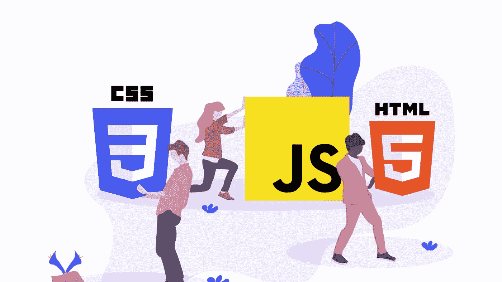
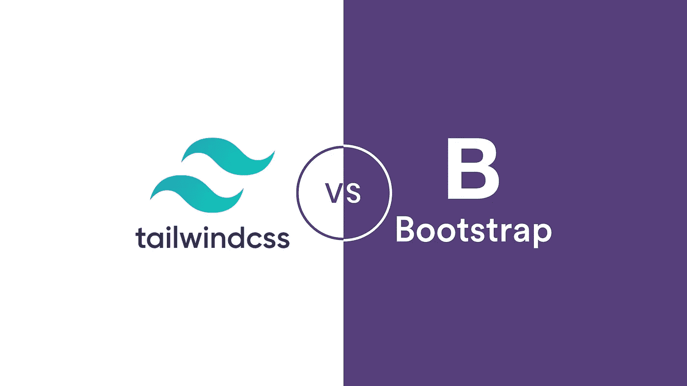
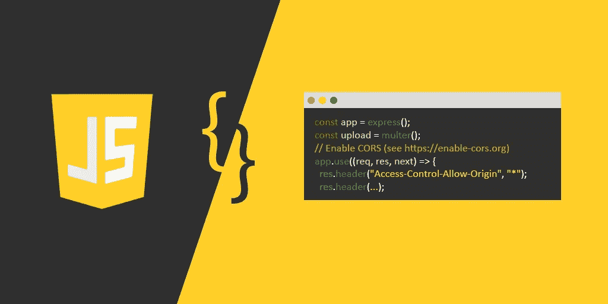
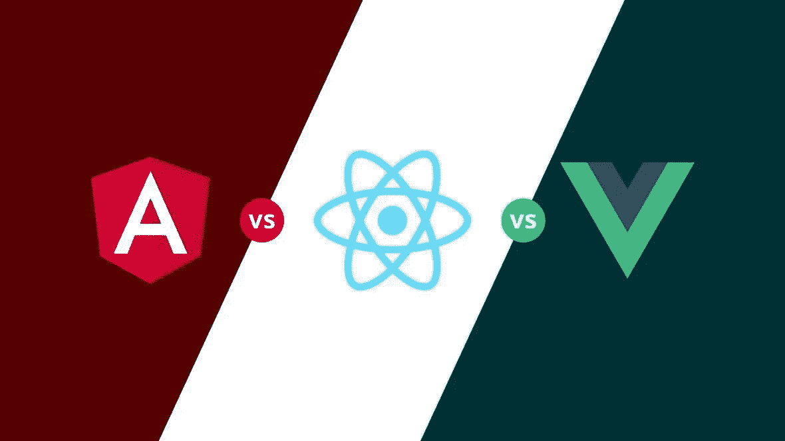
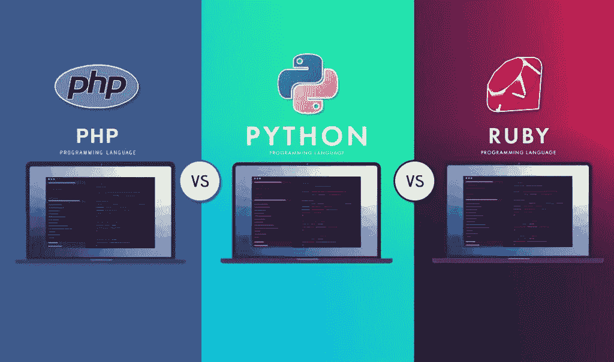
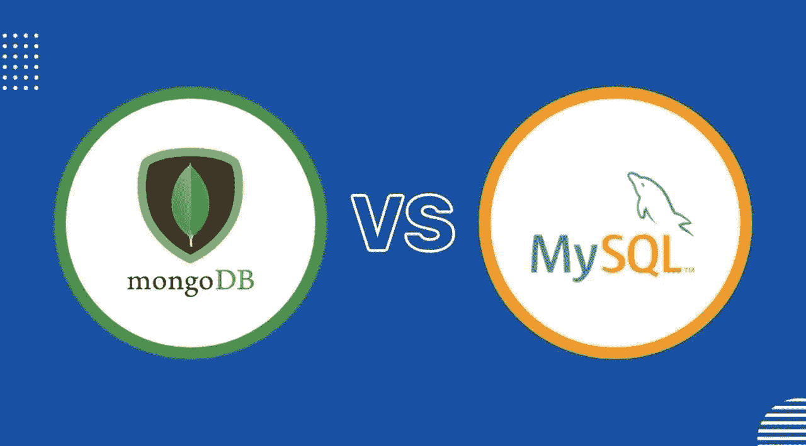
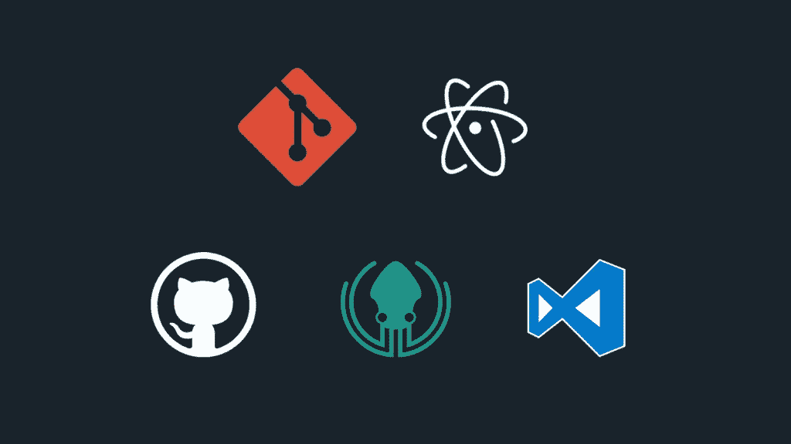

# 让我们全力以赴！

> 原文：<https://medium.com/codex/lets-be-full-stack-26368ef08a22?source=collection_archive---------11----------------------->

我邀请你参加一个非常有吸引力的挑战，这个挑战将在几个月后把你变成一名成熟的开发人员。挑战是在七个月内成为一名成熟的开发人员。如果你对编程感兴趣或者像我一样喜欢学习新东西，这篇文章适合你…

在这篇文章中，我将确定这七个月的路径，并给你一个解释，以便我们知道我们想要做什么。如果我的文章有案例，我很乐意在评论区告诉你问题出在哪里。我自己已经把所有我想介绍的部分弄得支离破碎，乱七八糟，但我想从头开始，带着力量前进。

好了，现在我们知道我们想做什么了，现在让我们来看看步骤，然后开始:

## 第一个月(HTML、CSS、JAVASCRIPT)

第一步，我们需要学习基本内容，如 HTML、CSS 和 JAVASCRIPT 基本内容，并用它们实现一系列迷你项目…

> 提示:如果掌握了这些基本功，也可以从事 SEO 工作。因为这个内容是 SEO 的基础…

要学习这些技能，可以访问 [W3SCHOOLS](https://w3schools.com) 网站或者伊朗网站，获得良好的培训。当你学习的时候，看看用 html，css，js 创建的项目来发展你的创造力和技能。

需要学习的最重要的事情:

*   基本的 html 标签(p，span，ul，li，h1 等。)
*   css 中的基本样式
*   弹性框讨论
*   使用媒体查询的响应
*   用 java script 控制点击和事件
*   …

还有其他重要的事情，如果你遵循，你一定会理解和学习它们。

## 第二个月(CSS 框架)

嗯，在完成第一个月的挑战后，你应该让你的工作变得更容易，并转到 css 框架… css 框架在样式和响应性方面让你的工作更容易，并允许你这样做，他们知道如何编写更干净和更好的代码。

我建议你学习 bootstrap 和 tailwind，因为这两个框架更受欢迎，除了需求，它们比许多 css 框架更容易和更好。

在框架部分要学习的最重要的东西是关于响应性的讨论。因为使用框架需要更少的媒体查询。

## 第三个月(全 Javascript)

在克服了这两个月的挑战后，你需要提高你的 JavaScript 技能。尽量多学 JavaScript，因为 JavaScript 根植于计算机世界的每一个部分，一般适合社区程序员(用黑客的话说，扳手)。

在这一部分，一切都很重要，正如我上面所说的，尽你所能去学习和前进，度过一个令人兴奋的月份…

JavaScript 在 web、黑客和安全、应用程序开发领域非常重要，如果你知道，你可以在所有这些选项之间切换…

## 第四个月(Java 脚本框架)

既然您已经掌握了 JavaScript，那么您可以轻松地选择一个框架并使用它。

尝试学习 React.js，因为它非常非常强大，你可以用这个框架编写 web 应用程序，如果你喜欢，可以用相同的代码编写移动应用程序！！！这个框架需求量很大，并且因为它提供的访问权限而成为最强大的 JavaScript 框架。Angular 和 ViewGS 框架也非常强大，我自己也对 ViewGS 感兴趣，但对于未来，我推荐 React …

你自己会明白重要的事情，但是重要的事情:

*   熟悉打字脚本
*   jsx 简介
*   熟悉如何获取信息
*   还有…

我建议你在这部分多花点时间(比如两个月)，一定要用它做一个项目，这样才能入门。

## 第五个月(后端语言)

恭喜您，您已经能够在三个月内完成前端部分，现在是时候学习服务器端编程了，这样您就可以连接前端和后端部分了。

我能介绍的最好的语言是 PYTHON 和 PHP。Python 是目前世界上最强大的编程语言，无论你进入哪个领域，肯定都会需要 Python 语言。我不同意。目前世界上大部分网站都是用 php 或者基于 php 做的，这些规范对于一门语言来说根本不死！

有许多编程语言，我不会说它们不好，但对于刚刚起步的人来说，这两种语言是最好的选择。

在这一节中，最重要的内容是你应该熟悉编程的基本原理(语法、变量、循环、函数等)。)并学习如何连接前端和后端。

## 第六个月(数据库语言)

如果您想从事中型或大型项目，您肯定需要将信息存储在某个地方，并能够使用后端编程语言将其连接到前端。(这个很吸引人)

> 注意:如果你使用 php，你会自动使用我的 sql

了解 sql 和 nosql 的区别，并尝试在小型项目中使用它们..

## 第七个月(项目和工具)

恭喜你，你已经成功地把自己变成了一个成熟的开发者。现在是时候应用你所学的一切并用它做一个项目了(现在要么免费获得一个项目，要么自己做一个项目放在 gate hub 里)。

最重要的是，你必须学习工具，作为一名程序员，能够轻松、自动地完成工作是非常重要的。

> 在第一到第四个月，一定要学会使用 Gate，因为它可以帮助你控制不同版本的项目。我的建议是看看 [Jadi Git 教程](https://faradars.org/courses/fvgit9609-git-github-gitlab)。

搜索和增强您的信息，并尝试为自己找到更好、更强大的工具…

## 继续这条路线。。。

为自己能够增长见识，挑战自我而自豪。现在，在经历了这段漫长的旅程后，试着成为前面或后面某一节的专家。这对你来说是最好的。

> 既然你已经走了这么远，你肯定知道该如何继续，该学些什么…

## 结论

当然，如果你想把这一切都学得很好，需要 7 个月以上的时间，但是如果你想适量地拥有所有这些技能，这 7 个月足以成为一个完全成熟的开发者。如果这是一个问题或者你喜欢它，我很乐意在评论区告诉你。我希望这篇文章对编程爱好者来说是有趣的，并且我已经能够提供一个相对较好的路径。

健健康康。。。