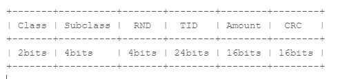
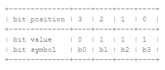
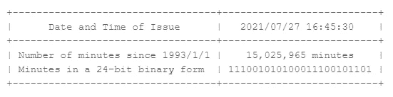
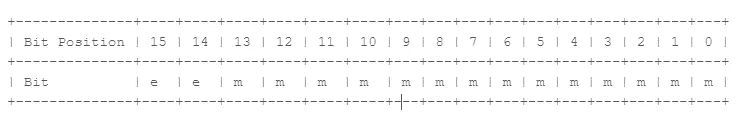
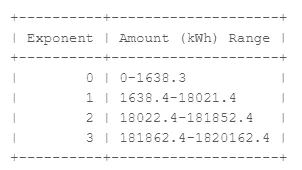
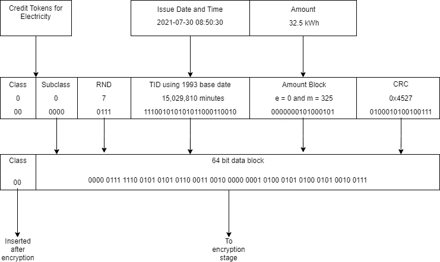
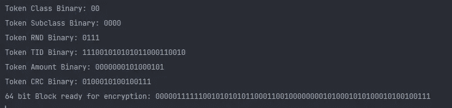

# 让我们揭开 20 位实用令牌的神秘面纱——第 2 部分

> 原文：<https://medium.com/codex/lets-demystify-that-20-digit-utility-token-part-2-64ca45f4b88b?source=collection_archive---------8----------------------->

欢迎来到这个有趣系列的第 2 部分，我们将揭开 STS 令牌。在[之前的文章](https://mwangi-patrick.medium.com/lets-demystify-that-20-digit-utility-token-part-1-74c85eebbac4)中，我们讨论了解码器密钥生成。这一点很重要，因为解码器密钥用于令牌内信息的加密和解密。您必须记住，这个解码器密钥存储在您的仪表中，而服务提供商在购买令牌时会使用您的仪表编号动态生成一个类似的密钥。在本帖中，我们将探讨组成令牌的各个部分及其意义。如果你不熟悉这些基础知识，你可以通过阅读[第一部分](https://mwangi-patrick.medium.com/lets-demystify-that-20-digit-utility-token-part-1-74c85eebbac4)找到它们。

## 令牌格式

在转换成 20 位数之前，令牌通常是二进制形式(0 和 1)。在这个二进制数据块内是令牌类、子类、随机数(RND)、令牌标识符(TID)、效用量和循环冗余校验(CRC)块。整个数据块是 66 位，总共 66 位(0 和 1)。

图 1:令牌数据块

token 类定义了令牌的类型。0 类代币是信用代币，即用于向您的血糖仪充值更多单位。对于额外的配置，也存在 1、2 和 3 类令牌，例如从意外超额购买的客户的仪表中清除信用。从今以后，我们将专注于 0 班。其他令牌部分将仅与 0 类令牌相关。

子类定义了实用程序的类型。这是一个介于 0 和 15 之间的数字。子类 0 用于电，1 用于水，2 用于气，3 用于时间等。随机数的范围是 0–15，生成该随机数是为了确保没有令牌具有彼此相似的二进制签名。令牌标识符是令牌发行的日期和时间，用自基准日期以来的分钟数表示。对于 2014 年之前制造的某些仪表，基准日期为 1993 年 1 月 1 日。这些仪表必须在 2024 年 11 月 24 日之前更新，以 2014 年为基准日期。否则他们将不再接受代币。这种翻转每 31 年发生一次，这篇文章会告诉你为什么。数量部分包含已经分配给客户的单位数量，而 CRC 用于确保数据块是真实的并且没有被破坏。在接下来的段落中会有更多的介绍。

## 二元基础

这一节对于让你跟上速度是至关重要的，因为大量的二进制代码正在向我们走来，理解基础知识将使你很容易掌握整个过程。计算机以二进制形式存储信息。可以存储的最小数据单位是 1 个二进制数字(位),可以是 1 或 0。二进制块可以转换成十进制(如 1、5、19 等数字)，反之亦然。考虑如图所示的二进制 0111；

图 2:二进制形式

要获得二进制数据块的十进制值，我们可以使用以下公式:2 * b0 + 2 * b1 + 2 * b2 + 2⁰ *b3 概括为该位置的 2^bit_position *位值之和。也就是说 2 * 0 + 2 * 1 + 2 * 1 + 2⁰ * 1 = 7。比特位置在左边最大，因为最左边的比特是最重要的。重新查看图 1 所示的表格，我们注意到令牌类仅由 2 位表示。这两位可以代表 4 个不同的数字。例如，二进制 00 转换为十进制 0，01 转换为 1，10 转换为 2，11 转换为 3。假设只有 2 位，您可以通过使用上面给出的公式来确认这里的位位置是 1 和 0。类似地，对于子类和随机数，4 位可以代表 16 个不同的数。二进制 0000 转换为 0，而 1111 转换为 15。你可以使用[这个](https://www.rapidtables.com/convert/number/decimal-to-binary.html)在线工具进行快速转换。有了这些知识，你就能理解接下来的部分。

## 令牌标识符(TID)

令牌标识符是整个令牌块中非常重要的一部分。这个时间戳值是您无法重用令牌的主要原因。输入有效令牌后，TID 将保存在表中。具有相同 TID 的令牌在进入时被拒绝。如前所述，该值计算为自基准日期以来经过的分钟数。分钟随后被转换成 24 位二进制数。值得注意的是，秒会被截断，并且不计入已用分钟数。看看下面的例子。

图 3:令牌标识符计算示例

这里有一些有趣的事情。假设您在同一分钟内为一个仪表购买了多次代币。在第一个和以后的重置之后，对于每一个生成的代币，自动售货单元必须将 TID 增加一分钟。这可以防止您刚刚购买的令牌共享一个公共 TID，从而导致只接受一个令牌而拒绝其他令牌。

二进制形式的 TID 的最大值是 1111111111111111111。它转化为 16，777，215 分钟，大约 31.9 年后，它滚动到 0。这就是为什么仪表中的基准日期必须更新为最近的基准日期的原因。基准日期为 93 的计量表必须更新为基准日期 14(代表 2014 年),稍后将更新为基准日期 35(代表 2035 年),以处理这种展期并继续接受令牌。

## 效用量

金额字段在令牌块中占用 16 位，与 TID 不同，从二进制计算十进制金额的公式是不同的。数量数据块具有以下结构:

图 4:数量数据块

在上图中, **e** 是以 10 为底的指数，而 **m** 是尾数。不要让那迷惑你。假设这是二进制的，则 e 的十进制值是通过转换位置 15 和 14 的两位来获得的，就好像它们分别位于位置 1 和 0。m 的十进制值是通过将从比特位置 13 开始的二进制数转换到比特位置 0 而获得的。例如，考虑金额块 010000000000101。为了计算指数和尾数，我们必须分割方块。二进制 01 表示指数，0000000000101 表示尾数。使用二进制基础部分讨论的公式，指数的十进制值是 1，而尾数的值是 5。通过指数和尾数，可以使用以下公式计算电力单位的数量:

图 5:公式 1

图 6:公式 2

我们的示例 amount 块需要第二个公式，因为指数大于 0。客户收到的千瓦时数将计算为(10 * 5 + 2 ⁴ *10⁰ )/10 = 1643.4 单位。每个 e 值根据尾数的值提供不同的转账金额范围。

图 7:指数和相应的数量范围

使用上述范围的值，只需简单地将公式向后推，就可以从最初的十进制状态计算出二进制的金额块。

## 循环冗余校验

CRC 用作数据处理中的错误检查技术，以检查令牌块中的任何意外变化。用于 STS 令牌的 CRC 方法是 CRC-16 (Modbus ),其生成多项式的值为 x ⁶+x ⁵+x +1，其二进制形式为 1100000000000101。采用二进制形式的原因是因为在生成多项式中只有比特位置 16、15、2 和 0 具有系数 1。所有其他位位置的系数为 0。计算 CRC 后，该值被附加到令牌数据块，并在电表内部的错误检查过程中使用。如果你对 CRC 感兴趣，有人制作了一个很好的解释视频，包括一步一步的计算指南。你可以在这里观看视频。

## 代码示例

讨论完所有信息后，我们将构建一个令牌数据块，并以二进制形式显示它。这是在使用解码器密钥进行加密过程之前的原始形式。这个数据块只有 64 位，因为初始类位是在加密后插入到数据块中的。但是，在 CRC 计算过程中会出现 2 个类别位。下图显示了我们将要模拟的内容。为了保证相同的结果，随机数将是常数。发行日期和时间也是如此，尽管在现实生活中这两个领域都在不断变化。

图 8:令牌块构建

运行上面的代码会得到类似于图 8 的输出。

图 9:程序输出

像往常一样，您可以通过单击下面的链接来运行代码并查看输出；

 [## 标准转换规范-令牌生成

### 这个 repl 演示了令牌块的生成

replit.com](https://replit.com/@AplusProgrammer/StandardTransferSpecification-Token-Generation) 

我们再次深入探讨了令牌的结构以及构建令牌块的过程。在下一篇文章中，我们将研究加密，并构建一个程序来加密令牌，并将其转换为代表客户收到的内容的 20 位输出。我希望到目前为止，你已经从这个系列中学到了很多。

[**第三部**](https://mwangi-patrick.medium.com/lets-demystify-that-20-digit-utility-token-part-3-d05002dbdf71) 见丫，感谢阅读！