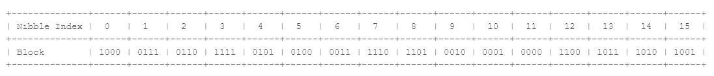
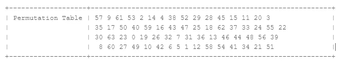

# 让我们揭开 20 位实用令牌的神秘面纱——第 3 部分

> 原文：<https://medium.com/codex/lets-demystify-that-20-digit-utility-token-part-3-d05002dbdf71?source=collection_archive---------3----------------------->

好久不见了。欢迎来到这篇文章的第三部分。这是演示令牌加密-解密过程和所使用的各种算法的系列文章的最后一部分。在[之前的文章](/codex/lets-demystify-that-20-digit-utility-token-part-2-64ca45f4b88b)中，我们讨论了整个令牌块及其生成策略。加密-解密过程是对称的。这意味着用于加密的密钥也用于解密。还记得《T2》第一部中讨论的解码器密钥吗？这把钥匙在这一进程中发挥着至关重要的作用，这将是我们的主要关注点。有两种主要的加密算法在使用。加密算法 7 (EA07)基于 DES，与解码器密钥生成算法 2 (DKGA02)配合使用，加密算法 9 (EA09)与解码器密钥生成算法 4 (DKGA04)配合使用。EA07 在许多方面不同于 EA09。EA07 的密钥大小是 64 位，而 EA09 的密钥大小是 128 位。此外，EA07 是自定义的 DES 加密算法，而 EA09 使用 MISTY1 加密算法。鉴于整个系列一直专注于 DKGA02，将探讨 EA07。坐着别动。

# 加密

EA07 是一种定制的数据加密标准(DES)算法。它遵循 DES 惯例，但不同之处在于利用了定制的替换和置换表和过程。下图总结了整个过程。

图一。EA07 工艺流程

## 替代过程

为替换过程提供了两个各有 16 个元素的替换表。表中的元素在 0–15 的范围内，代表 64 位数据块中半字节的索引。样本替换表如下所示。

图二。替换表示例

在替换之前，64 位解码器密钥通过 xor 运算与 64 位令牌块相结合。然后，生成的二进制文件被分成 16 个 4 位半字节。评估第 3 位(右数第四位),如果其值为 0，则使用替换表 1。如果半字节中位 3 的值为 1，则使用替换表 2。考虑下面的工作示例。

图 3。来自 6 4 位数据块的 16 个 4 位块

索引 0 处的半字节为 1000，位 3 的值为 1。在这种情况下，使用替换表 2。为了进行替换，我们使用半字节索引作为替换表中的索引，并用与替换表中该半字节索引处的数字相等的二进制数替换该半字节。对于这个例子，替换表 2 的索引 0 处的值是 2。二进制值 2 是 0010。所以我们用 0010 代替半字节 1000。索引 1 处的半字节是 0111，在这种情况下，将使用替换表 1，因为位 3 的值是 0。在这种情况下，0111 将被替换为 0110，0110 是数字 6 二进制等价物，是替换表 1 中索引 1 处的值。替换过程一直持续到所有 16 个半字节都被处理完。

## 置换过程。

您可以将置换过程视为一种预先确定的混洗，其中数据块中的位根据给定的置换表进行重新排列。这个过程与替换过程没有太大的不同。下面提供了一个样本置换表。

图 4。样本排列表

表中的第一个值对应于比特位置 0(最右边的比特)，而最后一个值对应于比特位置 63(最左边的比特)。为了执行置换，将位置 I 处的比特移动到从 P[i]导出的比特位置，其中 P 是置换表，I 是表中的索引。例如，比特位置 0 处的比特被移动到新数据块中的位置 57。类似地，在目的数据块中，位置 4 处的比特被移动到位置 2。

提供逆表用于解密目的，以便将比特映射回它们的原始位置。图 4 中置换表的逆表如下所示。

图 5。样本逆置换表

## 密钥轮换过程

对于每一轮加密，密钥都向左旋转。对于每次旋转，最高有效位(位 63)变成最低有效位(位 0)。这已经在下面的图表中可视化了。

图 6。密钥旋转

加密过程有 16 轮替换、置换和密钥轮换。轮次完成后，出现 64 位加密数据块。

## 类别位的插入和转置

如果您还记得本系列第 2 部分中的图 8，那么在加密过程中，类位不是令牌块的一部分。插入后，两个类别位分别与位置 28 和 27 的位交换。下图很好地展示了这一过程。

图 7。类别位的换位

## 转换为令牌号码

通过简单地将二进制转换成十进制，得到的 66 位数据块被转换成 20 位数。例如下面的数据块；

010010100100000100100001011110011110100011100101100010010000101001

上述区块的 20 位令牌号为 **2140-2378-5590-9990-5065** 。你可以通过在这个[工具](https://www.rapidtables.com/convert/number/binary-to-decimal.html)中粘贴二进制文件来确认。在令牌数少于 20 位的情况下，令牌用 0 填充，直到长度达到 20。这是公用事业提供商发送给客户的令牌号码。

## 代码示例

下面的代码使用了普通的 DES 加密算法。在不久的将来，这可能会更新到符合图 1 中概述的步骤的版本。

# [通信]解密

将令牌发送给客户并键入仪表后，令牌号首先被转换成二进制形式，并在必要时填充到 66 位数据块中。类别位被移位并从数据块中移除，以留下经过解密过程的加密的 64 位块。鉴于该过程是对称的，解密是加密步骤的逆过程。在置换阶段的解密过程中使用逆置换表。下图展示了解密流程。

图 8。DA07 工艺流程

## 代码示例

下面的 Repl 中提供了一个可运行的演示，从解码器密钥生成一直到令牌信息的解密和提取。

 [## 标准转换规范-完整演示

### 一个由程序员编写的 Java repl

replit.com](https://replit.com/@AplusProgrammer/StandardTransferSpecification-Full-Demo) 

您应该会看到类似下图的输出

图 9。演示输出

# 揭穿误解

最常见的误解是令牌表与服务提供商通信。这在大多数情况下带来了一种想法，即令牌号码类似于刮刮卡号码，设备将该号码发送给服务提供商作为确认，并接收信用作为回报。显然，STS 令牌表的情况并非如此。该标准旨在允许在最偏远的地方部署电表，而无需通信。只需将解码密钥嵌入电表中，提供商只需生成令牌并将其发送到用户的电话号码，或者在某些情况下将令牌打印在纸上。令牌表不呼叫总部。

# 结论

这一部分讲述了令牌数据块的加密和解密，并概述了加密和解密过程的各个步骤，以便更清楚地了解情况。我希望你发现整个系列的内容有启发性，并清除了 STS 令牌之谜。:).DKGA04 和 EA11 上的加成内容可以在 [**Part 4**](/codex/lets-demystify-that-20-digit-utility-token-part-4-9143c1c0792c) 上找到。下次见，再见！

## 参考

[IEC 62055-41 个电能计量支付系统](https://webstore.iec.ch/publication/28425)

[STS 协会](https://www.sts.org.za/)