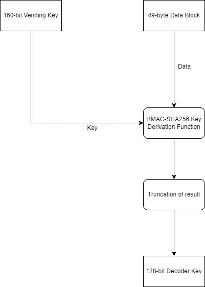
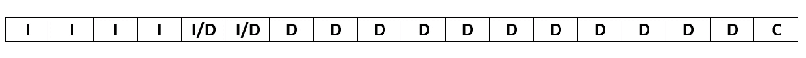
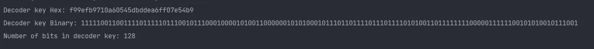
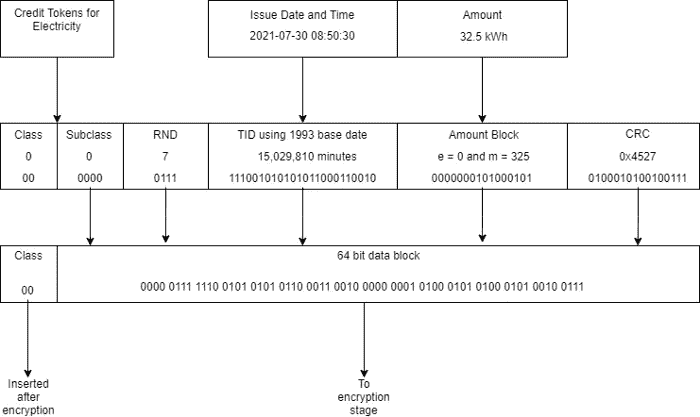
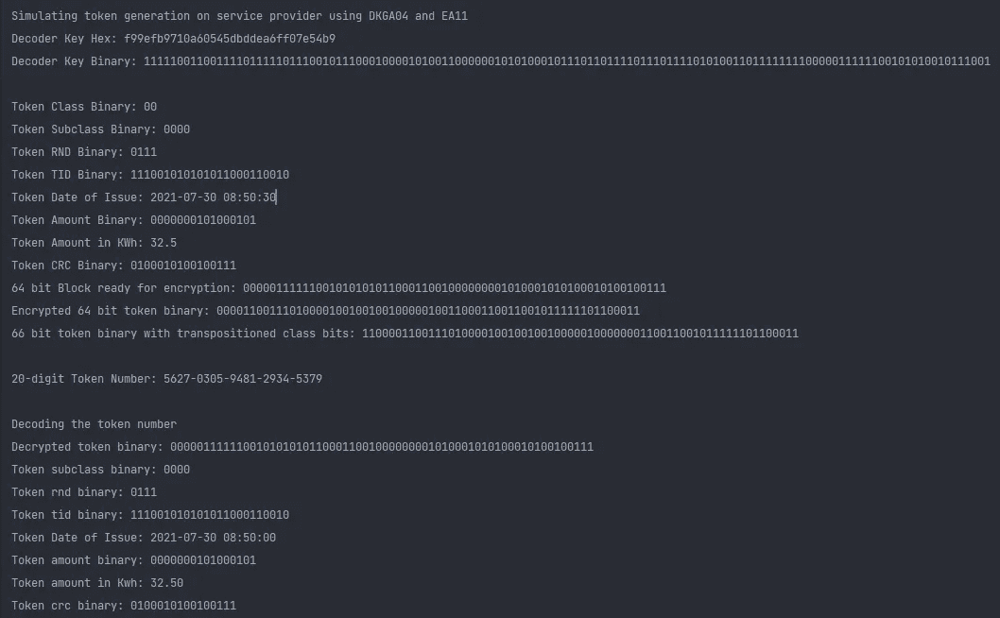

# 让我们揭开 20 位实用令牌的神秘面纱——第 4 部分

> 原文：<https://medium.com/codex/lets-demystify-that-20-digit-utility-token-part-4-9143c1c0792c?source=collection_archive---------5----------------------->

我记得我承诺过涵盖加密算法 11 (EA 11)和解码器密钥生成算法 4 (DKGA04)。没有比现在更好的时机了。我深信是前三篇文章把你带到了这里。如果没有，不用担心。点击链接可以进入 [Part1](https://mwangi-patrick.medium.com/lets-demystify-that-20-digit-utility-token-part-1-74c85eebbac4) 、 [Part2](/codex/lets-demystify-that-20-digit-utility-token-part-2-64ca45f4b88b) 和 [Part3](/codex/lets-demystify-that-20-digit-utility-token-part-3-d05002dbdf71) 。

如果你还记得的话，我们在之前的帖子里讨论过 DKGA02 和 EA07。两组密钥生成和加密算法的主要区别在于密钥大小以及所使用的加密算法。

对于 DKGA02，密钥大小只有 64 位，而 DKGA04 的密钥大小是可变的。您可以使用 DKGA04 生成 64 位和 128 位解码器密钥。EA07 使用自定义的 DES 加密算法。另一方面，EA11 使用 [MISTY1](https://en.wikipedia.org/wiki/MISTY1) 加密算法。在本帖中，我们将介绍使用算法版本 4 的解码器密钥生成技术，使用 Misty1 加密和解密令牌有效载荷。我希望你能像我一样兴奋地投入进去。

## 解码器密钥生成

假设使用算法版本 4 生成的解码器密钥是 128 位，用于 EA11，很明显它包含更多的信息。然而，与 DKGA02 相比，该算法非常简单，因为它涉及计算 HMAC-SHA256 哈希，然后选择最左边的 **n** 位。看看下面的图表。



图 1。DKGA04 流量

49 字节的数据块以十六进制格式构建，由以下数据元素组成。

```
+=====================+==================+=======+
|        **Field**        |      **Value**       | **Bytes** |
+=====================+==================+=======+
| Separator           | 0402(hex)        |     2 |
+---------------------+------------------+-------+
| DKGA                | 2 ASCII digits   |     2 |
+---------------------+------------------+-------+
| Separator           | 02 (hex)         |     1 |
+---------------------+------------------+-------+
| BaseDate            | 2 ASCII digits   |     2 |
+---------------------+------------------+-------+
| Separator           | 02 (hex)         |     1 |
+---------------------+------------------+-------+
| EA                  | 2 ASCII digits   |     2 |
+---------------------+------------------+-------+
| Separator           | 02 (hex)         |     1 |
+---------------------+------------------+-------+
| Tariff Index        | 2 ASCII digits   |     2 |
+---------------------+------------------+-------+
| Separator           | 000406 (hex)     |     3 |
+---------------------+------------------+-------+
| Supply Group Code   | 6 ASCII digits   |     6 |
+---------------------+------------------+-------+
| Separator           | 01 (hex)         |     1 |
+---------------------+------------------+-------+
| Key Type            | 1 ASCII digit    |     1 |
+---------------------+------------------+-------+
| Separator           | 01 (hex)         |     1 |
+---------------------+------------------+-------+
| Key Revision Number | 1 ASCII digit    |     1 |
+---------------------+------------------+-------+
| Separator           | 12 (hex)         |     1 |
+---------------------+------------------+-------+
| Meter PAN           | 18 ASCII digits  |    18 |
+---------------------+------------------+-------+
| Decoder Key Length  | 32-bit Integer   |     4 |
+---------------------+------------------+-------+
| -                   | **Total**            |    **49** |
+---------------------+------------------+-------+
```

这个场景中的仪表台是一个有趣的点。在 DKGA02 中，PAN 的最大长度为 16 位。18 位仪表面板中的 2 个额外数字在最左端容纳一个额外的 IIN(发行人识别号)数字，在另一端容纳一个校验位。



图二。仪表盘(主账号)

在上图中，I 表示 IIN 数字所占据的位置。I/D 表示 IIN 或解码器注册号(DRN)数字可能占用的空间，具体取决于 DRN 的长度。c 是通过使用 IIN 和 DRN 数字作为输入，使用 [Luhn](https://www.geeksforgeeks.org/luhn-algorithm/) 算法计算的校验位。使用我们的例子 DRN 56728389216，电度表将是 **600727567283892161** 。您可以使用 [SimplyCalc](https://simplycalc.com/luhn-calculate.php) 等在线工具确认校验位的有效性。

## 代码示例

出售密钥生成。

解码器密钥生成

运行上面的代码将产生类似下图的输出



图 3。DKGA04 程序输出

## 令牌加密和解密

加密算法 11 使用 MISTY1，它是一种对称分组密码。该算法接收 64 位输入，并使用 128 位密钥进行加密和解密。MISTY1 是一种获得专利的分组密码，但可以免费用于教育目的。EA07 和 EA11 的令牌块准备是相似的，因为两种算法都需要 64 位输入。附上与本系列第 2 部分类似的图表以供参考。



图 4。令牌块准备

## 代码示例

下面的类扩展了本系列第三部分中演示的 [**TokenEncryptor**](https://gist.github.com/CodeLover254/8c41fbb1b645a42641f2bb47cba5cc68) 类，并利用 Misty1 加密令牌块。

Misty1 实现最初是从[besom/bbossgroups-mvn](https://github.com/besom/bbossgroups-mvn)Github 存储库中获得的，并根据演示的需要进行了修改。你可以在这里访问实现[。](https://gist.github.com/CodeLover254/b6a1ce5296dbd23178804d5122910bbf)

下面的类扩展了 [**TokenMeter**](https://gist.github.com/CodeLover254/629b99b8bdee39cd5b06ee6679d3dccc) 类，并演示了使用 Misty1 块密码对令牌块进行解密。

要运行加密和解密示例，请随意单击下面的嵌入链接。

[](https://replit.com/@AplusProgrammer/StandardTransferSpecification-DKGA04-and-EA11) [## 标准转换规范-DKGA04 和 EA11

### 演示 STS 加密算法 11

replit.com](https://replit.com/@AplusProgrammer/StandardTransferSpecification-DKGA04-and-EA11) 

您应该会得到类似下图的输出。



图 5。程序输出

## 结论

这篇文章是专门针对 DKGA04 和 EA11 的，是对前三篇文章的补充。它标志着标准传输规范系列的最后一章。期待将来有更多的帖子涉及其他有趣的领域。感谢您的阅读，祝您愉快！