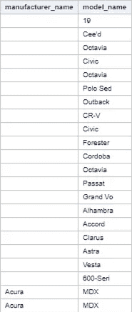

# 我们来探究一下二手车价格数据吧！

> 原文：<https://medium.com/codex/lets-explore-the-used-car-price-data-bcc1daae382a?source=collection_archive---------1----------------------->

## [法典](http://medium.com/codex)

[史蒂夫·哈维](https://unsplash.com/@trommelkopf?utm_source=medium&utm_medium=referral)在 [Unsplash](https://unsplash.com?utm_source=medium&utm_medium=referral) 上拍照

我从 Kaggle 那里得到了这些数据，包括白俄罗斯的汽车目录，这些数据是从网络资源上搜集来的。该数据集可用于建立二手车预测模型。从数据预处理到探索性数据分析的所有程序都使用 SAS OnDemand for Academics 进行。

让我们看看。原始数据总共包含 30 个变量。我不知道功能 0-9 是什么。数据所有人给出的描述是:“汽车上有合金车轮、空调等选项吗？”。另一方面，上行计数器表示“轿厢上行的次数”。

下面是一个原始数据的例子:

数据集第一部分的前 10 个观察值

数据集的前 10 个观察值第 2 部分

数值数据集的散点图矩阵

这是我从原始数据集散点图矩阵得出的结果。因变量价格 USD 与自变量里程表值和生产年份之间存在相关性。

**数据预处理**

看起来数据集中有“新”汽车。这需要删除，因为我们正在考虑二手车价格。

从状态变量中删除“New”的 SAS 代码

状态条形图的 SAS 代码

移除“新”汽车后的状态条形图

当然，删除功能 0 —功能 9，因为我们没有太多关于它具体代表什么的信息。

现在有趣的部分是处理丢失的值。有太多的变量缺少值，所以我只显示其中的几个作为例子。

**制造商名称**

SAS 代码到集群缺少制造商名称

缺少制造商名称的观察结果

发现制造商名称变量中有 20 个值缺失。采用最后观察到的方法估算缺失值。首先，缺失制造商名称的记录被一起估算。

用于检查制造商名称和型号名称关系的 SAS 代码

按制造商名称和型号名称分组的观察计数

假设可以使用型号名称来确定制造商名称。理想情况下，1 个型号名称应该属于 1 个制造商名称。根据结果，除 Vesta 和 Grand V 模型外，大多数模型符合假设。

按制造商名称、型号名称和车身类型分组的观察计数的 SAS 代码

观察计数结果按制造商名称、型号名称和车身类型分组

因此，体型被包括在分组中。注意到如果车型名称是 Grand V，车身类型是 minivan，则制造商名称是 Chrysl。如果车身类型是掀背车或 SUV 的制造商名称是铃木。

根据型号名称替换最后观察到的制造商名称的 SAS 代码

**传输**

对于传输变量，使用最高频率值估算缺失值。如上表所示，“机械”出现的频率最高。因此，带有缺失值的变速器记录被替换为“机械”记录。

用“机械”替换变速器缺失值的 SAS 代码

缺失值处理前的传输条形图

缺失值处理后的传输条形图

## 发动机有汽油

发动机有气体，缺失值按发动机燃料和发动机类型分组

发动机的 SAS 代码有“汽油”和“柴油”的气体频率计数

发动机的频率计数具有按发动机燃料和发动机类型分组的气体

如果与发动机类型和发动机燃料相关，则首先检查发动机有气体。根据上图，发动机既有汽油又有柴油是“错误的”。因此，观察到的缺失值可以根据最后一次观察进行估算'假'。

接下来是处理异常值。

异常值处理前 7 个变量的偏斜度

## **里程表值**

处理异常值之前的里程表值

里程表值直方图显示处理异常值之前的右偏分布。采用数据转换方法处理里程表值的异常值。首先比较对数和平方根变换的结果。

log 和 sqrt 转换里程表值的比较

对数变换的里程表值

使用 sqrt 转换的里程表值

根据上面的直方图，对数转换的里程表值是左偏的。Sqrt 转换的里程表值将偏斜度从 1.23 提高到-0.41。因此，选择了 sqrt 转换的里程表值。里程表值的原始偏斜度为 1.2397747。

## 发动机容量

SAS 代码检查 bin 分配

采用宁滨方法处理发动机容量中的异常值。首先使用“hpbin”，确定了 15 个箱的发动机容量范围。

hpbin 函数的结果

宁滨发动机容量的 SAS 代码

宁滨之前的发动机容量

宁滨之后的发动机容量

对其余变量进行类似的处理。

好吧，让我们继续想象。

**探索数据**

按制造商名称分组的汽车数量

如上图所示，清理后的数据集主要包含大众汽车，其次是欧宝和福特，而观察最少的是林肯、卡迪尔和伟大。如上图所示，清理后的数据集主要包含大众汽车，其次是欧宝和福特，而观察最少的是林肯、卡迪尔和伟大。

按制造商名称分组的保修条形图

的条形图可交换，按制造商名称分组

上面的条形图显示，二手车市场中只有 0.19%的汽车仍有保修。当计算按生产年份分组的有保修的汽车数量时，我们看到近年生产的汽车中有保修的更多。然而，也有一些 2015 年之前生产的保修汽车。据 Gibson (2020)称，在欧洲地区，大多数汽车制造商提供 3-7 年汽车保修。当标准保修结束时，购买者可以购买延长保修。由于数据集中没有太多关于这些汽车保修类型的信息，因此无法确定 2015 年之前生产的汽车所提供的保修类型。34%的车主愿意以很少或没有额外价格与另一个制造商/型号交换他们的二手车。大多数愿意交换旧车的车主如下图所示。因此，如果一个新的业务或平台以汽车交换服务为目标，拥有 90 年代末和 21 世纪初汽车的车主将被视为一个很好的目标受众。

按生产年份分组的自动汽车变速器

24，368 辆汽车，占汽车总数的 67.88%。当按生产年份分组时，可以观察到大多数机械车都是车龄较大的车。2000 年代后期生产的汽车更有可能采用自动变速器。

传动系统频率折线图

26，342，其中大部分是前轮驱动系统。前轮和后轮驱动系统之间的区别在于，对于前轮驱动系统，动力被转移到前轮，提供更好的燃油经济性和排放更少的二氧化碳，而对于后轮驱动系统，动力被转移到后轮，这创造了更好的重量平衡(Admin，2017；车主小贴士，2018)。虽然后轮提供了更好的操控性和加速，但在恶劣的天气条件下这是不利的。前轮驱动列车在雪地上表现更好，因为它保持了更好的牵引力(车主提示，2018)。对于全轮驱动，顾名思义，动力传递到汽车的所有四个轮子。虽然全轮驱动提供了更好的加速和干操纵性能，但燃油经济性越低，维护成本就越高(Montoya，2017)。根据白俄罗斯 by (n.d .)，白俄罗斯每年经历降雪 75-125 天，这解释了为什么前驱动系统在数据集中占大多数。它既经济又能承受恶劣的天气条件。

车身类型与发动机燃油的气泡图

汽车类型及其发动机燃料

值得注意的是，轿车使用不同的发动机燃料。混合动力 d 型车只在轿车中有售。然而，对于混合动力 d 型汽车只有一次观察，因此进一步的观察将需要更大的样本量。同样，cabrinolet 有汽油和柴油两种燃料，而 limousine 有汽油和汽油两种燃料。混合动力汽车正慢慢向更多的车型发展。

按生产年份分组的汽车数量

使用上面的直方图可以观察到，大多数待售汽车位于 1996-2000 年之间。从 2006 年到 2009 年有下降趋势，这可以用金融危机来解释。从 2015 年起，汽车数量也会减少，这可能是因为新用户不太可能出售他们的汽车。

照片数量与原木价格(美元)的方框图

照片数量是指汽车目录上可见的照片数量。方框图显示，随着更多照片上传，平均价格略有上升。可以假设，当汽车状况良好时，车主会上传更多照片，因为没有什么可隐藏的。因此，总的来说，它们的价格更高。

另一方面，当比较不同汽车颜色和美元价格时，可以观察到深色汽车的价格通常较高。从黑色、棕色和灰色的汽车上可以看出，平均价格更高。至于醒目的颜色，如绿色、红色和紫色，平均价格较低。也许这是因为醒目的颜色在普通人群中接受度不高。

汽车颜色与对数价格(美元)方框图

有保修和无保修汽车的平均价格

正如所料，有保修的汽车比没有保修的汽车具有更高的平均价格，因为可以假设有有效保修的汽车是较新的汽车。鉴于保修仍然有效，车主更愿意支付更高的价格。

**假设检验**

假设 1

零假设:混合动力车的平均价格更高。

替代假设:混合动力汽车没有更高的平均价格。

宁滨发动机燃料的 SAS 代码

绘制发动机燃料与平均对数价格(美元)的关系图

为了确定混合燃料和非混合燃料之间的价格差异，宁滨使用了一个新的变量“燃料箱”。Hybrid-p 和 hybrid-d 被归入“混合”箱，而汽油、天然气和柴油被归入“非混合”箱。混合动力车和非混合动力车的平均价格比较表明，混合动力车的平均价格更高。因此，零假设是无法拒绝的。

假设 2

零假设:在所有制造商中，保时捷的平均价格最高

替代假设:在所有制造商中，保时捷不具有最高的平均价格

SAS 代码，根据平均原木价格(美元)绘制制造商名称

为了确定保时捷与其他制造商相比是否具有最高的平均价格，绘制了一个条形图，并按平均价格降序排列。如上图所示，保时捷的均价最高。因此，不能拒绝零假设。

假设 3

零假设:价格和发动机容量之间没有显著差异

替代假设:价格和发动机容量之间存在显著差异

发动机盖范围统计分析的 SAS 代码

结果示例。

使用统计方法来检验假设 3。为了确定是否应该使用参数或非参数检验，首先进行了正态性检验。正如在上述 Kolmogorov Smirnov 测试的结果中观察到的，大多数显示 Pr > D 0.0100，表明数据集不符合正态分布。使用 Kolmogorov Smirnov 检验，因为它适用于样本量超过 50 的情况(Mishra 等人，2019)。由于数据集不是正态分布，因此必须进行非参数检验。为这一假设选择的检验是 Kruskal-wallis 检验，这是一种单向方差分析的非参数方法。

非参数检验结果

使用 SAS 的非参数检验函数进行检验。Kruskal Wallis 检验导致双边检验 p 值<0.0001\. This indicates that we should reject the null hypothesis that mean ranks are equal across engine capacity and accept alternate hypothesis that there is a significant difference in engine capacity with car price.

And… that’s the end of the project. There’s (obviously) many room for improvement. For example, the choice of plot and I’m gonna admit that I’m still learning how to handle outliers. This is my second project, more to come!

**参考**

Admin (2017)。*前轮驱动与后轮驱动|优点&缺点*。【在线】。2017.自动简单。可从:[https://www . auto simple . com/blog/前轮驱动 vs 后轮驱动-利弊/。](https://www.autosimple.com/blog/front-wheel-drive-vs-rear-wheel-drive-pros-cons/.)【访问时间:2020 年 12 月 14 日】。

车主小贴士(2018)。*了解你的动力传动系统 RWD，前进，AWD |汽车贴士*。【在线】。2018.新道路汽车集团。可从:[https://www . new roads . ca/blog/understanding-drive train-rwd-FWD-awd/。【访问日期:2020 年 12 月 14 日】。](https://www.newroads.ca/blog/understanding-drivetrain-rwd-fwd-awd/.)

吉布森博士(2020)。*汽车保修建议:制造商保修范围和延期保修说明*。【在线】。2020.自动快递。可从:[https://www . auto express . co . uk/car-news/103763/car-warranty-advice-manufacturer-warranty-cover-and-extended-warranties-explained 获取。](https://www.autoexpress.co.uk/car-news/103763/car-warranty-advice-manufacturer-warranty-cover-and-extended-warranties-explained.)【访问日期:2020 年 12 月 14 日】。

蒙托亚河(2017 年)。你需要一辆全轮驱动还是四轮驱动的汽车？【上线】。2017.埃德蒙兹。可从:[https://www . edmunds . com/car-buying/do-you-need-a-all-wheel-drive-or-four-wheel-drive-car . html .](https://www.edmunds.com/car-buying/do-you-need-an-all-wheel-drive-or-four-wheel-drive-car.html.)[访问日期:2020 年 12 月 14 日]。