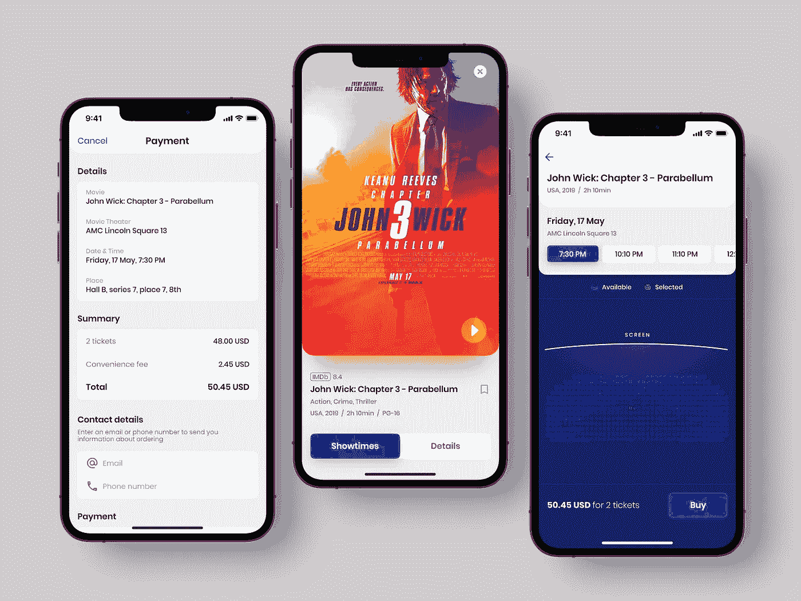
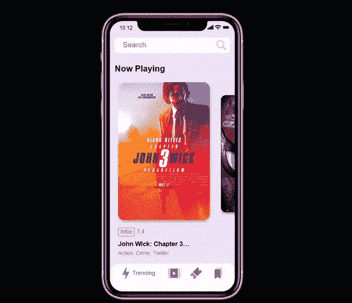
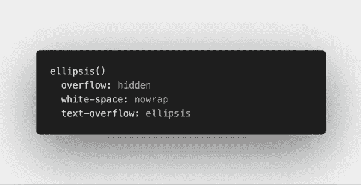
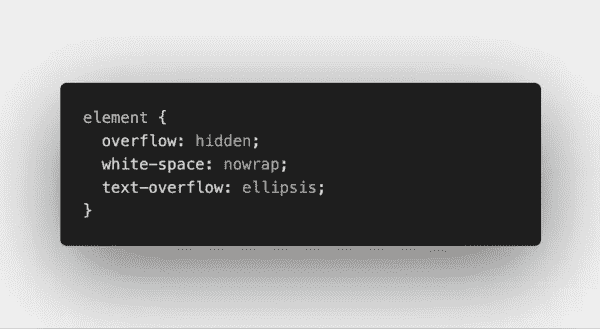

# 让我们制作一个电影应用程序:来自前端开发人员的提示

> 原文：<https://medium.com/codex/lets-make-a-movie-app-tips-from-a-front-end-developer-9b94280edbcc?source=collection_archive---------2----------------------->

## 疾速追杀和翻转动画有什么共同点？

由 [Shakuro](https://dribbble.com/shots/15420280-Cinema-Ticket-App-Concept) 开发的电影票应用程序概念

市场上还有新应用的空间吗，或者网飞是唯一的解决方案吗？我们认为，如果我们遵循一些简单的规则，仍然有可能创建一个病毒式电影应用程序。

[Hugo Priet](https://codepen.io/smoothdev35) ，一位自学成才的前端开发人员，为我们最近的一个电影应用程序设计了动画并扩展了其设计理念。我们认为结果很棒:

在 [CodePen](https://codepen.io/smoothdev35/pen/rNMxPwQ) 上的最终演示

他友好地向我们提供了一些关于如何通过编码让概念变得生动的技巧。你会在下面看到他的文字，随后是草书中的几段三郎的言论*。*

# 加价

很多前端的乡亲会告诉你，做一个好的 app 或者网站，需要的就是 HTML，CSS，JS。他们是对的！结构化标记不仅易于访问，而且非常容易理解，准备好 DOM 操纵工具将会让你走得更远。

这个演示是一个例子，展示了如何用这些工具实现非常干净的 UI 动画。

非常感谢格林斯托克和他们的动画平台 GSAP。这是目前为止 JS 中最好的动画工具，无论是特性还是性能。*如果你想了解更多，* [*三郎有一篇单独的文章，题目是*](https://shakuro.com/blog/greensock-tutorial-for-beginners-web-animation-library) *。*

# 造型

我在整个“应用程序”中使用 CSS 自定义属性进行颜色重用。CSS 自定义属性为样式和交互性打开了一个可能性的世界，因为您可以在 Javascript 中更改它们。仔细整合 Shakuro 的设计是这里的驱动焦点，但有两个主要的事情要考虑，以便动画在我们实现它们时渲染得很好:

# 1.泛滥

所选电影视图的动态水平滚动和垂直滚动混合在一起，产生一种你呆在同一个“地方”的错觉。自然过渡的实现归功于两件事:翻转(第一个，最后一个，反转，播放)动画，但我们会回到那个，和…隐藏滚动条！隐藏滚动条有助于节省屏幕空间，消除我们在不同页面上的印象，所有这些都是为了更好的用户体验。

# 2.文本溢出

细节决定成败。出于上面提到的同样原因，电影海报下面的文字需要设置，这样动画才会流畅。处理文本溢出的方法是 web 开发中经常出现的问题。

幸运的是，CSS 已经发展为我们提供了可靠的选择。在我们的例子中，要让截断的文本变成完整的文本，可以使用省略号:

更多代码见[优惠券](https://codepen.io/smoothdev35/pen/rNMxPwQ)

# 核心

哪里有 HTML，哪里就有 DOM 操作。整个事情由一个多数组对象来保存数据和三个对象文字组成。在 array 对象中，我们有简单的嵌套数组，包含电影的所有必要信息。我对所有数据进行了硬编码，因为这主要是一个前端演示。

**第一个对象文字**，dynamicClock，用来在手机屏幕的左上角有一个基本的实时时钟。使用 setInterval，我每秒解析一次当前时间，并更新时钟占位符的内容。

**第二个对象文字**，footerNav，在页脚给了我们一个假的顶级导航。我们有一个菜单图标之间的过渡效果，但实际上我还没有创建其他三个部分。

通过 DOM 操作和 CSS 转换，导航就像一个类开关(“active”，“”)一样简单，可以将活动部分转换到屏幕上。你会注意到我找不到相同的页脚导航图标。

第三个对象文字，动态滚动，是迄今为止最重要的一个，它控制着“应用”最重要的两个方面:动态滚动和翻转动画。

# 动态滚动

最近，IntersectionObserver 已经成为许多 web 开发人员从头实现基于滚动的动画的首选解决方案。有很多选择，但我追求的是终极性能。为此，我使用了 GSAP 插件 ScrollTrigger。

这是迄今为止最具性能和跨浏览器的 JS 动画工具。我花了一段时间才找到实现我想要的动画的方法。我没有试图在电影海报出现时缩放它们，而是定义了一个时间轴，让所有海报一个接一个地动画化，然后将动画链接到 reel 元素的滚动条(谢谢 ScrollTrigger)。

除了显示电影的缩放动画之外，我还需要一种方法来知道哪部电影是活动的，这样我就可以在单击时触发翻转动画来扩展所选的电影。ScrollTrigger 又一次给我带来了解决方案。我在 screen 元素中创建了一个触发器，这样，对于元素宽度在 0 到 80%之间的任何卡片，它都会被激活。这样，我确保了如果你在屏幕上的活动卡片外单击，不会触发扩展动画。

# 翻转动画

自从我第一次读到这个概念，我就爱上了它。FLIP 代表第一、最后、反转和播放。这到底是怎么回事？首先，这个术语是由保罗·刘易斯在他著名的文章《翻转你的动画》中创造的。这里可以找到[。](https://aerotwist.com/blog/flip-your-animations/)

FLIP 的整个要点是以最高的性能(60FPS 是标准)实现复杂(或不复杂)的动画。因此，在动画元素时，不需要进行计算(新位置、新大小、新的等等)，而是在动画触发之前进行。

你会问，怎么会？按照这个“简单”的方法:存储元素的第一个状态，将元素设置为它的最后一个状态(在哪里，动画后它将如何)，反转更改，这意味着元素将转换回它的第一个状态，最后播放动画，这样元素就转换回它的最终状态，无需执行任何计算。你可以在保罗的原始文章中找到一般概念的片段。

# 翻转插件

我用来将翻转动画应用到我的“应用程序”的工具是 GSAP 高级翻转插件。你可以在 CodePen 上免费试用。不用说，这个插件使得使用这种动画技术变得非常快，否则这种技术会非常冗长和棘手。我需要在两个动画上使用它:一个用于扩展(和关闭)选定的电影，另一个用于扩展(和关闭)选定的预告片。

请随意跳转到代码中仔细查看！

感谢这个伟大的教程！

缺乏真实项目的经验是没有投资组合的糟糕借口。你可以随时在 T2 众多不同的网络和移动概念中进行选择。别忘了提到我们。

*由* [*雨果*](https://codepen.io/smoothdev35)*&*[*丽塔·恩慈——羡慕，文案由*三郎](https://shakuro.com/blog/author/margarita-nevidnyk)