# 让我们团结一致制造塔皮飞机！

> 原文：<https://medium.com/codex/lets-make-tappy-plane-with-unity-bdcde93f2705?source=collection_archive---------3----------------------->

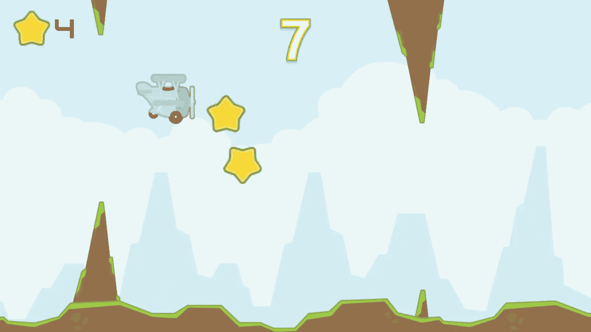

在这篇文章中，我将向你展示如何使用 Unity 创建 Tappy 平面游戏(类似于 Flappy Bird )!

这是我们将要建造的:

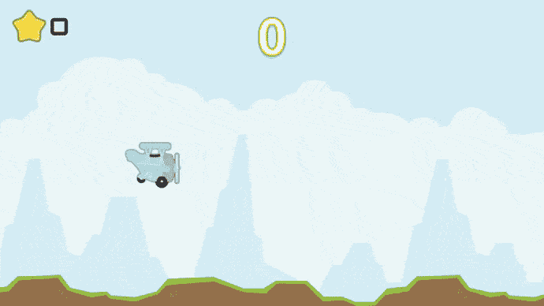

你可以在 GitHub 的这里获得游戏[的源代码。](https://github.com/tariibaba/Tappy-Plane)

# 我们将使用的是:

*   [UniRx](https://github.com/neuecc/UniRx)——用于反应式编程，以及漂亮干净的数据和视图分离。
*   [来自肯尼的 Tappy 飞机资产](https://www.kenney.nl/assets/tappy-plane)。

# 添加重复的背景和背景

我们首先创建我们将在游戏中使用的背景。用于背景的精灵是`Assets/Sprites/background.png`。

我们的背景图像

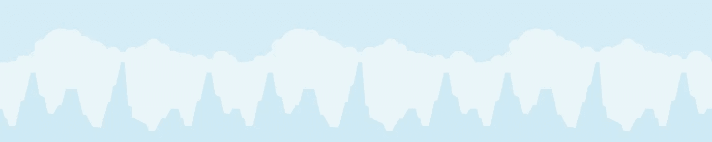

同一图像的三个副本并排

## 制作重复的图像

组件`RepeatingBackground`被附加到组件`Background`上，该组件包含背景的所有片段作为子游戏对象。我们首先将重复背景的所有片段按照它们在场景中出现的顺序初始化成一个队列。这些片段是连接在一起的同一个图像，并以一定的速度向屏幕的左边移动。当第一个段完全离开屏幕时，我们将其发送到队列的末尾(成为新的最后一个段),并将其位置移动到屏幕的最右侧——但仍与其他段相连。我们一直这样做，直到游戏停止。通过这样做，我们创造了一个永无止境的背景的幻觉。

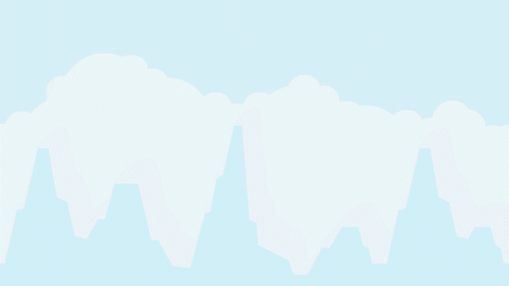

以下是场景中实际发生的情况:

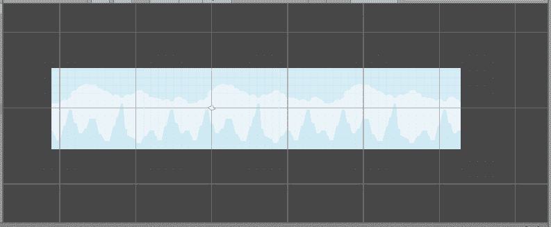

这是因为精灵的设计方式。

我们对地面做了同样的处理，但是速度更快，因为它在前景中(精灵是`Assets/Sprites/groundGrass.png`)

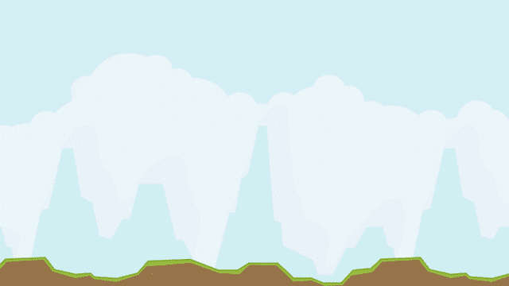

# 创建平面

我们将在飞机上使用这些精灵:

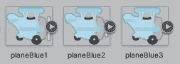

我们一次选择三个并把它们拖到场景中。这将打开一个对话框，允许我们自动创建一个新的精灵动画。现在我们在游戏中有了带旋转叶片的飞机:

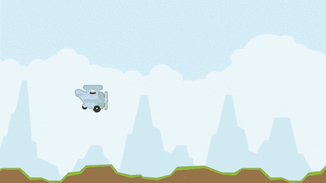

# 检测玩家输入

在`Plane`脚本组件中，我们从玩家那里获得输入来让飞机跳跃。当用户点击鼠标左键或按空格键时，我们设置 Y 方向的速度。这是飞机在由于重力而失去速度之前的初始速度(我们在飞机上附加了一个`Rigidbody 2D`组件来实现物理)。当玩家撞上障碍物时，游戏将会结束，所以当这种情况发生并且飞机落到地面时，我们停止检测输入。

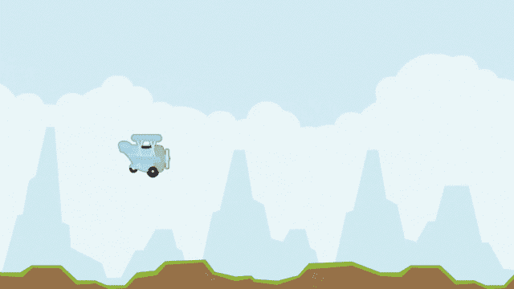

# 制造障碍

我们用这两个精灵来制造障碍:

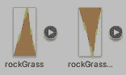

我们通过在`Hierarchy`窗口中使它们成为同一个父`Rock Grass`的两个孩子来使它们一起移动。

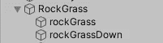

我们在场景中有一个`GameController`游戏对象(来实现单机游戏管理模式)。它有一个附加的`GameController`脚本，该脚本有`firstRockPair`序列化字段。我们在 Unity 编辑器中将该字段设置为`Rock Grass`。是玩家在游戏中遇到的第一个障碍，也是我们将要克隆以制造更多障碍的对象。

当游戏开始时，我们创建了一个`firstRockPair`的克隆体，并把它放在离`firstRockPair`随机距离的地方。在随机的几秒钟后，第一个克隆体向左移动了很多，我们创建了另一个`firstRockPair`的克隆体。

# 检测碰撞

我们将一个`Polygon Collider 2D`组件附加到平面和显示顶部和底部岩石精灵的两个子组件`Rock Grass`(`rockGrass`和`rockGrassDown`)上，以启用我们在`Plane`脚本中处理的碰撞检测:

在这一点上，我们已经有了一个功能齐全的 Tappy 飞机游戏！

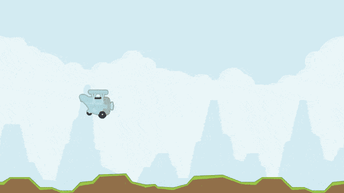

# 添加评分

我们在场景中创建一个不可见的游戏对象，并使它成为岩草的孩子。我们将这个对象标记为`ScoreIncreaseTrigger`。我们把它放在场景中岩石对的后面，这样当`OnTriggerExit2D`函数被调用来触发飞机和这个物体之间的碰撞时，就意味着飞机已经成功地通过了岩石对，所以我们增加了玩家的分数。

## 分数指示器

代替显示玩家当前分数的字体，我们将使用这些精灵(一个精灵代表分数的一个数字):

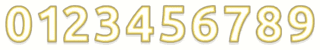

所以我们需要一个自定义方法来根据来自`Score`组件的分数更新显示的精灵。

我们在一个列表中存储每个数字的。这些图像在场景中并排放置。假设现在的分数是 9。9 只有一个数字，这意味着我们在列表中只有一个图像。当我们将分数更新为 10 时会发生什么？嗯，10 有两个数字(1 和 0)，所以我们将列表中第一个图像的精灵更新为显示数字 1 的精灵。然后我们在列表中创建一个新的图像，并将它的 sprite 设置为显示数字 0 的 sprite。

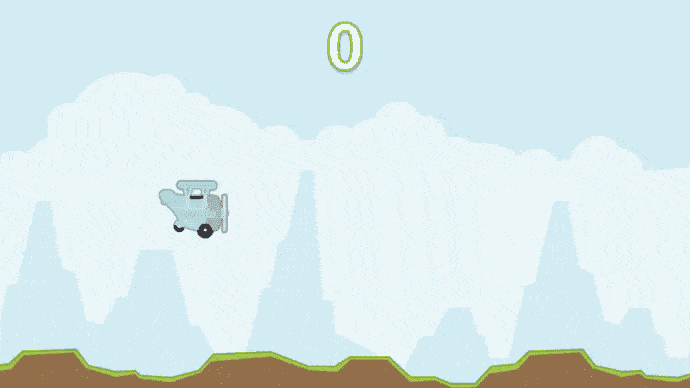

# 添加星星

自从上一次产生一个恒星群以来，在飞机通过随机数量的岩石后，我们产生了一个新的恒星群。

`SpawnStars()`使每个星群中的星星走半圆的路径。一组中的每颗恒星都围绕同一点旋转一个角度，这个角度基于它们在组中的位置。

当飞机撞上一颗星星时，我们破坏该星星的游戏对象，并增加星星数:

我们需要做的最后一件事是添加一个星计数指示器。`StarCount`组件只是检测星星数量的变化，并相应地更新场景中指示器的文本。我们这次使用了一种字体(KenVector Future ),所以我们不会像分数指示器那样使用自定义更新方法。我们只需要设置`text`属性。

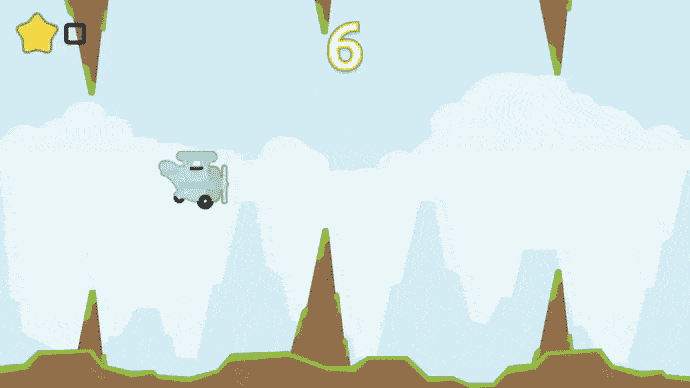

就是这样！我们有 Tappy 飞机启动并运行(飞行，跳跃？)!

我们可以给游戏增加更多的功能。来自[肯尼](https://www.kenney.nl/)的资源包含精灵，当飞机跳跃时，我们可以用它们来创建像排气动画这样的东西。我们甚至可以利用地面和岩石精灵的各种变化来改变天气。

你可以在 GitHub 上的这里找到项目[。也许你可以克隆它，并尝试自己扩展它？或者喜欢就从头开始？](https://github.com/tariibaba/Tappy-Plane)

无论如何，我希望你在阅读这篇文章的时候过得愉快，现在你知道如何用类似的机制制作一个游戏了。