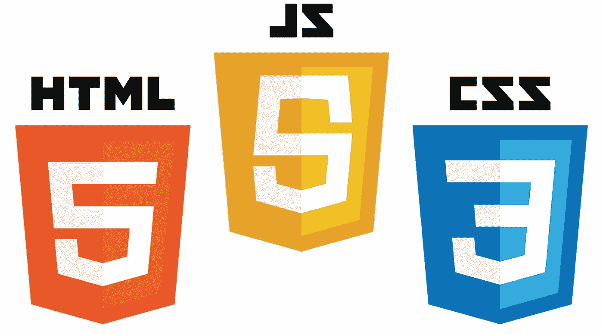

# 让我们来看看⚛—的入门指南

> 原文：<https://medium.com/codex/lets-react-a-reactjs-starter-guide-a333ad79eaef?source=collection_archive---------20----------------------->

Web 开发是软件工程的主要领域之一。无论你是想构建你的个人项目还是想构建高质量的行业应用程序，web 开发知识都是非常重要的。了解网络如何工作以及如何构建网络应用程序会给你带来很多机会。你可以建立自己的网络应用程序，通过广告赚钱，你可以为大型科技公司工作，你可以根据客户的要求自由建立网站。

现在我们都知道 web 开发由两个主要部分组成，前端(T0)和后端(T2)。现在，前端是用户可以看到并与之交互的东西，后端是存储主要业务逻辑的地方。我们使用 *HTML、CSS 和 JavaScript 开发前端。对于后端，我们使用像 Nodejs(JavaScript)、Django(Python)这样的工具和语言。Net(C#)等。现在，为了让你的开发变得容易，一些非常聪明的人开发了一些非常酷的框架，可以减轻你的开发压力，Reactjs 就是这样一个库。现在 Reactjs 被用来构建交互式前端 UI。还有其他前端框架，如 Vuejs、Angular 等等。你知道这个世界现在唯一不需要的是另一个 JavaScript 框架。但是，是什么让 react 如此伟大呢？为什么几乎每个前端开发工作都要求你具备 react 技能？为什么它在开发者中如此受欢迎？*

# 爱情的反应💖 ⚛

现在看来，react 并不是最好的框架。还有人爱 Vue，Angular 等框架。连我都喜欢 vue。事实上，Vue 拥有当今最多的 github stars⭐(as)！但是，是什么让 React 成为最受欢迎的框架呢？

现在 React 是前端库，现在不想讨论库和框架的区别，可以参考这个 [*视频*](https://www.youtube.com/watch?v=9LNaQln11BA) 同样。React 是一个由脸书开发的前端库，正如我之前所说，很多聪明人写这个来为你做前端的繁重工作。你看，脸书意识到他们的网站将会增长，用户将会大量涌入，所以他们需要可以在前端真正扩展的东西，可以轻松管理的东西，需要时可以重用的东西。反应过来进来了。

React 提出了一些有趣的想法，

1.  单页应用程序
2.  可重用组件
3.  虚拟 Dom
4.  开源库

# 1.单页应用程序

网页开发的三位一体

现在我们知道，互联网上的所有网站都使用三个主要文件来制作一些很棒的前端——HTML、CSS 和 JavaScript。现在 HTML 文件的工作是给你的网站一个基本的结构，CSS 用来设计这些结构的样式，JS 用来使这些结构具有交互性，这样用户就可以发送和接收数据。现在回到过去，网站通常只有链接，链接到页面的其他部分，但在后端，你的浏览器必须与服务器对话，才能获得新的 HTML、CSS、JS 文件。出现了单页应用程序的想法。

现在的普遍情况是，我们更少关注 HTML，而更多关注 JavaScript，你只需加载一次应用程序代码。我们不再向服务器发出新的请求，在那里获取新的文档，现在我们的应用程序更像一个桌面应用程序，我们始终停留在同一个页面上，JavaScript 文件只是改变或更新 DOM 来显示新的内容。因此，您能够登录到应用程序并与该应用程序交互，而无需再与服务器对话。这种编写应用程序的方式变得非常流行，2010 年，Google 创建了 Angularjs，这成为了构建应用程序的标准方式。Angularjs 在容器中构建了应用程序，但是随着应用程序的增长，即使这样也变得难以管理。因此，脸书在 2013 年推出了 reactjs，了解所有问题。它的腾飞是因为 react 开发了一种全新的方法来构建前端应用程序。现在，在 2014 年，angularjs 意识到他们设计框架的方式不再允许构建好的应用程序。所以他们在 2014 年决定重写整个图书馆，称之为 angular，但因为他们想做整个重写，所以很多人在那段时间做出了反应。

# 2.虚拟 Dom📃

现在虚拟 dom 的概念在不新了所有这些库中都使用了 [*虚拟 dom*](https://www.youtube.com/watch?v=RquK3TImY9U) 的概念。Reactjs 由两个主要的 API 组成，即 React — *用于编写 UI* 和 ReactDOM — *虚拟 DOM。*

现在 React 库被用来编写组件和 UI，这些 UI 有一个叫做*状态的东西。状态定义了 UI 当前的样子。现在，每当状态更新时，UI 都需要对这些变化做出“反应”,而这个 ReactDOM 的工作就是跟踪这些变化并更新 DOM 上的 UI。在 react 中，你不会像在普通的 JS 项目和应用程序中那样直接更新 DOM。相反，您只需使用 UI 组件*的这些*状态，ReactDOM 就会负责更新 DOM。*

# 3.可重用组件🔁

使用 React，您可以创建非常小的可重用组件，并组合所有不同的组件，制作您的网页。例如，您的网页可能由导航条、按钮、个人资料图标等组成。现在使用 react 你可以创建一个导航条组件，一个按钮组件，一个配置文件图标组件，只要有必要就使用这个组件。

这个想法对调试很有帮助。例如，如果你的按钮现在按照你想要的方式工作，你就知道在哪里搜索你的错误。您还可以减少代码重复，这意味着您可以在应用程序的其他页面中使用相同的按钮、相同的配置文件图标组件。

# 4.开源库📂

现在 Angular 在框架本身中给了你一些额外的功能，它要求你按照它需要的方式做事情，因此导致你可以使用的工具的自由度减少。

React 只是一个 UI 库。所以 React 只能处理 UI 的外观，根据状态更新 UI，并在 DOM 上显示相同的内容。但是，当您构建更大的应用程序时，您需要一些额外的功能，如路由器、状态管理库等。所以 React 有一个很大的社区，你可以选择任何工具来完成你的工作，从而给你很大的自由。

1.  如果您想要路由，您可以使用— react 路由器 dom
2.  您需要状态管理— Redux
3.  您想要服务器端呈现— Nextjs

# 资源📖

现在我只想介绍一下反应的概念。如果你想学 React，udemy 有很多很棒的课程，但是我最爱 2021 年的 [*完整 React 开发者(w/ Redux，Hooks，GraphQL)*](https://www.udemy.com/course/complete-react-developer-zero-to-mastery/) *。*本课程涵盖了许多 react 概念，如状态、状态管理(redux)、路由以及使用所有这些工具构建大型项目(电子商务网站)。

学习 React 后，你可以深入到服务器端渲染，Nextjs 也是如此。您可以使用本教程， [*Next.js & React —完整指南(包括两条路径！*](https://www.udemy.com/course/nextjs-react-the-complete-guide/) *)* 学习 Nextjs

# 最后

非常感谢你的阅读，我希望你学到了一些东西。因此，如果您想学习 react，那么现在是时候选择一个 react 资源并开始学习了😃！快乐学习😎！

P.S .如果想了解这些框架的对比，看 [*这个视频。*](https://academy.zerotomastery.io/courses/learn-vue-js/lectures/31318382)